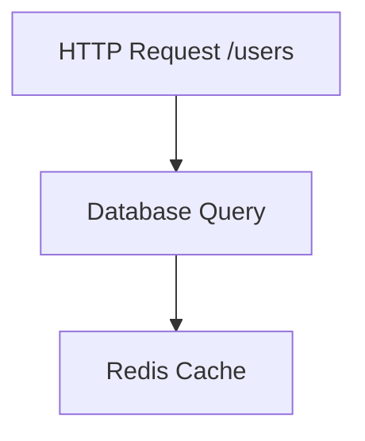

# SkyWalking PHP Agent使用

## 介绍

SkyWalking PHP Agent是一个用于监控PHP应用程序性能的工具，它能够自动收集请求链路、慢查询、异常等数据，并将这些信息上报至SkyWalking后端进行分析。通过使用SkyWalking PHP Agent，开发者可以快速定位性能瓶颈，优化应用响应速度。

:::note
SkyWalking PHP Agent目前支持PHP 7.2及以上版本，并依赖扩展`skywalking_agent.so`。
:::

## 安装与配置

### 1. 安装扩展

首先，下载并编译SkyWalking PHP Agent扩展：

```bash
git clone https://github.com/apache/skywalking-php.git
cd skywalking-php
phpize
./configure
make && make install
```

在`php.ini`中启用扩展：

```ini
extension=skywalking_agent.so
```

### 2. 配置Agent

创建配置文件`/etc/skywalking.ini`，填写以下内容：

```ini
[skywalking]
; SkyWalking OAP服务器地址
agent.service_name=my_php_app
collector.backend_service=127.0.0.1:11800
```

:::caution
确保`collector.backend_service`指向正确的SkyWalking OAP服务器地址。
:::

## 基本使用

### 自动追踪HTTP请求

SkyWalking PHP Agent会自动追踪常见的PHP框架（如Laravel、Symfony）的HTTP请求。启动应用后，访问接口即可在SkyWalking UI中查看数据：

```php
// Laravel示例路由
Route::get('/hello', function () {
    return 'Hello SkyWalking!';
});
```

### 手动创建Span

如果需要监控自定义代码块，可以手动创建Span：

```php
use SkyWalking\Agent;

$span = Agent::startSpan('custom_operation');
try {
    // 执行耗时操作
    sleep(1);
    $span->tag('status', 'success');
} finally {
    $span->end();
}
```

## 实际案例

### 监控数据库查询

以下示例展示如何监控一个PDO数据库查询：

```php
$span = Agent::startSpan('database_query');
$span->tag('db.type', 'mysql');
$span->tag('db.instance', 'orders');

$pdo = new PDO('mysql:host=localhost;dbname=test', 'user', 'pass');
$stmt = $pdo->query('SELECT * FROM users');
$results = $stmt->fetchAll();

$span->end();
```

在SkyWalking UI中，你将看到类似以下链路信息：



## 总结

通过本指南，你学会了：
1. 如何安装和配置SkyWalking PHP Agent。
2. 自动和手动监控PHP应用性能的方法。
3. 通过实际案例理解Agent的使用场景。

## 扩展资源

- [SkyWalking PHP Agent官方文档](https://github.com/apache/skywalking-php)
- 练习：尝试将Agent集成到一个现有PHP项目中，并分析监控数据。