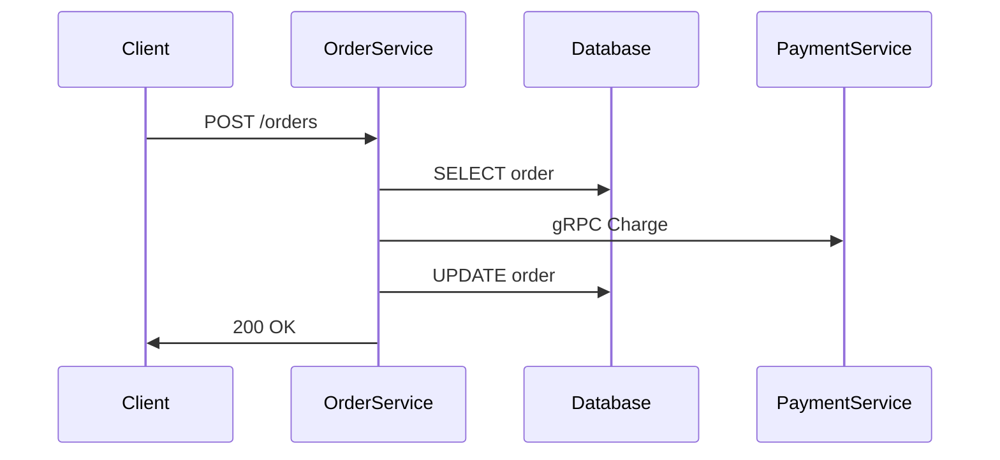

## 介绍

SkyWalking .NET Agent是Apache SkyWalking生态系统的一部分，专为.NET应用程序设计。它通过自动或手动插桩（Instrumentation）方式，收集应用程序的运行时数据（如HTTP请求、数据库调用等），并将这些数据发送到SkyWalking后端进行分析和可视化。对于.NET开发者来说，这是实现应用可观测性的重要工具。

:::note
SkyWalking .NET Agent支持.NET Core和.NET 5+应用程序，暂不支持传统的.NET Framework。
:::

## 安装与配置

### 1. 下载Agent
从[SkyWalking官方发布页面](https://skywalking.apache.org/downloads/)下载最新的.NET Agent包，解压到本地目录。

### 2. 配置环境变量
在启动应用程序前，需设置以下环境变量：

```bash
export SKYWALKING__SERVICENAME=Your_Service_Name
export SKYWALKING__DIRECTSERVERS=your_OAP_server_address:11800
```

### 3. 集成到应用程序
在.NET项目的启动文件（如`Program.cs`）中，添加Agent初始化代码：

```csharp
public static IHostBuilder CreateHostBuilder(string[] args) =>
    Host.CreateDefaultBuilder(args)
        .ConfigureWebHostDefaults(webBuilder =>
        {
            webBuilder.UseStartup<Startup>();
        })
        .UseSkyWalking(); // 添加这一行
```

## 核心功能

### 自动追踪
Agent会自动追踪以下操作：
- HTTP请求（ASP.NET Core）
- gRPC调用
- 数据库访问（如SQLClient、Entity Framework Core）

### 自定义追踪
手动创建追踪片段：

```csharp
using SkyApm.Tracing;
using SkyApm.Tracing.Extensions;

public class MyService
{
    private readonly ITracingContext _tracingContext;

    public MyService(ITracingContext tracingContext)
    {
        _tracingContext = tracingContext;
    }

    public void PerformTask()
    {
        var span = _tracingContext.CreateEntrySpan("MyCustomOperation");
        try
        {
            // 业务逻辑代码
            span.Log("Task started");
        }
        finally
        {
            _tracingContext.Release(span);
        }
    }
}
```

## 实际案例

### 场景：电商订单服务
假设有一个处理订单的微服务，需要追踪以下流程：
1. HTTP请求进入
2. 数据库查询（订单信息）
3. 调用支付服务（gRPC）
4. 更新数据库



在SkyWalking UI中，您将看到完整的调用链，包括每个步骤的耗时和状态。

## 高级配置

### 过滤特定请求
在`appsettings.json`中忽略健康检查端点：

```json
{
  "SkyWalking": {
    "Sampling": {
      "IgnorePaths": ["/healthcheck"]
    }
  }
}
```

### 自定义采样率
调整采样率以减少性能开销：

```json
{
  "SkyWalking": {
    "Sampling": {
      "SamplePer3Secs": -1, // 禁用
      "Percentage": 0.5 // 50%采样
    }
  }
}
```

## 常见问题

:::warning
如果看不到数据，请检查：
1. OAP服务是否正常运行
2. 网络连接是否通畅
3. 服务名称是否冲突
4. Agent日志（默认在logs/目录）是否有错误
:::

## 总结

通过SkyWalking .NET Agent，您可以：
- 自动收集关键性能指标
- 可视化微服务架构中的调用关系
- 快速定位性能瓶颈

## 扩展资源

1. [官方文档](https://skywalking.apache.org/docs/skywalking-net/1.0.0/readme/)
2. 尝试在示例项目中添加自定义标签（Tags）和日志（Logs）
3. 比较不同采样率对性能的影响