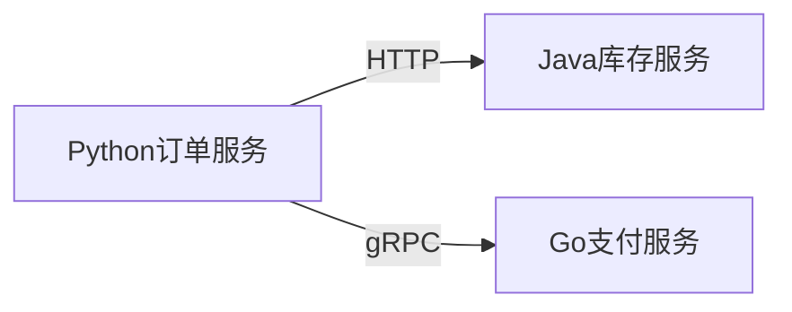

## 介绍

SkyWalking Python Agent 是一个轻量级的代理工具，用于监控和追踪Python应用程序的性能。它通过收集应用运行时的数据（如HTTP请求、数据库调用等），帮助开发者分析系统瓶颈和优化性能。本指南将详细介绍如何部署SkyWalking Python Agent，并展示其在实际项目中的应用。

:::note
SkyWalking Python Agent 支持 Python 3.6+，兼容主流框架（如Django、Flask、FastAPI等）。
:::

---

## 安装与配置

### 1. 安装依赖
通过pip安装SkyWalking Python Agent包：
```bash
pip install apache-skywalking
```

### 2. 基础配置
在Python应用的入口文件（如`main.py`）中初始化Agent：
```python
from skywalking import agent, config

config.init(
    agent_name='your-service-name',  # 服务名称
    agent_instance_name='instance-1',  # 实例名称
    collector_address='localhost:11800',  # SkyWalking OAP服务地址
)
agent.start()
```

:::caution
确保`collector_address`指向正确的SkyWalking OAP服务器地址，否则数据无法上报。
:::

---

## 集成示例

### 示例1：监控Flask应用
以下是一个完整的Flask应用集成案例：
```python
from flask import Flask
from skywalking import agent, config

config.init(
    agent_name='flask-demo',
    collector_address='localhost:11800',
)
agent.start()

app = Flask(__name__)

@app.route('/')
def hello():
    return "Hello, SkyWalking!"

if __name__ == '__main__':
    app.run(port=5000)
```

启动应用后，访问`http://localhost:5000`，SkyWalking将自动记录请求链路。

### 示例2：自定义追踪
手动创建Span以监控特定代码块：
```python
from skywalking.trace import tag
from skywalking.trace.context import get_context

def slow_operation():
    with get_context().new_entry_span(op='slow_operation') as span:
        span.tag(tag.Tag(key='param', val='value'))
        # 模拟耗时操作
        import time
        time.sleep(1)
```

---

## 实际应用场景

### 场景：电商订单系统
假设有一个处理订单的Python服务，通过SkyWalking Agent可以：
1. 追踪订单创建、支付、物流等子流程的耗时。
2. 识别慢查询（如数据库调用超过1秒的请求）。
3. 分析跨服务调用链路（如Python服务调用Java库存服务）。



---

## 总结

- SkyWalking Python Agent 提供开箱即用的分布式追踪能力。
- 支持自动埋点和手动Span创建，灵活适应不同场景。
- 通过SkyWalking UI可直观分析性能数据。

### 后续学习
- 尝试为Django或FastAPI项目集成Agent。
- 探索SkyWalking的[告警功能](https://skywalking.apache.org/docs/)。

:::tip 练习
在本地启动一个Flask应用，并配置SkyWalking Agent，观察UI中的链路数据。
:::