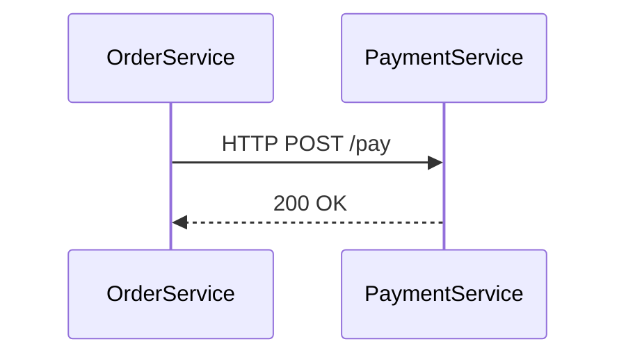

## 介绍

SkyWalking Go Agent是Apache SkyWalking项目的一部分，专为Go语言应用程序设计的轻量级探针（Agent）。它通过自动或手动埋点的方式，采集应用的运行时数据（如调用链路、性能指标等），并将这些数据发送到SkyWalking后端进行分析和可视化。对于Go开发者而言，这是实现分布式追踪和性能监控的高效工具。

## 核心概念

1. **自动埋点**：自动拦截HTTP/gRPC等框架的请求，无需修改业务代码。
2. **手动埋点**：通过API在关键业务逻辑中添加自定义追踪。
3. **上下文传播**：跨服务传递追踪上下文（Trace ID、Span ID等）。

---

## 安装与配置

### 1. 下载Agent
通过go get安装SkyWalking Go Agent库：
```bash
go get github.com/apache/skywalking-go/agent
```

### 2. 启用Agent
在Go程序启动时通过环境变量启用Agent：
```bash
export SW_AGENT_NAME=your_service_name
export SW_AGENT_COLLECTOR_BACKEND_SERVICES=127.0.0.1:11800
go run main.go
```

:::tip
生产环境中建议将Agent配置写入文件（如`skywalking-go.json`），通过`SW_AGENT_CONFIG`环境变量指定路径。
:::

---

## 代码示例

### 自动埋点（HTTP服务）
以下是一个使用`net/http`的示例，Agent会自动追踪HTTP请求：

```go
package main

import (
	"net/http"
	_ "github.com/apache/skywalking-go/agent" // 导入Agent包
)

func handler(w http.ResponseWriter, r *http.Request) {
	w.Write([]byte("Hello, SkyWalking!"))
}

func main() {
	http.HandleFunc("/", handler)
	http.ListenAndServe(":8080", nil)
}
```

**输出效果**：
在SkyWalking UI中可以看到：
- 请求路径`/`的响应时间、状态码。
- 完整的调用链路（如果调用其他服务）。

---

### 手动埋点
通过`skywalking-go/tracing`包手动创建Span：

```go
import (
	"context"
	"github.com/apache/skywalking-go/tracing"
)

func businessLogic(ctx context.Context) {
	span, ctx := tracing.CreateLocalSpan(ctx, "businessLogic")
	defer span.End()
	
	// 业务代码...
}
```

---

## 实际案例：微服务调用追踪

假设有一个订单服务调用支付服务的场景：



1. **订单服务代码**：
```go
func placeOrder(w http.ResponseWriter, r *http.Request) {
	// 创建跨服务的Span
	span := tracing.CreateExitSpan(r.Context(), "/pay", "payment-service:8080")
	defer span.End()

	// 调用支付服务
	resp, _ := http.Post("http://payment-service:8080/pay", "application/json", nil)
	// 处理响应...
}
```

2. **支付服务代码**：
```go
func payHandler(w http.ResponseWriter, r *http.Request) {
	span := tracing.CreateEntrySpan(r.Context(), "/pay")
	defer span.End()
	// 处理支付逻辑...
}
```

---

## 总结

- **优势**：低侵入性、支持主流框架（Gin、gRPC等）、上下文自动传播。
- **适用场景**：微服务监控、性能瓶颈分析、分布式调试。

---

## 附加资源

1. [官方文档](https://skywalking.apache.org/docs/skywalking-go/next/readme/)
2. **练习**：尝试在本地启动一个Gin服务，并集成SkyWalking Go Agent，观察UI中的链路数据。