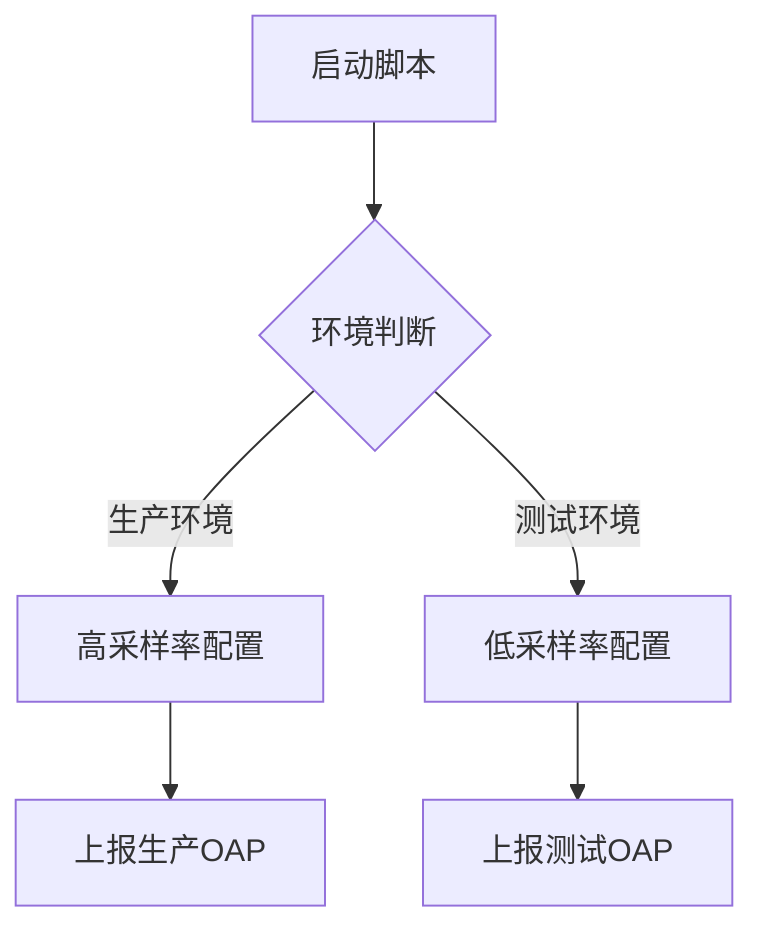

## 简介

SkyWalking Agent是分布式系统的探针，负责收集应用性能数据并上报至SkyWalking后端。通过启动参数可以控制Agent的核心行为，如服务命名、采样率、后端地址等。本文将详细介绍常用参数及其应用场景。

## 核心启动参数

### 1. 基础配置参数

| 参数名 | 示例值 | 说明 |
|--------|--------|------|
| `agent.service_name` | `your-application-name` | 在SkyWalking UI中显示的服务名 |
| `collector.backend_service` | `127.0.0.1:11800` | OAP服务器地址 |
| `agent.namespace` | `prod-team` | 跨进程链路中的逻辑分组 |

:::tip 命名规范
服务名建议使用`<部门>-<应用名>-<环境>`格式，例如：`biz-order-service-prod`
:::

### 2. 采样与性能参数

```bash
# 启动示例
java -javaagent:/path/to/skywalking-agent.jar \
     -Dskywalking.agent.sample_n_per_3_secs=10 \
     -Dskywalking.agent.force_sample=true \
     -jar your-app.jar
```

- `agent.sample_n_per_3_secs`：每3秒采样的请求数（默认-1表示全采样）
- `agent.force_sample`：是否强制采样（覆盖下游采样决策）

### 3. 网络与安全参数

```properties
# 配置文件示例（agent.config）
agent.authentication=YOUR_TOKEN
collector.grpc_channel_check_interval=30
logging.level=INFO
```

:::caution 安全提醒
生产环境务必配置`agent.authentication`参数，与OAP服务端保持一致
:::

## 实际应用案例

### 案例1：多环境配置



对应启动脚本：
```bash
#!/bin/bash
if [ "$ENV" = "prod" ]; then
  JAVA_OPTS="-javaagent:/agent/skywalking-agent.jar \
             -Dskywalking.agent.service_name=prod-service \
             -Dskywalking.agent.sample_n_per_3_secs=100"
else
  JAVA_OPTS="-javaagent:/agent/skywalking-agent.jar \
             -Dskywalking.agent.service_name=test-service \
             -Dskywalking.agent.sample_n_per_3_secs=10"
fi

java $JAVA_OPTS -jar app.jar
```

### 案例2：Kubernetes部署

```yaml
# Deployment示例片段
env:
- name: SW_AGENT_NAME
  value: "order-service"
- name: SW_AGENT_COLLECTOR_BACKEND_SERVICES
  value: "skywalking-oap:11800"
```

## 高级参数参考

| 参数 | 适用场景 |
|------|----------|
| `agent.ignore_suffix` | 忽略特定后缀的请求（如`.jpg,.css`） |
| `agent.active_vm_version` | 解决JVM版本兼容性问题 |
| `logging.max_file_size` | 日志文件大小限制（默认300MB） |

:::warning 性能影响
高频率采样（如全采样）会显著增加网络开销和存储压力，需根据业务需求平衡
:::

## 总结与练习

### 关键要点
1. 服务命名需遵循明确的命名规范
2. 采样率应根据业务量动态调整
3. 生产环境必须配置安全参数

### 实践练习
1. 尝试为你的开发环境配置Agent，设置采样率为50%
2. 观察修改`agent.ignore_suffix`参数前后对监控数据的影响
3. 对比不同网络超时设置下的连接稳定性

### 扩展阅读
- [SkyWalking官方Agent配置文档](https://skywalking.apache.org/docs/)
- 《分布式系统可观测性最佳实践》第三章
``` 

注意：实际使用时请移除代码块外的