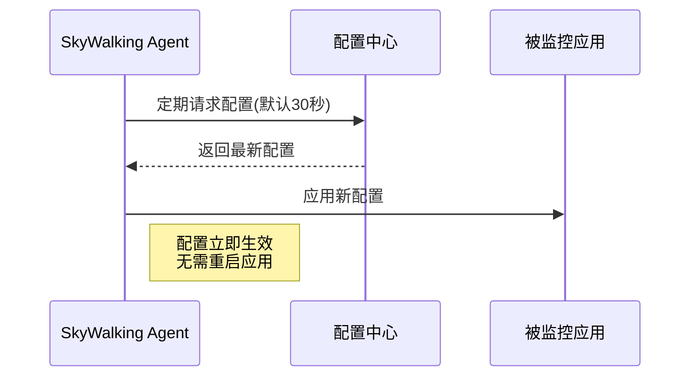

## 介绍

SkyWalking Agent的动态配置功能允许运维人员在运行时修改Agent的采集策略、采样率等关键参数，而无需重启被监控的应用。这种机制对于生产环境中的性能调优和故障排查至关重要，能够实现"热更新"式的监控调整。

## 动态配置原理

SkyWalking Agent通过定期轮询配置中心（如Nacos、Zookeeper等）获取最新配置，其核心工作流程如下：



## 配置项详解

常见的动态配置参数包括：

| 配置项 | 默认值 | 说明 |
|-------|--------|------|
| `agent.sample_n_per_3_secs` | -1(全采样) | 每3秒采样数 |
| `agent.force_sample_error` | `false` | 是否强制采样错误请求 |
| `logging.level` | `INFO` | 日志级别 |

## 配置示例

### 1. 通过Nacos配置

在Nacos中创建Data ID为`skywalking-agent`的配置：

```properties
# 采样率调整为每秒5个请求
agent.sample_n_per_3_secs=15
# 开启错误强制采样
agent.force_sample_error=true
```

:::note
Agent需要配置Nacos服务器地址，在`agent.config`中添加：
```properties
config.namespace=skywalking-agent
config.nacos.server_addr=127.0.0.1:8848
```
:::

### 2. 通过HTTP接口配置

SkyWalking OAP服务提供配置管理API：

```bash
curl -X POST http://oap-server:12800/configuration/update \
  -H 'Content-Type: application/json' \
  -d '{
    "key": "agent.sample_n_per_3_secs",
    "value": "10",
    "service": "your-service-name"
  }'
```

## 实际案例

**电商大促场景**：当系统面临突发流量时，可以通过动态配置实现：

1. 临时降低采样率减轻Agent负担：
   ```properties
   agent.sample_n_per_3_secs=5
   ```
2. 重点关注错误请求：
   ```properties
   agent.force_sample_error=true
   logging.level=DEBUG
   ```
3. 大促结束后恢复默认配置

## 验证配置生效

检查Agent日志可以看到配置更新记录：
```
DEBUG 2023-07-20 14:30:05 AbstractConfigWatcher - Config changed: 
{"agent.sample_n_per_3_secs":"15","agent.force_sample_error":"true"}
```

## 总结

SkyWalking Agent动态配置提供了强大的运行时调整能力，主要优势包括：
- 实时生效无需重启
- 支持多种配置中心
- 细粒度的采样控制
- 降低生产环境风险

## 扩展学习

1. 尝试在本地环境搭建Nacos并配置动态参数
2. 使用Arthas工具验证配置是否真正生效
3. 阅读官方文档了解完整的配置项列表

:::tip 最佳实践
建议为不同环境（开发/测试/生产）维护独立的配置集，并通过版本控制管理配置变更历史。
:::