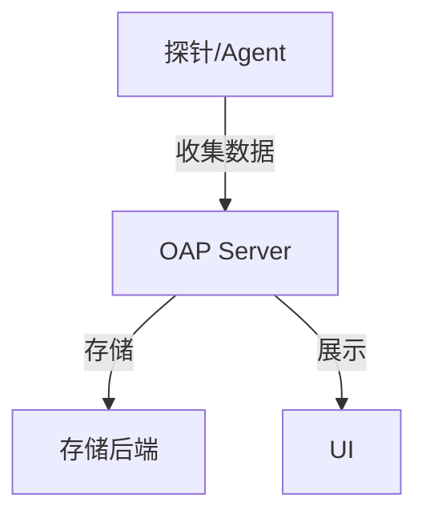
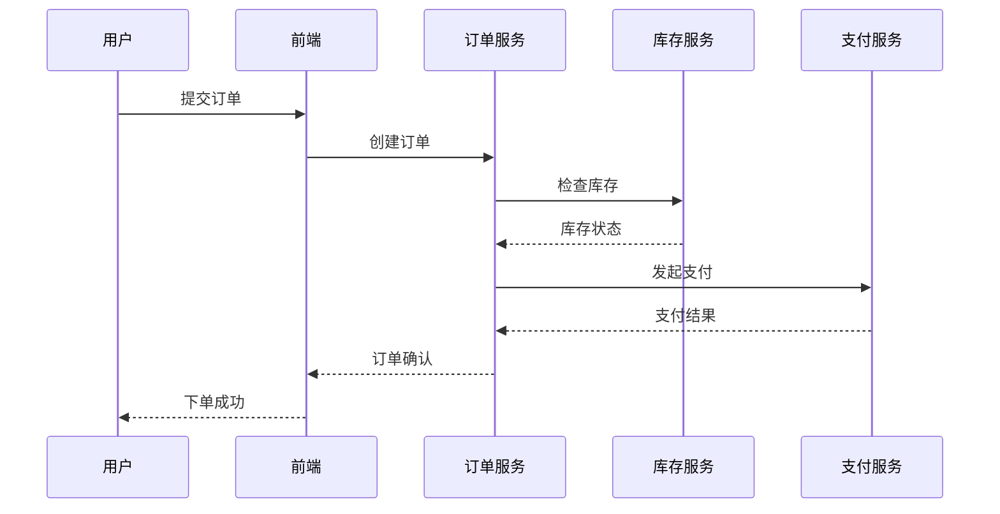

# SkyWalking 可观测性概述

## 什么是可观测性？

可观测性（Observability）是指通过系统外部输出的数据（如日志、指标、追踪）来推断内部状态的能力。在分布式系统中，传统的监控手段难以覆盖复杂的服务依赖关系，而可观测性通过三大支柱（**Tracing**、**Metrics**、**Logging**）提供了更全面的视角。

SkyWalking作为开源的可观测性平台，专为云原生和分布式系统设计，支持：
- **分布式追踪**：可视化服务调用链路
- **指标监控**：实时采集系统性能数据
- **日志聚合**：集中管理和分析日志

## 核心组件



1. **探针（Agent）**：嵌入到应用中收集数据
2. **OAP（Observability Analysis Platform）**：数据处理和分析
3. **存储**：支持Elasticsearch/H2/MySQL等
4. **UI**：可视化界面

## 实际案例：电商系统追踪

假设一个用户下单请求流经以下服务：
```
前端 → 订单服务 → 库存服务 → 支付服务
```

通过SkyWalking的追踪功能，我们可以看到：



## 关键功能详解

### 1. 分布式追踪

通过唯一TraceID串联跨服务的调用链：

```java
// 在Spring Boot应用中自动追踪（通过SkyWalking Agent）
@RestController
public class OrderController {
    @GetMapping("/create")
    public String createOrder() {
        // 业务逻辑会自动被追踪
        return "Order created";
    }
}
```

### 2. 指标监控

SkyWalking采集的典型指标包括：
- 服务响应时间（P99/P95）
- JVM内存/CPU使用率
- HTTP请求成功率

:::tip
在UI的`Metrics`页面可以设置告警阈值，如当错误率>5%时触发通知
:::

### 3. 日志关联

通过TraceID将日志与特定请求关联：
```
[2023-01-01 12:00:00] INFO [order-service] 
TraceId: abc123 Order created for user 456
```

## 为什么选择SkyWalking？

| 特性        | 传统监控       | SkyWalking         |
|------------|--------------|--------------------|
| 追踪粒度    | 服务级别      | 方法级别           |
| 部署方式    | 中心化        | 无侵入式Agent      |
| 协议支持    | 有限          | HTTP/gRPC/Kafka等 |

## 总结

SkyWalking的可观测性能力可以帮助开发者：
1. 快速定位跨服务问题
2. 优化系统性能瓶颈
3. 统一监控日志和指标

## 延伸学习

- 实践练习：部署SkyWalking Agent到Spring Boot应用
- 官方文档：[SkyWalking官网](https://skywalking.apache.org)
- 推荐阅读：《分布式系统可观测性实践》

:::note 新手建议
从单服务追踪开始，逐步扩展到微服务集群。使用本地H2存储快速体验基础功能。
:::