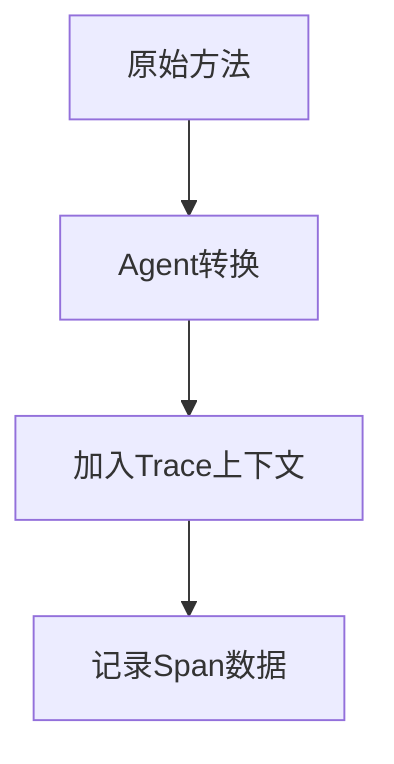

# SkyWalking 分布式追踪实现

## 介绍

分布式追踪是现代可观测性的核心组件之一，它允许开发者追踪请求在分布式系统中的完整流动路径。SkyWalking通过自动化的探针（Agent）和轻量级的后端服务，实现了跨进程、跨线程的请求链路追踪。

当用户发起一个请求时，该请求可能会经过多个微服务：


## 核心概念

### 1. Trace与Span
- **Trace**：代表完整的请求链路（如图中的A→B→C→D→E）
- **Span**：每个服务节点上的操作单元，包含：
  - 开始/结束时间戳
  - 操作名称（如HTTP请求）
  - 上下文信息（traceId/spanId）

```java
// Java Agent自动生成的Span示例
Span span = ContextManager.createLocalSpan("queryOrder");
try {
    // 业务逻辑...
} finally {
    ContextManager.stopSpan();
}
```

### 2. 上下文传播
SkyWalking通过以下方式传递追踪上下文：

| 协议       | 传播方式                     |
|------------|----------------------------|
| HTTP       | `sw8` Header               |
| gRPC       | Metadata                   |
| MQ         | 消息头扩展                  |

:::tip 实际案例
当订单服务调用支付服务时，HTTP请求会自动添加：
```
Headers:
sw8: 1-YWxpY2U=-dXNlci1zZXJ2aWNl-L3YxL3VzZXIvMQ==-...
```
:::

## 实现原理

### 1. 探针自动埋点
SkyWalking Agent通过字节码增强技术自动注入追踪代码：



### 2. 采样策略
通过配置控制追踪数据量：
```yaml
# agent.config
sample:
  # 每秒最多收集3个Trace
  n_per_3_secs: 3
  # 强制采样错误请求
  force_sample_error: true
```

## 实战演示

### 场景：电商下单流程
1. 用户提交订单
2. 系统依次调用：
   - 订单服务（创建记录）
   - 支付服务（处理支付）
   - 库存服务（扣减库存）

在SkyWalking UI中看到的追踪数据：
```
Trace ID: 3d4e5f...
Duration: 420ms
Spans:
- [POST] /api/orders (120ms)
  - [POST] /payment/process (210ms)
    - [PUT] /inventory/deduct (90ms)
```

## 配置指南

### 1. Agent安装
```bash
# Java应用启动参数
-javaagent:/path/to/skywalking-agent.jar
-DSW_AGENT_NAME=order-service
-DSW_COLLECTOR_BACKEND_SERVICES=127.0.0.1:11800
```

### 2. 自定义追踪
```python
# Python手动埋点示例
from skywalking import trace

@trace()
def process_payment():
    with trace.span('credit_card_validation'):
        # 验证逻辑...
```

## 总结

关键要点：
- 分布式追踪通过Trace/Span模型记录请求链路
- SkyWalking Agent自动处理上下文传播
- 支持多种协议和自定义采样策略

## 扩展学习

推荐练习：
1. 部署SkyWalking并追踪一个Spring Boot应用
2. 尝试手动创建一个跨服务的自定义Span
3. 分析采样率对系统性能的影响

进一步阅读：
- SkyWalking官方文档"Tracing Setup"章节
- OpenTelemetry追踪规范
- 分布式系统诊断技术白皮书