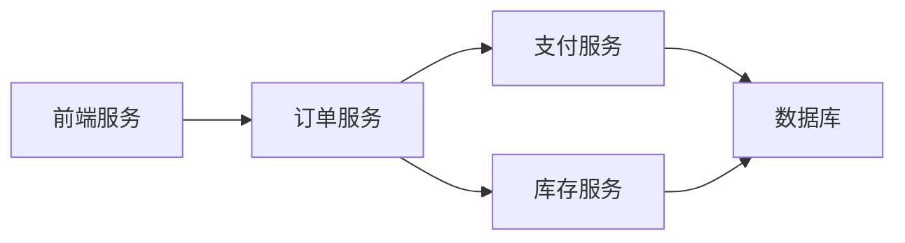
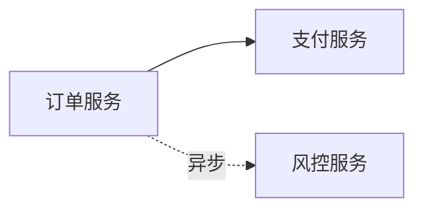

# SkyWalking 依赖分析

## 介绍

在现代分布式系统中，服务之间的依赖关系往往错综复杂。SkyWalking的**依赖分析**功能通过可视化拓扑图和调用链数据，帮助开发者理解服务间的交互关系，快速定位性能瓶颈或故障点。对于初学者而言，掌握这一功能是构建可观测性系统的关键一步。

## 核心概念

### 1. 拓扑图（Topology）
SkyWalking自动采集服务间的调用数据，生成实时拓扑图，展示：
- 服务节点（如微服务、数据库、消息队列）
- 调用方向（箭头表示请求流向）
- 调用指标（如响应时间、错误率）



### 2. 依赖矩阵（Dependency Matrix）
以表格形式量化服务间依赖强度，帮助识别关键路径：

| 调用方       | 被调用方   | 调用次数/分钟 | 平均延迟 |
|--------------|------------|---------------|----------|
| order-service | payment-service | 120 | 45ms |
| payment-service | mysql | 240 | 12ms |

## 实战操作

### 步骤1：查看拓扑图
1. 登录SkyWalking UI
2. 导航至 `Topology` 页面
3. 使用筛选器选择时间范围和服务

:::tip
双击节点可查看该服务的详细指标，右键拖动可调整视图布局。
:::

### 步骤2：分析依赖指标
通过以下API获取依赖数据（示例为SkyWalking OAL查询）：
```sql
-- 查询服务A到服务B的调用统计
service_relation_server side.service_id = 'A' and client side.service_id = 'B'
```

输出示例：
```json
{
  "latency": 50,
  "cpm": 150,
  "successRate": 0.992
}
```

## 实际案例

### 电商系统优化
某电商平台发现结算页延迟高，通过依赖分析发现：
1. 订单服务同时调用了支付服务和风控服务
2. 风控服务响应时间达300ms（红色高亮显示）
3. 优化方案：将风控检查改为异步流程

优化后拓扑变化：


## 总结

SkyWalking依赖分析能帮助您：
- 可视化系统架构
- 识别关键依赖路径
- 发现异常调用关系
- 验证架构变更效果

## 扩展练习
1. 在测试环境中部署两个相互调用的Spring Boot服务
2. 配置SkyWalking Agent采集数据
3. 观察拓扑图中是否出现预期连线
4. 人为制造高延迟调用，查看颜色变化

## 常见问题
:::caution
Q: 为什么拓扑图中缺少某些服务？<br />
A: 请检查：
- 服务是否安装了SkyWalking Agent
- Agent配置是否正确（如backend_service地址）
- 服务间是否有实际流量产生
:::