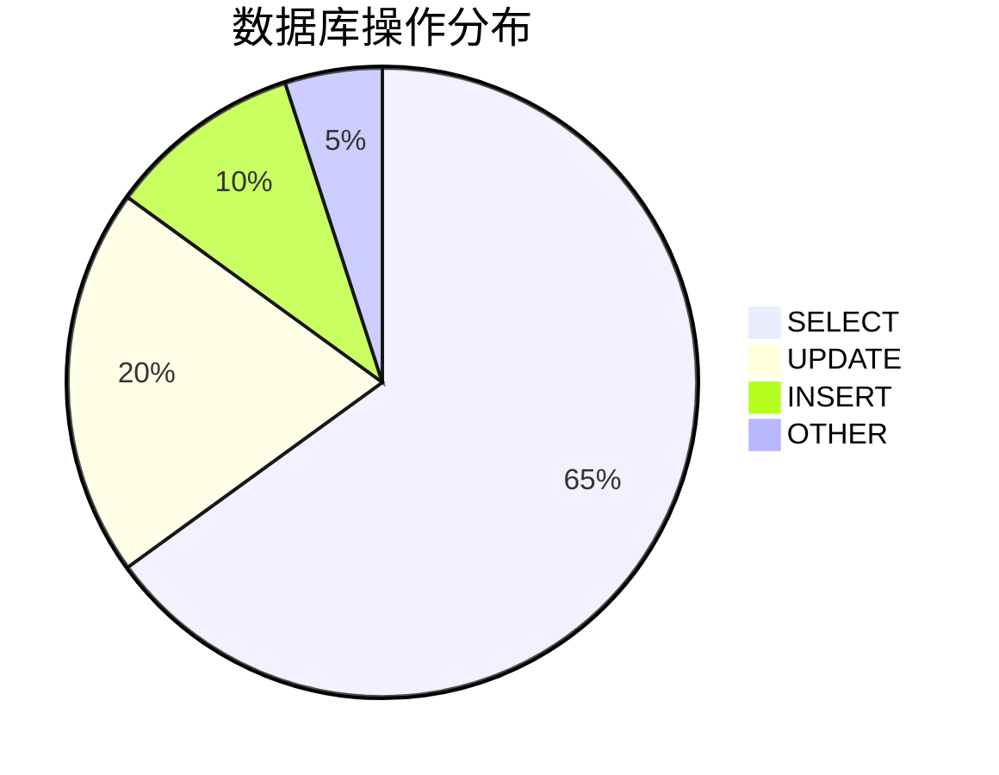

# SkyWalking 数据库访问监控

## 介绍

数据库访问监控是分布式系统可观测性的重要组成部分。SkyWalking通过自动探针或手动埋点，能够追踪SQL查询、连接池状态、慢查询等关键指标，帮助开发者快速定位数据库性能瓶颈。本文将介绍如何配置和使用SkyWalking的数据库监控功能。

## 核心概念

### 1. 监控指标类型
SkyWalking主要采集以下数据库指标：
- **SQL执行统计**：成功率、延迟、调用次数
- **连接池状态**：活跃连接数、等待线程数
- **慢查询**：超过阈值的SQL语句
- **拓扑关系**：服务与数据库的依赖关系

### 2. 数据采集方式


## 配置指南

### Java应用配置示例
在 `agent.config` 中添加数据库相关配置：

```properties
# 启用JDBC监控
plugin.jdbc.trace_sql_parameters=true
# 慢查询阈值(毫秒)
plugin.jdbc.slow_sql_threshold=500
# 记录SQL参数
plugin.jdbc.sql_parameters_max_length=512
```

### 常见数据库支持列表
| 数据库类型 | 支持版本 | 关键指标 |
|------------|----------|----------|
| MySQL      | 5.7+     | 连接数/慢SQL |
| PostgreSQL | 9.5+     | 事务状态   |
| Oracle     | 11g+     | 执行计划   |

## 实战案例

### 慢查询分析场景
1. 在UI界面进入「Database」面板
2. 筛选响应时间 > 1000ms的查询
3. 查看执行计划样本：

```sql
/* 检测到的慢查询示例 */
SELECT * FROM large_table 
WHERE unindexed_column = 'value'
ORDER BY create_time DESC
```

:::tip 优化建议
为 `unindexed_column` 添加索引后，该查询响应时间从1200ms降至45ms
:::

## 指标解读

### 关键指标说明
- **SQL Avg Response Time**：反映数据库处理能力
- **SQL Execute Error Count**：需关注突然增长
- **Connection Pool Wait Time**：连接池不足的信号



## 高级功能

### 自定义追踪
通过注解手动标记重要查询：

```java
@Trace(operationName = "getUserProfile", tags = {"db.type:mysql"})
public User getUserProfile(String userId) {
    // JDBC操作...
}
```

:::caution 注意事项
1. 生产环境建议关闭SQL参数记录
2. 监控会增加约3-5%的性能开销
3. Oracle监控需要额外license
:::

## 总结

SkyWalking的数据库监控能力可以帮助开发者：
- 实时掌握数据库健康状态
- 快速定位性能瓶颈
- 优化SQL查询性能
- 预防连接池耗尽等问题

## 扩展学习

### 推荐练习
1. 在测试环境模拟慢查询并观察监控指标变化
2. 尝试配置不同数据库的连接池告警规则
3. 对比监控前后SQL性能优化效果

### 后续学习路径
- SkyWalking告警配置
- 分布式事务追踪
- 跨服务链路分析