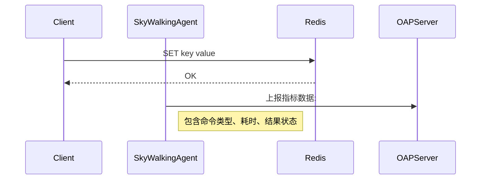

# SkyWalking 缓存服务监控

## 介绍

在现代分布式系统中，缓存服务（如Redis、Memcached）是提升应用性能的关键组件。SkyWalking通过**服务拓扑图**和**指标分析**提供缓存服务的可视化监控能力，帮助开发者快速定位缓存层性能瓶颈。

:::note 核心监控维度
- **命中率**：反映缓存有效性
- **响应时间**：包括平均/百分位耗时
- **容量指标**：内存使用率、键值数量
- **错误率**：连接失败、超时等情况
:::

## 配置缓存监控

### 1. 探针配置

在SkyWalking Agent配置文件中启用缓存插件（以Redis为例）：

```properties
# agent.config
plugin.redis.trace.parameters_max_length=512
plugin.redis.trace.command_max_length=128
```

### 2. 指标采集原理



## 关键指标解析

### 命中率监控

通过Dashboard查看缓存命中率趋势：

```sql
-- SkyWalking指标查询示例
SELECT 
    hit_count / (hit_count + miss_count) AS hit_ratio 
FROM 
    redis_indicators 
WHERE 
    service = 'cart-service-cache'
```

:::tip 优化建议
当命中率低于80%时，应考虑：
- 调整缓存淘汰策略
- 增加缓存容量
- 优化缓存键设计
:::

### 响应时间分析

典型慢查询告警规则配置：

```yaml
# alarm-settings.yml
rules:
  - name: redis_slow_command
    expression: avg(redis.cmd.latency) > 200
    period: 5
    silence-period: 10
```

## 实战案例

### 电商平台缓存雪崩排查

**场景**：某促销活动期间出现大量商品查询超时

**排查过程**：
1. 发现Redis平均响应时间从5ms飙升到1200ms
2. 通过**Endpoint Dependency Map**定位到热点Key
3. 确认是由于相同过期时间导致的缓存雪崩

**解决方案**：
```java
// 添加随机过期时间偏移量
public void setProductCache(Product product) {
    int baseExpire = 3600;
    int randomOffset = new Random().nextInt(300);
    redisTemplate.opsForValue().set(
        "product:" + product.getId(),
        product,
        baseExpire + randomOffset,
        TimeUnit.SECONDS
    );
}
```

## 总结

通过SkyWalking的缓存监控能力，开发者可以：
- 实时掌握缓存健康状态
- 快速定位性能异常
- 基于数据优化缓存策略

## 扩展学习

推荐练习：
1. 在测试环境模拟缓存穿透场景，观察指标变化
2. 配置基于百分位响应时间的告警规则
3. 对比LRU与LFU策略的命中率差异

相关资源：
- SkyWalking官方文档：Storage Plugin Configuration
- 《Redis设计与实现》- 缓存淘汰策略章节