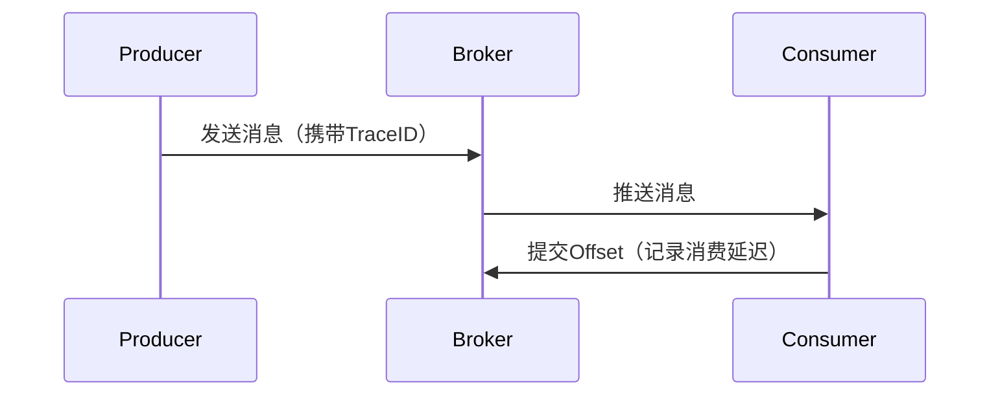

# SkyWalking 消息队列监控

## 介绍

在现代分布式系统中，消息队列（如Kafka、RabbitMQ）是解耦服务、实现异步通信的核心组件。SkyWalking通过**跨进程传播的TraceID**和**消息队列探针**，提供了对消息生产、消费全链路的监控能力。本章将介绍如何配置和使用SkyWalking监控消息队列的性能指标与链路追踪。

---

## 核心概念

### 1. 消息队列监控原理
SkyWalking通过以下方式实现监控：
- **生产者端**：在消息头部注入TraceID（如Kafka的Header）
- **消费者端**：提取TraceID并关联上下游链路
- **Broker指标**：采集队列积压、消费延迟等数据



### 2. 支持的消息队列
| 消息队列 | 支持版本 | 监控维度 |
|----------|---------|----------|
| Kafka    | 0.11+   | 生产/消费延迟、Topic吞吐量 |
| RabbitMQ | 3.8+    | 队列深度、消息ACK状态 |
| RocketMQ | 4.5+    | 消费组延迟、重试队列 |

---

## 配置示例

### Kafka监控配置
在SkyWalking Agent的 `config/agent.config` 中添加：

```properties
# 启用Kafka插件
plugin.kafka.trace=true

# 定义需要监控的Topic（正则匹配）
plugin.kafka.include_topics=orders_.*
```

### Java代码示例
生产者端自动注入TraceID（无需手动编码）：
```java
@Autowired
private KafkaTemplate<String, String> kafkaTemplate;

public void sendOrderEvent(Order order) {
    // SkyWalking会自动在消息Header中添加SW_CTX
    kafkaTemplate.send("orders_created", order.getId(), order.toJson());
}
```

消费者端需开启自动追踪：
```java
@KafkaListener(topics = "orders_created")
public void handleOrderEvent(ConsumerRecord<String, String> record) {
    // 自动关联Trace
    processOrder(record.value());
}
```

---

## 监控指标解读

在SkyWalking UI中可查看以下关键数据：

1. **拓扑图**
   - 消息生产/消费的服务依赖关系
   - 异常节点的红色高亮提示

2. **指标面板**
   ```text
   kafka_producer_latency    : 生产端到Broker的延迟（ms）
   kafka_consumer_latency    : 消费端处理延迟（ms） 
   kafka_queue_messages      : Topic待消费消息堆积量
   ```

3. **Trace详情**
   ```mermaid
   timeline
       title 消息链路追踪示例
       section 订单服务
         生产消息 : 2023-01-01 10:00:00
       section Kafka Broker
         存储消息 : 10:00:02
       section 支付服务
         消费消息 : 10:00:05
   ```

---

## 实际案例

### 电商订单超时问题排查
**现象**：用户投诉订单支付状态更新延迟<br />
**排查步骤**：
1. 在SkyWalking中筛选 `service:order-service` 的Kafka相关Trace
2. 发现生产消息到消费的平均延迟达30秒（正常应`<1秒`）
3. 下钻发现消费者线程池满导致消息积压
4. 扩容消费者实例后问题解决

:::tip 最佳实践
- 为关键业务Topic配置独立的Consumer Group
- 在SkyWalking中设置告警规则（如 `kafka_consumer_latency > 5000ms`）
:::

---

## 总结

通过本章学习，你应该掌握：
- SkyWalking消息队列监控的基本原理
- Kafka/RabbitMQ的Agent配置方法
- 如何通过Trace和指标定位消息链路问题

**扩展练习**：
1. 在本地启动Kafka并配置SkyWalking Agent
2. 发送测试消息并观察UI中的拓扑变化
3. 模拟消费者延迟场景并触发告警

**进一步学习**：
- SkyWalking官方文档：[Messaging Tracing](https://skywalking.apache.org/docs/)
- Kafka监控指标详解：[Kafka Monitoring](https://kafka.apache.org/documentation/#monitoring)