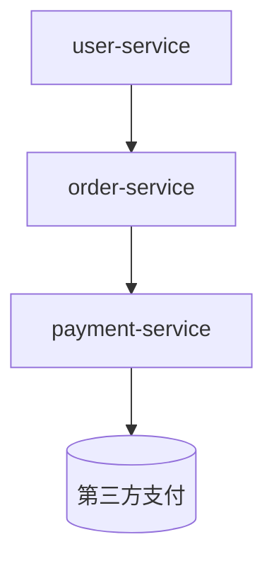

# SkyWalking 指标监控基础

## 介绍

SkyWalking是一个开源的分布式系统监控和追踪工具，它提供了强大的**指标监控**功能。指标监控是**可观测性**（Observability）的核心组成部分之一，帮助开发者了解系统的运行状态、性能表现和潜在问题。通过收集和分析指标数据，你可以快速发现异常、优化性能并确保系统稳定性。

在本章节中，你将学习：
- SkyWalking支持的指标类型
- 如何收集和查看指标数据
- 实际应用案例
- 常见指标的含义和用途

## 指标类型

SkyWalking主要监控以下几类指标：

1. **服务指标（Service Metrics）**：如请求量、响应时间、错误率等。
2. **实例指标（Instance Metrics）**：如CPU使用率、内存占用、线程数等。
3. **端点指标（Endpoint Metrics）**：如API的吞吐量、延迟等。
4. **拓扑指标（Topology Metrics）**：服务之间的调用关系和性能数据。

:::tip
指标通常以时间序列数据的形式存储，可以通过图表直观展示变化趋势。
:::

## 指标收集方式

SkyWalking通过以下方式收集指标：

1. **Agent自动上报**：SkyWalking的探针（Agent）自动收集应用指标并上报到后端（OAP Server）。
2. **Prometheus集成**：支持从Prometheus拉取指标数据。
3. **自定义指标**：通过SkyWalking的Meter系统手动上报指标。

### 示例：通过Agent上报指标

以下是一个简单的Java应用，通过SkyWalking Agent自动上报指标：

```java
// 示例：一个Spring Boot应用
@RestController
public class DemoController {
    @GetMapping("/hello")
    public String hello() {
        return "Hello, SkyWalking!";
    }
}
```

启动应用时，添加SkyWalking Agent参数：
```bash
java -javaagent:/path/to/skywalking-agent.jar -Dskywalking.agent.service_name=my-service -jar my-app.jar
```

Agent会自动收集以下指标：
- 请求量（如`/hello`的调用次数）
- 响应时间（如`/hello`的平均延迟）
- 错误率（如`/hello`的HTTP 500错误次数）

## 查看指标数据

SkyWalking的UI提供了丰富的指标可视化功能。以下是常见的查看方式：

1. **Dashboard**：在`Metrics`页面选择服务或实例，查看实时指标。
2. **拓扑图**：在`Topology`页面查看服务间的调用关系和性能数据。
3. **告警**：在`Alarm`页面配置阈值，触发异常告警。

### 示例：查看服务指标

1. 打开SkyWalking UI，进入`Metrics`选项卡。
2. 选择`Service`维度，输入服务名称（如`my-service`）。
3. 查看以下指标：
   - `service_resp_time`：平均响应时间
   - `service_cpm`：每分钟请求量
   - `service_sla`：请求成功率（SLA）

## 实际案例

### 案例：电商系统的性能监控

假设你有一个电商系统，包含以下服务：
- `user-service`：用户管理
- `order-service`：订单处理
- `payment-service`：支付服务

通过SkyWalking监控，你可以：
1. 发现`order-service`的响应时间突然增加，定位到是数据库查询慢导致的。
2. 观察到`payment-service`的错误率上升，发现是第三方支付接口超时。
3. 通过拓扑图发现`user-service`调用了`order-service`的冗余接口，优化调用链路。



:::note
实际场景中，你还可以结合日志（Logging）和链路追踪（Tracing）进一步分析问题。
:::

## 总结

- 指标监控是SkyWalking可观测性的核心功能之一。
- SkyWalking支持服务、实例、端点和拓扑等多维度的指标监控。
- 通过Agent、Prometheus或自定义方式收集指标。
- 结合UI和告警功能，快速发现和解决问题。

## 附加资源

1. **官方文档**：[SkyWalking Metrics](https://skywalking.apache.org/docs/main/latest/en/concepts-and-designs/metrics/)
2. **练习**：
   - 部署一个Spring Boot应用，接入SkyWalking Agent。
   - 在UI中查看服务的`cpm`（每分钟请求量）和`resp_time`（响应时间）指标。
   - 尝试配置一个告警规则，当错误率超过5%时触发告警。

:::caution
确保Agent版本与OAP Server版本兼容，否则可能导致指标上报失败。
:::