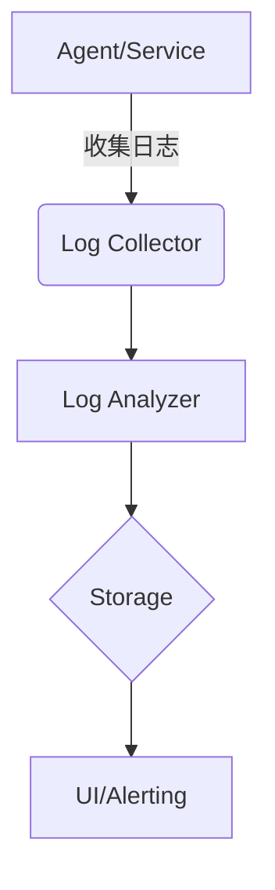

# SkyWalking 日志分析功能

## 介绍

SkyWalking的日志分析功能是其可观测性体系中的核心组件之一。它通过收集、聚合和分析分布式系统中的日志数据，帮助开发者快速定位问题，理解系统行为。与传统的独立日志系统不同，SkyWalking将日志与追踪（Tracing）、指标（Metrics）数据关联，提供**端到端的可观测性**。

:::note 为什么需要日志分析？
在微服务架构中，日志分散在各个节点。SkyWalking通过统一收集和上下文关联，让您能：
- 通过TraceID直接关联相关日志
- 可视化分析日志模式
- 设置日志报警规则
:::

## 核心功能架构



## 配置日志收集

### 1. 通过agent配置

在agent配置文件中启用日志收集（以Java agent为例）：

```properties
# agent.config
plugin.toolkit.log.grpc.reporter.server_host=${SW_GRPC_LOG_SERVER:127.0.0.1}
plugin.toolkit.log.grpc.reporter.server_port=${SW_GRPC_LOG_SERVER_PORT:11800}
plugin.toolkit.log.grpc.reporter.max_message_size=${SW_GRPC_LOG_MAX_MESSAGE_SIZE:10485760}
```

### 2. 日志格式要求

SkyWalking推荐使用JSON格式日志以便自动解析：

```json
// 示例日志
{
  "timestamp": "2023-07-20T08:45:12.123Z",
  "service": "order-service",
  "level": "ERROR",
  "traceId": "abc123...",
  "message": "Failed to process order",
  "error": {
    "class": "NullPointerException",
    "stack": "..."
  }
}
```

## 日志查询与分析

### 基本查询语法

在SkyWalking UI的日志面板中，可以使用以下查询方式：

```
service:order-service AND level:ERROR AND timestamp:[now-1h TO now]
```

### 关联追踪数据

当日志包含TraceID时，可以直接跳转到关联的调用链：

```text
[2023-07-20 09:00:00] ERROR [order-service] [TID:abc123...] Payment failed
```

## 实际案例：电商系统故障排查

**场景**：用户投诉下单失败，但无明确错误提示。

1. **步骤1**：在SkyWalking中查询`order-service`的ERROR日志
2. **步骤2**：发现库存服务连接超时日志：
   ```
   [TID:xyz456] Connection timeout to inventory-service:8080
   ```
3. **步骤3**：点击TraceID查看完整调用链，发现网络延迟问题

:::tip 最佳实践
- 为关键业务操作添加业务ID到日志
- 统一日志级别标准（ERROR/WARN/INFO）
- 记录完整的上下文信息
:::

## 高级功能

### 1. 日志采样配置

避免高流量时产生过多日志：

```yaml
# OAP配置
log-analyzer:
  sampleRate: 0.1 # 10%采样率
  slowLogThreshold: 500ms
```

### 2. 日志告警规则

配置日志频率告警：

```yaml
rules:
  - name: error_log_spike
    expression: count(logs where level == 'ERROR') > 50 in 5m
    message: "Error log spike detected"
```

## 总结

SkyWalking的日志分析功能提供了：
- 分布式日志统一收集
- 与追踪数据的自动关联
- 强大的查询分析能力
- 可配置的告警机制

## 扩展学习

1. 尝试在自己的Spring Boot应用中集成SkyWalking日志收集
2. 配置一个当日志中出现"OutOfMemoryError"时触发的告警
3. 比较SkyWalking与ELK在日志分析方面的差异

:::caution 注意事项
- 生产环境建议启用日志采样
- 敏感信息需在客户端做脱敏处理
- 日志量过大时需要调整OAP存储配置
:::