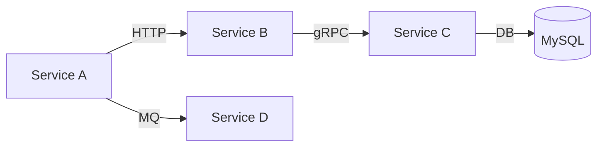
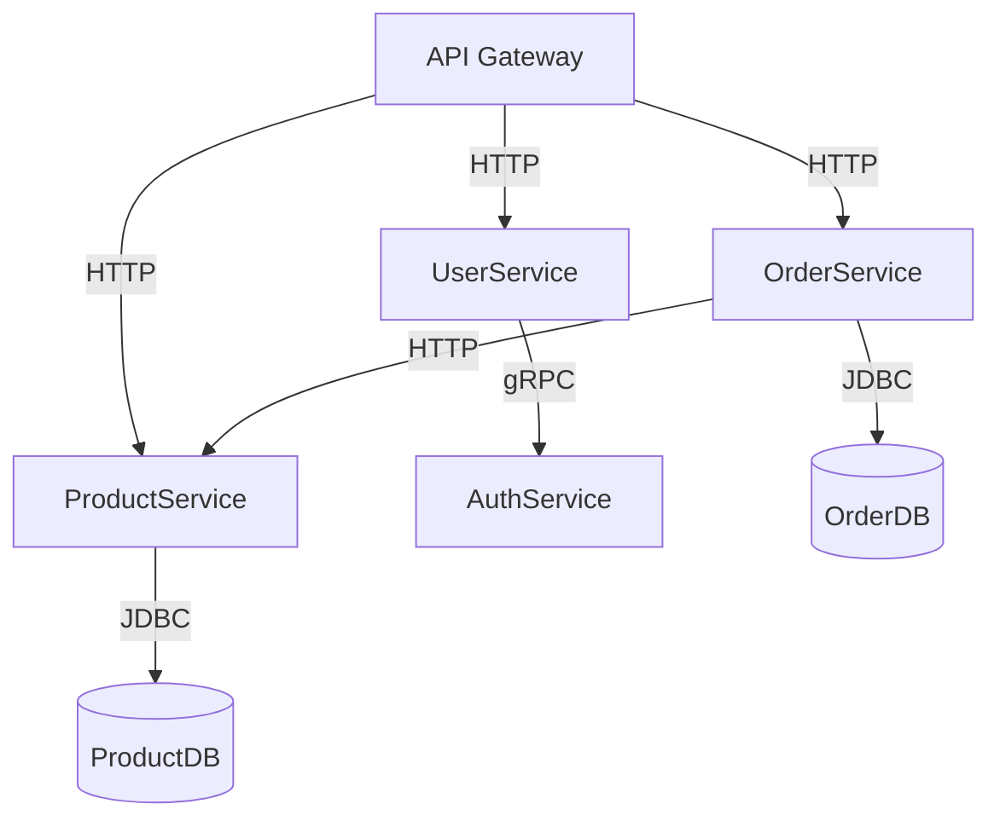

# SkyWalking 服务拓扑图

## 介绍

服务拓扑图是分布式系统可观测性的核心功能之一，它直观展示了服务之间的调用关系和依赖拓扑。SkyWalking通过自动采集跨服务调用数据，动态生成实时拓扑图，帮助开发者快速理解系统架构、定位性能瓶颈。

:::tip 为什么需要服务拓扑图？
- 可视化复杂系统中的服务依赖关系
- 快速识别异常传播路径
- 发现不合理的依赖调用
- 辅助容量规划和架构优化
:::

## 核心概念

### 1. 拓扑图元素

SkyWalking拓扑图包含以下关键元素：

- **节点(Node)**：表示服务、实例或端点
  - 颜色反映健康状态（红/黄/绿）
  - 大小反映流量负载
- **边(Edge)**：表示调用关系
  - 线条粗细反映流量大小
  - 颜色反映错误率

### 2. 数据来源

拓扑数据通过以下方式采集：

1. 服务间调用链追踪（Trace）
2. 服务注册中心信息
3. 基础设施探针数据



## 实战演示

### 案例：电商系统拓扑分析

假设我们有一个简单的电商系统：



#### 关键观察点：

1. **异常传播**：如果AuthService出现故障，会影响所有经过UserService的请求
2. **循环依赖**：检查OrderService和ProductService是否存在不合理的相互调用
3. **数据库负载**：观察哪些服务对数据库压力最大

### 访问拓扑图

在SkyWalking UI中，通过以下路径访问：
1. 导航到"Topology"菜单
2. 选择时间范围和服务范围
3. 使用鼠标悬停查看详细信息

:::note 交互操作
- 点击节点：查看服务指标详情
- 拖动节点：重新布局拓扑图
- 双击节点：聚焦特定服务
:::

## 高级功能

### 1. 自定义拓扑分组

通过`service-grouping.yaml`配置自定义服务分组规则：

```yaml
grouping:
  - name: "business-services"
    items: ["UserService", "OrderService", "ProductService"]
  - name: "infra-services"
    items: ["MySQL", "Redis"]
```

### 2. 拓扑对比分析

使用时间对比功能分析拓扑变化：
1. 打开时间选择器
2. 启用"Compare"模式
3. 选择两个不同时间段

## 常见问题

:::caution 拓扑图不完整？
可能原因：
- 部分服务未接入SkyWalking探针
- 调用链采样率设置过低
- 网络分区导致数据上报失败
:::

## 总结

SkyWalking服务拓扑图提供了：
- 系统架构的实时可视化
- 故障影响的快速定位
- 服务依赖的直观理解

## 扩展练习

1. 在你的测试环境中部署两个相互调用的服务，观察拓扑图变化
2. 模拟一个服务故障，观察拓扑图如何反映该异常
3. 尝试配置自定义服务分组规则

## 进一步学习

推荐接下来学习：
- SkyWalking告警配置
- 服务性能指标分析
- 分布式追踪详情解读