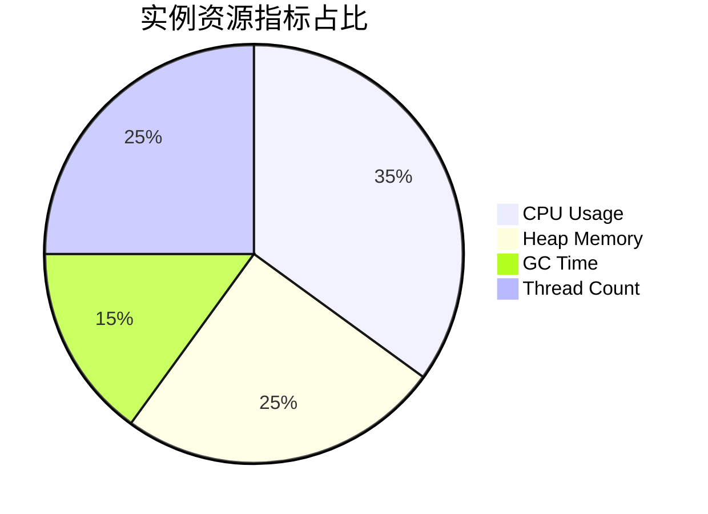
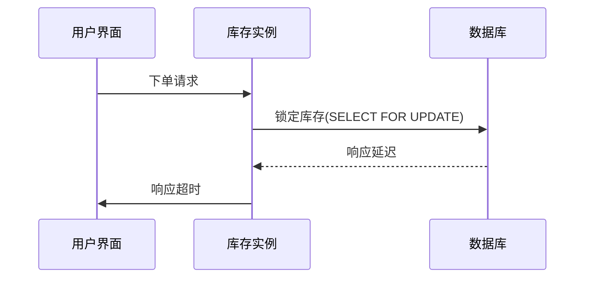

# SkyWalking 服务实例监控

## 什么是服务实例监控？

在分布式系统中，**服务实例**是服务的最小运行单元（如一个JVM进程、K8s Pod等）。SkyWalking的服务实例监控功能能够实时采集并展示：
- 实例的CPU/内存使用率
- 请求吞吐量和响应时间
- 实例间的调用拓扑关系
- 线程堆栈和异常信息

:::note 实例 vs 服务
- **服务**：逻辑概念（如"订单服务"）
- **实例**：物理运行单元（如"订单服务-容器ID: ab3d"）
:::

## 核心监控指标

### 1. 基础资源指标
通过```mermaid```展示指标关系：



### 2. 请求指标
示例指标表格：

| 指标名称          | 说明                          | 健康阈值       |
|-------------------|-----------------------------|---------------|
| Avg Response Time | 平均响应时间(ms)              | `< 500ms`       |
| Success Rate      | 请求成功率                   | `> 99%`         |
| Throughput        | 每分钟请求数                 | 依业务而定     |

## 实战演示

### 示例1：查看实例状态
在SkyWalking UI中查看实例的实时状态：

1. 进入`Instance`面板
2. 选择目标服务（如`inventory-service`）
3. 查看实例列表及其健康状态

:::tip
健康状态颜色标识：
- <span style={{color:'#52c41a'}}>绿色</span>：正常
- <span style={{color:'#faad14'}}>黄色</span>：警告
- <span style={{color:'#f5222d'}}>红色</span>：异常
:::

### 示例2：通过OAL查询实例指标
使用SkyWalking的OAL(Observability Analysis Language)查询实例指标：

```sql
-- 查询实例的响应时间百分位
instance_resp_time = from(ServiceInstance.*).percentile(50,75,90,95,99)

-- 查询实例错误率
instance_error_rate = from(ServiceInstance.*).filter(status == false).percent()
```

## 真实案例场景

**电商系统库存服务监控**：

1. **问题现象**：某实例CPU持续超过80%
2. **排查步骤**：
   - 检查实例的线程堆栈
   - 发现存在`库存锁定`操作的线程阻塞
3. **解决方案**：优化数据库索引后恢复



## 总结与扩展

### 关键点总结
- 实例监控是微服务可观测性的基础
- 需要关注资源指标和业务指标的组合
- 结合拓扑图能快速定位问题实例

### 进阶练习
1. 尝试为你的服务添加自定义实例标签
   ```yaml
   # agent.config
   agent.instance_properties[key1]=value1
   ```
2. 配置实例指标的告警规则

### 扩展阅读
- [SkyWalking Instance Metrics官方文档](https://skywalking.apache.org/docs/)
- 《分布式服务监控实战》第4章