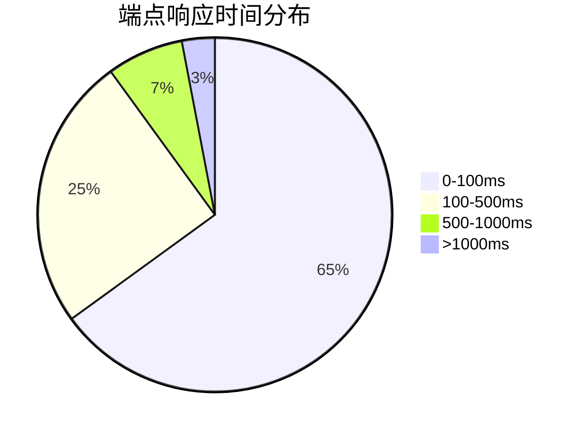
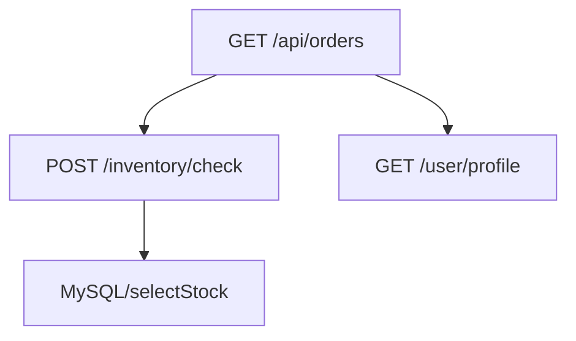

# SkyWalking 端点分析

## 介绍

在分布式系统中，**端点（Endpoint）**通常指代服务暴露的接口，例如HTTP API、gRPC方法或数据库查询入口。SkyWalking的端点分析功能帮助开发者监控这些关键接口的性能指标，包括响应时间、吞吐量和错误率。

端点分析是SkyWalking可观测性能力的核心组成部分，它能：
- 展示单个端点的调用拓扑关系
- 统计端点的响应时间百分位（P50/P75/P90/P95/P99）
- 追踪慢请求的完整调用链
- 识别异常端点（高错误率或超长响应时间）

## 基础概念

### 1. 端点指标

SkyWalking自动收集以下端点级指标：

| 指标名称          | 说明                          |
|-------------------|-----------------------------|
| Avg Response Time | 平均响应时间（毫秒）           |
| CPM               | 每分钟调用次数（Call Per Minute）|
| SLA               | 成功请求百分比（Service Level Agreement）|
| Percentile        | 响应时间分布（P50/P75/P90等）  |

### 2. 端点类型

常见的端点类型包括：
- HTTP URL（如 `GET /api/users`）
- gRPC方法（如 `com.example.UserService/Query`）
- 数据库操作（如 `MySQL/selectUsers`）
- 消息队列主题（如 `Kafka/order_topic`）

## 实战分析

### 案例：电商订单查询API

假设我们有一个订单查询端点 `GET /api/orders/{id}`，以下是SkyWalking可能展示的数据：



### 代码示例：手动追踪端点

对于需要特殊监控的代码块，可以手动添加追踪：

```java
@GetMapping("/api/orders/{id}")
public Order getOrder(@PathVariable String id) {
    // 创建自定义跨度
    Span span = ContextManager.createLocalSpan("OrderBusinessLogic");
    try {
        // 业务逻辑...
        return orderService.findOrder(id);
    } finally {
        span.tag("order_id", id);  // 添加标签
        span.setOperationName("OrderBusinessLogic/" + id);  // 修改操作名
        span.asyncFinish();
    }
}
```

:::tip 最佳实践
- 为端点设置有意义的名称（避免使用动态URL作为完整端点名）
- 关键业务参数应作为tag记录（如 `user_id=123`）
- 异步操作需要明确调用 `asyncFinish()`
:::

## 高级功能

### 1. 端点依赖分析

SkyWalking可以展示端点之间的调用关系：



### 2. 慢端点排查

当发现慢端点时，可以：
1. 在SkyWalking UI中筛选响应时间 >1s 的请求
2. 查看具体Trace的火焰图
3. 分析各Span的耗时占比

:::warning 常见性能问题
- 数据库查询缺少索引（表现为长时间MySQL Span）
- 循环远程调用（多个相似RPC Span）
- 大对象序列化（JSON编码耗时高）
:::

## 实际应用场景

### 场景：突发流量导致端点延迟

**现象**：
- `/api/products` 的P99响应时间从200ms升至1200ms
- 错误率从0.1%升至15%

**排查步骤**：
1. 确认时间窗口与促销活动重合
2. 检查该端点依赖的库存服务响应时间
3. 发现库存服务的数据库CPU达到100%
4. 优化SQL查询并增加缓存层

## 总结

SkyWalking端点分析提供了：
- 端点的**性能基准线**建立能力
- 问题端点的**快速定位**手段
- 系统瓶颈的**可视化分析**方法

## 延伸学习

推荐练习：
1. 在你的测试环境中部署SkyWalking
2. 创建一个有明显性能问题的端点
3. 使用SkyWalking定位并解决问题

附加资源：
- [SkyWalking官方文档 - 端点指标](https://skywalking.apache.org/docs/)
- [分布式追踪实战指南](https://example.com/tracing-guide)