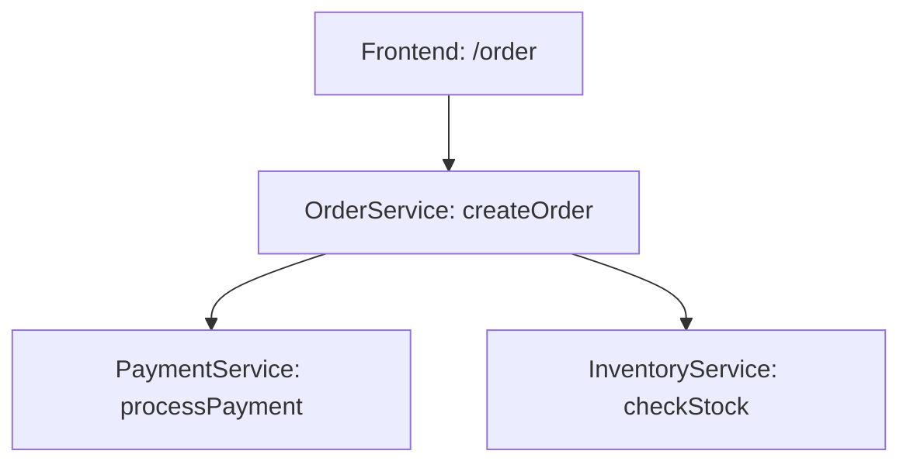
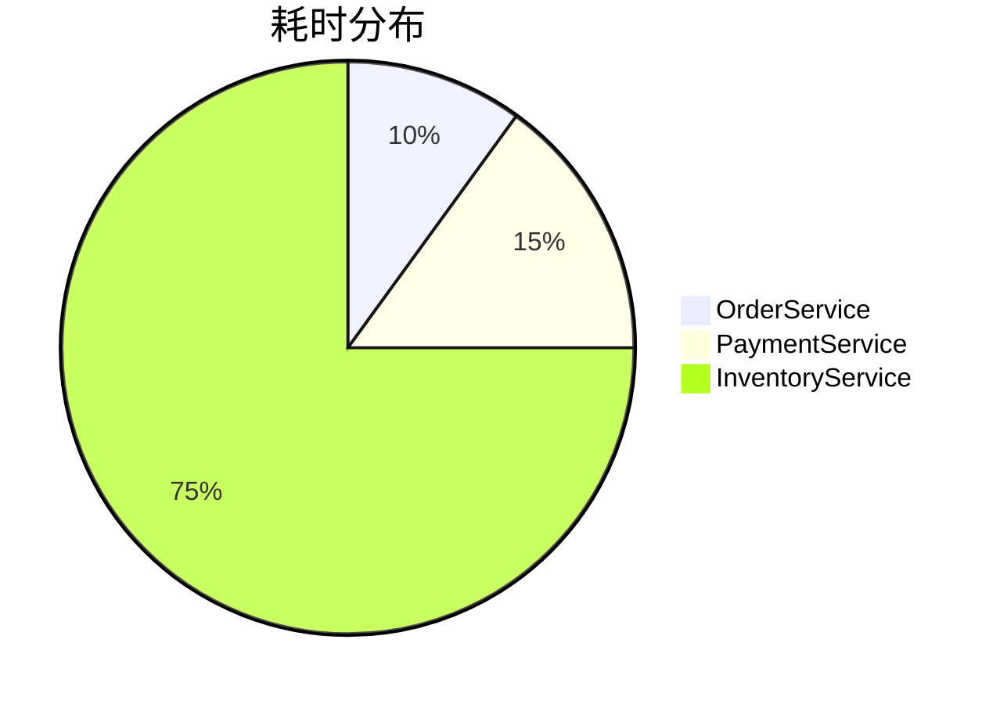

# SkyWalking 调用链路追踪

## 介绍

在现代分布式系统中，一个用户请求可能跨越多个服务、数据库和中间件。当出现性能问题或错误时，如何快速定位问题源头？**调用链路追踪（Distributed Tracing）** 正是解决这一问题的关键技术。SkyWalking作为一款优秀的APM（应用性能监控）工具，提供了强大的分布式追踪能力，帮助开发者可视化请求的完整路径，分析各环节耗时与状态。

## 核心概念

### 1. 什么是调用链路？

调用链路（Trace）代表一个完整请求的生命周期，由多个**跨度（Span）**组成。每个Span记录了一个服务内部的执行单元（如方法调用、数据库访问等），并包含以下关键信息：
- 操作名称（Operation Name）
- 开始/结束时间戳
- 标签（Tags）和日志（Logs）
- 父子关系（Parent/Child Span）

### 2. SkyWalking的追踪模型

SkyWalking采用**树形结构**组织Span数据：
- **根Span（Root Span）**：请求的入口点（如HTTP接口）
- **子Span（Child Span）**：下游服务或本地方法调用



## 实战演示

### 示例1：查看追踪数据

假设我们有一个订单服务调用支付服务，以下是SkyWalking UI中显示的Trace示例：

```
Trace ID: 4a3b2c1d
Duration: 320ms
Spans:
- [HTTP GET /order] (120ms)
  |- [OrderService.createOrder] (80ms)
    |- [HTTP POST payment-service/process] (60ms)
```

:::tip
在SkyWalking UI中，你可以通过**拓扑图**直观查看服务间依赖关系，或通过**Trace列表**筛选特定请求。
:::

### 示例2：手动埋点

如果你需要追踪自定义方法，可以使用SkyWalking的Java Agent API：

```java
import org.apache.skywalking.apm.toolkit.trace.Trace;
import org.apache.skywalking.apm.toolkit.trace.TraceContext;

@Trace // 自动追踪该方法
public String processPayment(PaymentRequest request) {
    // 获取当前Trace ID
    String traceId = TraceContext.traceId();
    
    // 添加自定义标签
    ActiveSpan.tag("payment_method", request.getMethod());
    
    // 业务逻辑...
}
```

## 真实案例

### 电商平台性能优化

某电商平台发现"下单"接口平均响应时间超过2秒。通过SkyWalking追踪分析：
1. 发现80%时间消耗在库存服务查询
2. 进一步定位到某个SQL查询未使用索引
3. 优化后响应时间降至400ms



## 总结

SkyWalking的调用链路追踪能帮助你：
- 可视化请求在分布式系统中的流转
- 快速定位性能瓶颈
- 分析跨服务异常传播路径
- 优化系统架构与代码逻辑

## 进阶学习

1. 官方文档：[SkyWalking Tracing](https://skywalking.apache.org/docs/)
2. 实践建议：
   - 在生产环境启用采样率控制
   - 结合日志与指标数据进行根因分析
3. 扩展思考：
   - 如何在高并发场景下降低追踪开销？
   - 怎样利用Trace数据构建服务依赖图谱？

:::note 练习
尝试在你的开发环境中：
1. 部署SkyWalking并接入一个Spring Boot应用
2. 触发一个跨服务调用并查看Trace数据
3. 添加自定义Span标签记录业务参数
:::