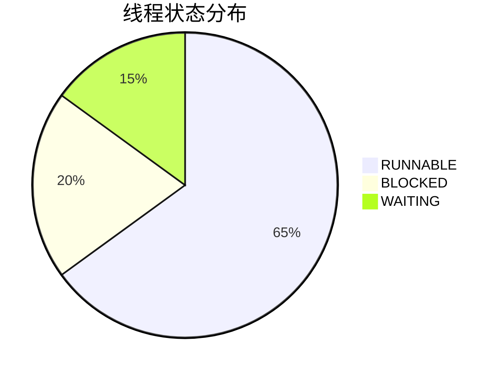

## 什么是性能剖析？

性能剖析（Performance Profiling）是分析应用程序运行时行为的过程，用于识别性能瓶颈、资源消耗热点和优化机会。在分布式系统中，SkyWalking通过**分布式追踪**和**线程堆栈分析**提供端到端的性能剖析能力，帮助开发者定位慢请求、高CPU占用或死锁等问题。

:::tip 核心能力
- **方法级耗时分析**：精确到代码行或方法调用链的耗时统计。
- **线程状态监控**：识别阻塞、等待或CPU密集的线程。
- **跨服务关联**：在微服务架构中追踪跨服务的性能影响。
:::

## 性能剖析实战

### 1. 启用SkyWalking性能剖析

在SkyWalking中，性能剖析通过**任务**触发。以下是一个通过API创建剖析任务的示例：

```bash
curl -X POST http://localhost:12800/task \
  -H 'Content-Type: application/json' \
  -d '{
    "service": "your-service-name",
    "endpoint": "/your-api-path",
    "duration": 10,  # 剖析持续时间（秒）
    "minDurationThreshold": 50  # 仅剖析耗时超过50ms的请求
  }'
```

响应示例：
```json
{"taskId":"a1b2c3d4","success":true}
```

### 2. 分析剖析结果

任务完成后，在SkyWalking UI的`Performance Profile`页面查看结果。典型报告包含：
- **调用树（Call Tree）**：显示方法调用层级和耗时占比。
- **线程分析**：展示线程状态（RUNNABLE/BLOCKED等）和时间分布。



### 3. 代码级优化案例

假设剖析发现`DatabaseService.query()`耗时占比80%：
```java
// 优化前
public List<User> query(String sql) {
    return jdbcTemplate.query(sql, rowMapper);  // 未使用预编译
}

// 优化后：使用预编译SQL
public List<User> query(String sql, Object... params) {
    return jdbcTemplate.query(sql, params, rowMapper);
}
```

优化后效果对比：
| 指标          | 优化前 | 优化后 |
|---------------|--------|--------|
| 平均耗时(ms)  | 120    | 35     |
| CPU使用率(%)  | 75     | 40     |

## 实际应用场景

### 电商系统秒杀活动
**问题现象**：下单接口在流量高峰时响应时间从200ms飙升到2s。

**SkyWalking剖析步骤**：
1. 创建针对`/createOrder`的剖析任务。
2. 发现`InventoryService.checkStock()`存在线程竞争。
3. 通过线程堆栈确认是同步锁导致阻塞。

**解决方案**：
- 将同步锁改为分布式缓存（如Redis）的原子操作。
- 结果：P99延迟降低至300ms。

## 总结

SkyWalking性能剖析的核心价值在于：
- **精准定位**：从服务→接口→方法层层下钻。
- **全栈可视**：结合拓扑图和调用链分析上下文。
- **持续优化**：支持周期性或触发式剖析。

:::note 延伸练习
1. 对您的应用发起一个15秒的剖析任务。
2. 找到耗时最高的3个方法，思考优化方案。
3. 比较优化前后的追踪数据差异。
:::

**扩展阅读**：
- [SkyWalking官方文档：性能剖析](https://skywalking.apache.org/docs/)
- 《分布式系统观测性实战》第5章