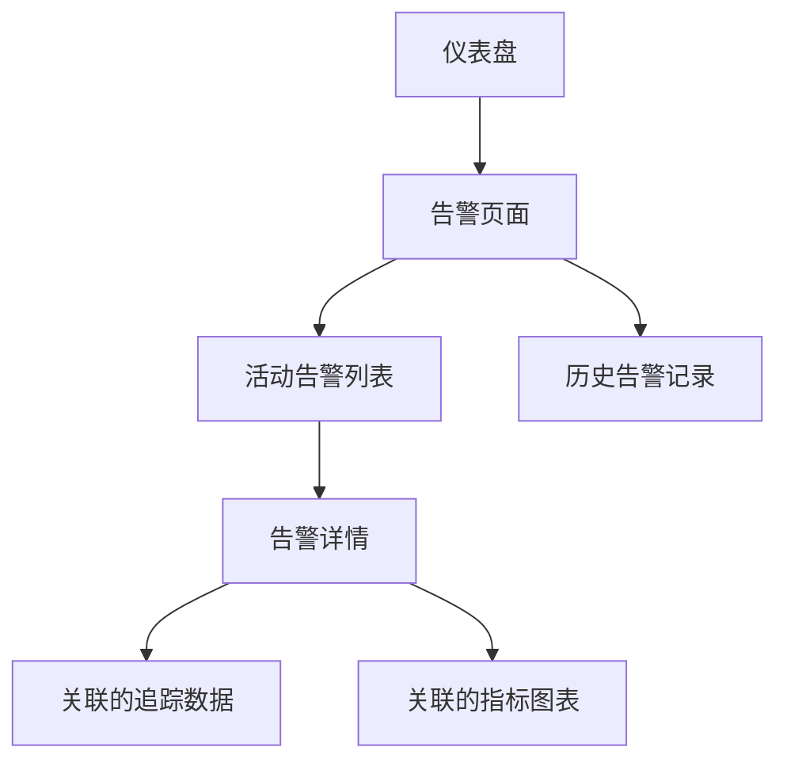

# SkyWalking 告警指标

## 介绍

SkyWalking的告警指标系统是其可观测性功能的核心组成部分，它允许开发者定义规则来监控服务、实例和端点的关键性能指标（KPIs）。当这些指标超过预设阈值时，系统会触发告警，帮助团队及时发现潜在问题。

告警指标通过以下方式工作：
1. 定期从收集的遥测数据中评估指标
2. 将当前值与告警规则中定义的阈值进行比较
3. 当条件满足时触发告警通知

:::tip 初学者提示
告警指标不同于日志或追踪数据 - 它们是系统状态的量化测量，专门用于异常检测而非问题诊断。
:::

## 核心告警指标

SkyWalking提供多种内置指标，主要分为三类：

### 1. 服务级别指标
- `service_resp_time` - 服务响应时间（毫秒）
- `service_sla` - 服务可用性（百分比）
- `service_cpm` - 每分钟调用次数

### 2. 端点级别指标
- `endpoint_resp_time` - 端点响应时间
- `endpoint_cpm` - 端点每分钟调用次数

### 3. 实例级别指标
- `instance_jvm_memory_heap_used` - JVM堆内存使用量
- `instance_jvm_gc_time` - GC耗时

## 告警规则配置

告警规则通过YAML文件定义，通常位于 `config/alarm-settings.yml`。以下是一个基本示例：

```yaml
rules:
  service_resp_time_rule:
    metrics-name: service_resp_time
    op: ">"
    threshold: 1000
    period: 10
    count: 3
    silence-period: 5
    message: 服务 {name} 的平均响应时间在过去10分钟内超过1秒达3次
```

配置参数说明：
- `metrics-name`: 要监控的指标名称
- `op`: 比较操作符（`>, <, =`）
- `threshold`: 阈值
- `period`: 评估周期（分钟）
- `count`: 触发告警需要满足条件的次数
- `silence-period`: 告警静默期（分钟）
- `message`: 告警消息模板

:::note 配置生效
修改告警配置后需要重启OAP服务或通过动态配置API更新。
:::

## 实际案例

### 案例1：高延迟检测
```yaml
high_resp_time_rule:
  metrics-name: endpoint_resp_time
  op: ">"
  threshold: 2000
  period: 5
  count: 2
  message: 端点 {name} 响应时间超过2秒
```

当某个API端点（如`/checkout`）的响应时间连续2个周期（每个周期5分钟）超过2秒时，会触发告警。

### 案例2：JVM内存泄漏检测
```yaml
jvm_heap_usage_rule:
  metrics-name: instance_jvm_memory_heap_used
  op: ">"
  threshold: 80
  period: 3
  count: 3
  message: 实例 {name} 的JVM堆内存使用率超过80%
```

## 告警通知集成

SkyWalking支持多种通知方式：

```yaml
webhooks:
  - url: http://your-webhook-server/alerts
    secret: your-secret-key
```

通知消息示例（JSON格式）：
```json
{
  "scope": "SERVICE",
  "name": "order-service",
  "ruleName": "high_resp_time_rule",
  "alarmMessage": "服务 order-service 的平均响应时间在过去10分钟内超过1秒达3次",
  "startTime": 1625097600000
}
```

## 可视化与调试

使用SkyWalking UI查看告警：



## 最佳实践

1. **分层告警**：为不同环境（开发/生产）设置不同阈值
2. **避免告警疲劳**：合理设置`silence-period`
3. **上下文丰富**：在告警消息中包含足够的问题上下文
4. **定期评审**：每月审查告警规则的有效性

## 总结

SkyWalking的告警指标系统提供了强大的实时监控能力，通过合理配置可以帮助团队：
- 及时发现性能退化
- 预防系统宕机
- 快速定位问题根源

## 扩展学习

1. 尝试为你的测试服务配置一个CPU使用率告警
2. 研究如何将告警与Slack或Teams集成
3. 了解指标聚合函数（如`percentile`）在告警中的应用

:::warning 注意事项
过度告警会导致"狼来了"效应，建议从少量关键指标开始，逐步完善你的告警策略。
:::