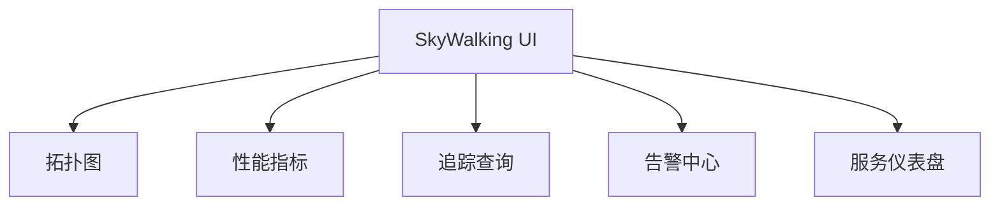
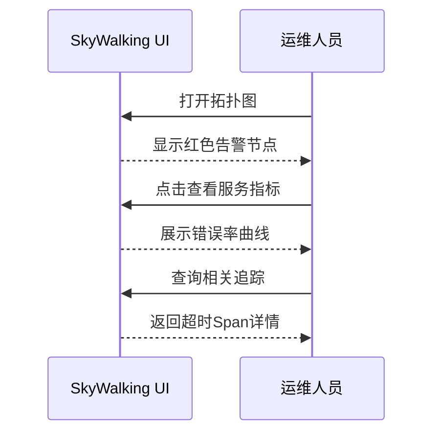

## 什么是SkyWalking UI？

SkyWalking UI是Apache SkyWalking项目的可视化控制台，用于展示从分布式系统收集的监控数据。它通过直观的图表和交互式界面，帮助开发者快速定位性能瓶颈、分析调用链路，并监控服务健康状态。

:::note 核心价值
- **实时可视化**：将复杂的监控指标转化为图形化展示
- **多维度分析**：支持服务/实例/端点等多层级数据钻取
- **开箱即用**：默认提供丰富的仪表盘模板
:::

## 主要功能模块



### 1. 拓扑图（Topology）
展示服务间调用关系的动态拓扑图，节点大小反映流量权重，连线颜色标识健康状态：

```json
// 示例拓扑数据（简化版）
{
  "nodes": [
    {"id": "order-service", "type": "service", "cpm": 1200},
    {"id": "payment-service", "type": "service", "cpm": 800}
  ],
  "calls": [
    {"source": "order-service", "target": "payment-service", "latency": 200}
  ]
}
```

### 2. 性能指标监控
提供关键指标的时序图表，包括：
- 吞吐量（Requests/min）
- 响应时间（Latency）
- 成功率（SLA）
- JVM/CPU等资源指标

:::tip 实践技巧
使用时间选择器对比不同时段的性能表现，快速识别异常波动。
:::

### 3. 分布式追踪
通过TraceID查询完整的调用链路：

```
TraceID示例：4f56b8a8-7a2e-4a9b-b8c2-42a1b7a8e9f1
```

典型追踪视图包含：
- 调用树形结构
- 各跨度(Span)的耗时详情
- 错误标记与日志关联

## 实际应用案例

**电商系统故障排查**：
1. 在拓扑图发现`库存服务`节点变红
2. 进入服务仪表盘，发现错误率突增至15%
3. 查询相关追踪，定位到超时的数据库查询
4. 检查关联的JVM指标确认内存泄漏



## 界面操作指南

### 基本导航流程
1. 顶部时间范围选择器
2. 左侧菜单切换功能模块
3. 主内容区数据交互
4. 右键上下文菜单（拓扑图专属）

### 常用快捷键
| 操作               | 快捷键       |
|--------------------|-------------|
| 刷新当前数据       | Ctrl + R    |
| 时间范围快速选择   | Alt + 1~6   |
| 追踪详情展开/折叠  | Space       |

## 总结与进阶

SkyWalking UI将复杂的监控数据转化为直观的可视化信息，是分布式系统观测的核心工具。关键要点：
- 掌握拓扑图与指标关联分析
- 熟练使用追踪查询定位问题
- 结合告警实现主动监控

**推荐练习**：
1. 在演示环境模拟服务超时，通过UI定位问题点
2. 创建自定义指标仪表盘
3. 配置并触发一个告警规则

:::caution 注意事项
- 大数据量查询可能影响性能，合理设置时间范围
- 浏览器兼容性要求：Chrome/Firefox最新版
:::