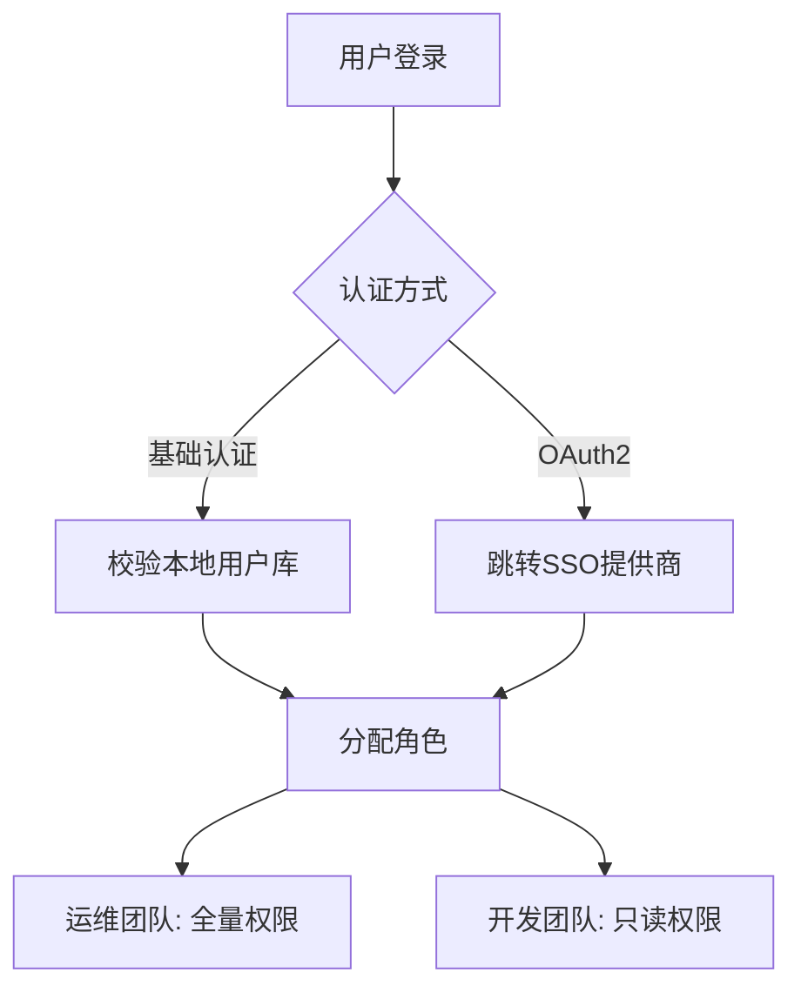

# SkyWalking UI登录配置

## 介绍

SkyWalking UI是Apache SkyWalking分布式系统监控平台的可视化界面，默认情况下允许匿名访问。但在生产环境中，**配置登录认证**是保护敏感监控数据的关键步骤。本文将指导你通过基础认证（用户名/密码）和OAuth2两种方式实现安全访问控制。

:::tip 为什么需要登录配置？
- 防止未授权用户查看系统监控数据
- 满足企业级安全合规要求
- 实现多租户场景下的权限隔离
:::

---

## 基础认证配置

### 1. 修改配置文件

编辑SkyWalking OAP服务器的`application.yml`（位于`config`目录），启用基础认证模块：

```yaml
security:
  selector: ${SW_SECURITY:basic-auth}
  basic-auth:
    # 用户列表
    users:
      - username: admin
        password: "{bcrypt}$2a$10$N9qo8uLOickgx2ZMRZoMy..."  # 使用BCrypt加密
      - username: guest
        password: "{SHA-1}5baa61e4c9b93f3f0682250b6cf8331b7ee68fd8"  # SHA-1加密
```

### 2. 密码加密方式

支持多种哈希算法，推荐使用BCrypt：

```bash
# 使用BCrypt生成密码（需要安装htpasswd工具）
htpasswd -nbBC 10 admin yourpassword
```

:::warning 安全提示
禁止使用明文密码！始终使用`{algorithm}`前缀指定哈希算法。
:::

### 3. 重启OAP服务

应用配置后重启服务：
```bash
bin/oapService.sh restart
```

---

## OAuth2集成示例

以下是与GitHub OAuth2集成的配置示例：

```yaml
security:
  selector: ${SW_SECURITY:oauth2}
  oauth2:
    provider: github
    clientId: "your_github_client_id"
    clientSecret: "your_github_client_secret"
    callbackUrl: "http://your-domain.com/oauth2/callback"
    scopes: "user:email"
```

### 配置流程
1. 在GitHub开发者设置中创建OAuth App
2. 获取`clientId`和`clientSecret`
3. 设置合法的`callbackUrl`
4. 指定所需权限范围（scopes）

:::note 支持的OAuth2提供商
SkyWalking 9.x+ 原生支持：GitHub、Google、Azure AD等
:::

---

## 实际案例：企业多团队场景

假设某公司有运维、开发两个团队需要不同权限：



对应配置片段：
```yaml
users:
  - username: ops-team
    password: "{bcrypt}...ops..."
    roles: [ADMIN]
  - username: dev-team
    password: "{bcrypt}...dev..."
    roles: [USER]
```

---

## 测试验证

1. 访问SkyWalking UI（默认8080端口）
2. 应看到登录页面而非直接仪表盘
3. 使用配置的凭据登录

成功登录后，浏览器开发者工具可检查：
- 本地认证：`Authorization: Basic`头
- OAuth2流程：`/oauth2/callback`重定向

---

## 总结

关键配置要点：
- 生产环境必须启用认证
- 基础认证适合简单场景
- OAuth2更适合企业SSO集成
- 密码必须加密存储

扩展练习：
1. 尝试配置Google OAuth2
2. 实现基于LDAP的认证集成
3. 测试不同角色的权限差异

遇到问题时，可参考：
- [SkyWalking官方安全文档](https://skywalking.apache.org/docs/)
- Spring Security的BCrypt实现
- OAuth2标准协议文档