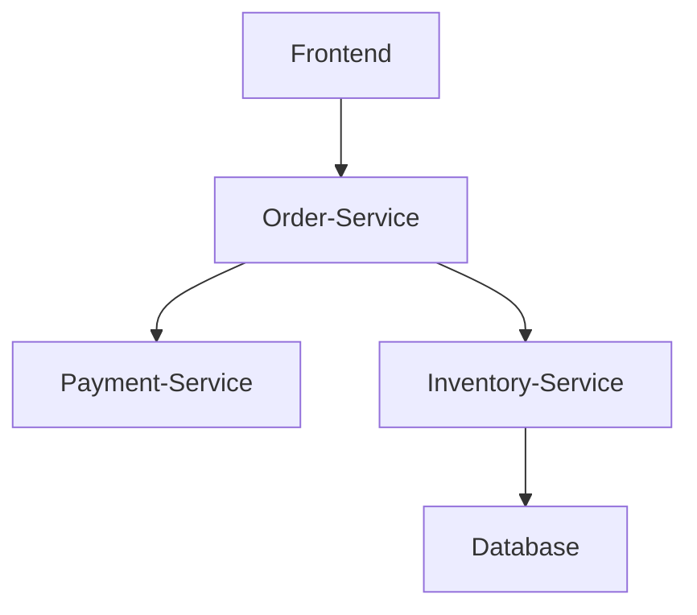

# SkyWalking UI数据查询

## 介绍

SkyWalking UI是Apache SkyWalking的可视化界面，用于展示和分析分布式系统的监控数据。通过UI的数据查询功能，用户可以快速获取服务性能指标、拓扑关系、追踪详情等信息。本章将详细介绍SkyWalking UI的查询语法、常用操作和实际应用场景。

## 基础查询语法

SkyWalking UI支持多种查询方式，主要包括：

1. **指标查询**：通过PromQL风格的语法查询监控指标
2. **追踪查询**：通过条件筛选特定的追踪记录
3. **拓扑查询**：可视化展示服务间调用关系

### 指标查询示例

查询某服务最近5分钟的请求成功率：

```graphql
service_resp_time{service="order-service"}[5m]
```

输出结果示例：

```
order-service 2023-01-01T12:00:00Z 98.5%
order-service 2023-01-01T12:01:00Z 97.8%
order-service 2023-01-01T12:02:00Z 99.1%
```

:::note
指标查询支持时间范围选择器，可以通过UI界面快速切换时间范围。
:::

## 追踪查询详解

追踪查询可以帮助开发者定位性能问题。以下是常见的查询条件：

| 字段 | 说明 | 示例值 |
|------|------|--------|
| service | 服务名称 | `order-service` |
| endpoint | 端点/接口路径 | `/api/orders` |
| traceId | 追踪ID | `3d7a1b...` |
| duration | 持续时间 | `>500ms` |

### 追踪查询示例

查找`order-service`中耗时超过1秒的请求：

```sql
service=order-service AND duration>1s
```

## 实际案例

### 案例1：定位高延迟接口

1. 在拓扑图中发现`payment-service`节点显示红色警告
2. 查询该服务的响应时间指标：
   ```graphql
   service_resp_time{service="payment-service"}[10m]
   ```
3. 筛选耗时超过500ms的追踪记录：
   ```sql
   service=payment-service AND duration>500ms
   ```
4. 分析具体追踪详情，发现是第三方支付接口响应缓慢

### 案例2：服务依赖分析



通过拓扑查询发现`order-service`同时依赖`payment-service`和`inventory-service`，而后者又依赖数据库。当订单创建变慢时，可以快速定位可能的瓶颈点。

## 高级功能

### 1. 自定义仪表盘

SkyWalking UI允许创建自定义仪表盘，组合多个相关指标：

```json
{
  "title": "订单服务监控",
  "widgets": [
    {
      "type": "line-chart",
      "query": "service_resp_time{service='order-service'}[5m]"
    },
    {
      "type": "pie-chart",
      "query": "service_error_rate{service='order-service'}[5m]"
    }
  ]
}
```

### 2. 告警集成

通过UI设置简单的阈值告警：

:::tip
在"Alarm"页面可以设置当错误率超过5%时触发告警
:::

## 总结

SkyWalking UI提供了强大的数据查询能力，主要特点包括：
- 直观的指标查询界面
- 灵活的追踪记录筛选
- 可视化的拓扑分析
- 自定义仪表盘功能

## 延伸学习

1. 尝试查询你部署的服务的基础指标
2. 创建一个自定义仪表盘，包含响应时间和错误率
3. 使用追踪查询功能定位一个实际性能问题

:::caution
查询大量数据时可能影响UI性能，建议合理设置时间范围
:::