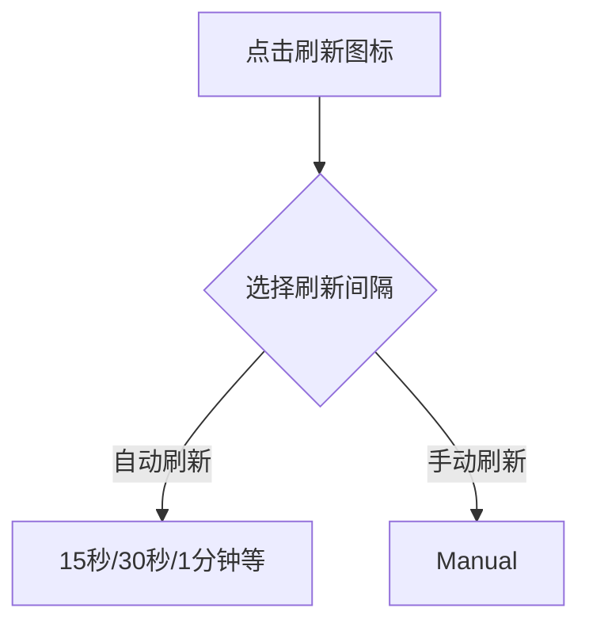

# SkyWalking UI时间选择器

## 介绍

SkyWalking UI的时间选择器是一个强大的工具，它允许用户灵活地查询和分析特定时间范围内的监控数据。无论是排查性能问题还是分析历史趋势，时间选择器都能帮助你快速定位目标时间段的数据。

在SkyWalking的Web界面中，时间选择器通常位于页面右上角，提供多种时间范围选项和自定义时间选择功能。

## 基本功能

SkyWalking UI时间选择器提供以下主要功能：

1. **预设时间范围**：快速选择常见的时间段（如最近15分钟、1小时、1天等）
2. **自定义时间范围**：精确选择任意起止时间
3. **时间刷新**：自动或手动刷新数据
4. **时区设置**：支持不同时区的数据显示

## 预设时间范围

SkyWalking提供了多种预设时间范围选项，方便快速查询：

```
最近15分钟
最近1小时
最近3小时
最近6小时
最近12小时
最近1天
最近3天
最近7天
```

这些预设选项覆盖了大多数常见的监控场景需求。

## 自定义时间选择

对于更精确的分析需求，你可以使用自定义时间选择功能：

1. 点击时间选择器
2. 选择"Custom"选项
3. 在弹出的日历界面中选择开始和结束时间
4. 点击"Apply"应用选择

:::tip
自定义时间选择支持精确到分钟的时间设置，非常适合排查特定时间点发生的问题。
:::

## 自动刷新设置

SkyWalking UI允许你设置数据的自动刷新频率：

1. 点击时间选择器旁边的刷新图标
2. 选择刷新间隔（如15秒、30秒、1分钟等）
3. 或选择"Manual"进行手动刷新



## 实际应用案例

### 案例1：排查服务突然变慢的问题

1. 收到告警：某服务响应时间在10:30左右突然升高
2. 使用自定义时间选择器，设置时间为10:20-10:40
3. 分析该时间段内的服务指标，定位问题原因

### 案例2：每日性能趋势分析

1. 选择预设时间范围"最近7天"
2. 查看服务性能指标的变化趋势
3. 识别是否存在周期性性能波动

## 高级技巧

1. **时区切换**：如果你的团队分布在多个时区，可以在用户设置中切换时区显示
2. **URL分享**：选择的时间范围会保存在URL中，方便分享特定时间段的监控视图
3. **快捷键**：某些版本支持快捷键快速切换时间范围

## 总结

SkyWalking UI的时间选择器是监控数据分析的重要入口，掌握它的使用技巧可以显著提高排查问题的效率。通过合理使用预设时间范围和自定义选择功能，你可以快速定位到关键时间段的监控数据。

## 练习与进一步学习

1. 尝试使用不同的预设时间范围查看服务的各项指标
2. 模拟一个性能问题场景，练习使用自定义时间选择器定位问题
3. 比较不同刷新频率下数据的实时性差异

:::note
要深入了解SkyWalking的监控数据模型，可以参考官方文档中关于指标采集和存储的部分。
:::