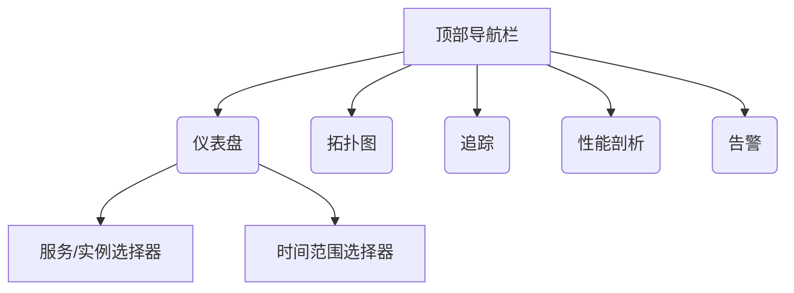
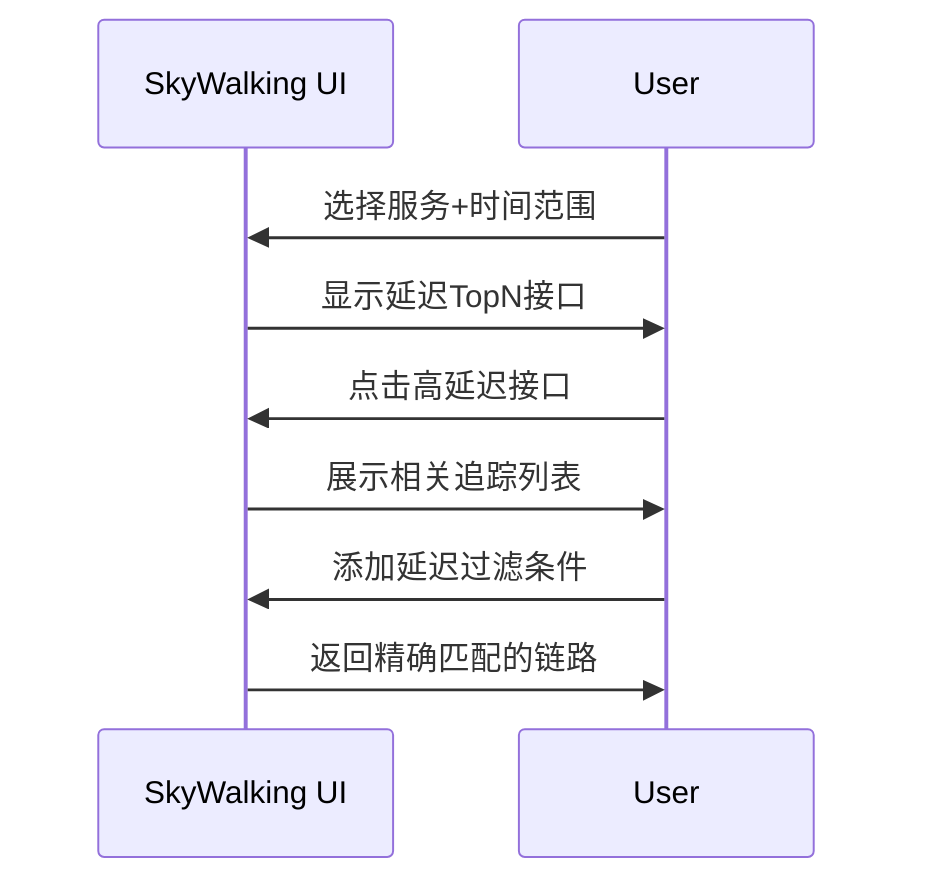

## 介绍

SkyWalking UI是Apache SkyWalking的可视化界面，用于展示分布式系统的监控数据。通过灵活的导航和过滤功能，用户可以快速定位性能问题、分析链路追踪数据。本章将详细介绍UI的核心操作，包括仪表盘导航、服务/实例筛选、时间范围控制等。

## 基础导航结构

SkyWalking UI主要分为以下功能区域：



### 1. 主菜单导航
- **仪表盘**：查看服务的各项指标（响应时间、吞吐量等）
- **拓扑图**：可视化服务间调用关系
- **追踪**：查看具体请求的调用链详情
- **性能剖析**：分析代码级性能问题
- **告警**：查看触发的事件通知

## 核心过滤功能

### 1. 服务/实例筛选
在任意仪表盘页面，使用顶部下拉框选择目标服务或实例：

```text
Service: [FrontendService ▼]  
Instance: [all ▼]  
Endpoint: [all ▼]
```

:::tip 实践建议
当分析性能问题时，先选择服务级别视图，再逐步下钻到具体实例。
:::

### 2. 时间范围控制
点击右上角时间选择器，支持：
- 预设快捷选项（最近15分钟/1小时等）
- 自定义绝对时间范围
- 时间对比模式（对比两个时段的数据）

```text
Time Range: [Last 30 minutes ▼]  🔄 Auto Refresh
```

### 3. 指标维度过滤
在追踪(Trace)页面，可通过多种条件筛选链路数据：

```json
{
  "status": "success|error|all",
  "service": "your-service",
  "latency": ">1000ms",
  "tags": "key=value"
}
```

## 实际案例

### 场景：诊断高延迟接口
1. 在**仪表盘**选择目标服务
2. 设置时间范围为故障时段
3. 切换到**Endpoint**视图，按延迟排序
4. 点击可疑接口，跳转到**追踪**页面
5. 添加过滤条件 `latency > 2000ms`
6. 分析具体链路的Span详情



## 高级技巧

### 1. 标签过滤
在追踪查询中使用标签系统：
```sql
tag.key = 'value' AND component = 'HttpClient'
```

### 2. 保存常用视图
通过URL参数共享当前过滤状态：
```
?service=payment-service&time=last-1h
```

### 3. 快捷键操作
- `Shift + 点击`：在新标签页打开链接
- `Ctrl/Cmd + F`：快速聚焦搜索框

## 总结

通过本章学习，你应该能够：
- 熟练切换SkyWalking的不同功能视图
- 使用服务/实例选择器定位监控目标
- 通过时间范围和条件过滤缩小问题范围
- 结合多维分析诊断具体性能问题

## 延伸学习

1. 尝试对比不同时间段的同一服务指标
2. 练习使用标签系统过滤特定业务请求
3. 创建自定义仪表盘（需企业版支持）

:::note 后续步骤
建议在测试环境中实际操作所有过滤功能，观察不同条件下的数据变化。
:::