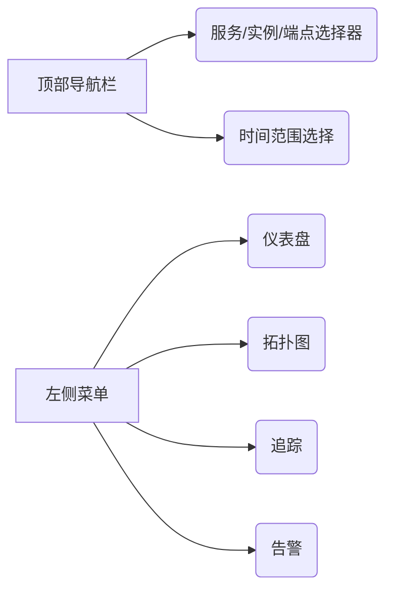

# SkyWalking UI常见问题解答

## 介绍

SkyWalking UI是Apache SkyWalking分布式系统监控工具的可视化界面，用于展示拓扑图、追踪数据、指标图表等核心功能。对于初学者而言，初次接触时可能会遇到界面导航困惑、数据解读困难等问题。本文将解答高频问题并提供实用技巧。

## 基础导航问题

### 1. 如何访问SkyWalking UI？
默认情况下，UI服务运行在8080端口。启动SkyWalking后，通过浏览器访问：
```bash
http://localhost:8080
```
若修改过配置，请检查`webapp/application.yml`中的`server.port`参数。

### 2. 主界面各区域功能是什么？


:::note 关键区域说明
- **服务选择器**：切换监控的微服务
- **时间选择器**：调整数据时间范围（支持相对/绝对时间）
- **拓扑图**：展示服务间调用关系
:::

## 数据解读问题

### 3. 为什么拓扑图中某些服务显示红色？
红色节点表示该服务的错误率超过阈值（默认5%）。可通过以下步骤确认：
1. 点击节点查看弹出面板
2. 检查`Service Successful Rate`指标
3. 在"追踪"页面筛选该服务的错误请求

### 4. 如何理解追踪列表中的状态码？
常见状态码含义：
- `200`：成功
- `403`：权限拒绝
- `404`：端点不存在
- `500`：服务端错误

示例追踪条目：
```
Trace ID: 4a3b2c1d
Endpoint: /user/login
Status: 500
Duration: 1200ms
```

## 功能操作问题

### 5. 如何保存自定义仪表盘？
1. 在"仪表盘"页面点击`+`按钮
2. 配置指标后选择"Save as template"
3. 输入模板名称并设置可见范围

:::warning
自定义仪表盘需要管理员权限才能保存为全局模板
:::

### 6. 如何对比两个时间段的性能数据？
使用"Compare"功能：
1. 在图表右上角点击"Compare"按钮
2. 选择基准时间段（如"Last Week"）
3. 系统会自动生成对比曲线

## 实际案例

### 案例：诊断API延迟升高
1. **现象**：`/order/create`接口平均响应时间从200ms升至800ms
2. **排查步骤**：
   - 在拓扑图中定位Order服务节点
   - 查看"Endpoint Response Time"指标
   - 筛选该端点的慢追踪（>500ms）
   - 发现大量数据库`SELECT`操作耗时异常
3. **解决方案**：优化数据库查询索引

## 总结与资源

### 关键要点
- 掌握时间范围选择能有效定位问题时段
- 拓扑图颜色反映系统健康状态
- 追踪详情是分析单个请求的黄金标准

### 进阶练习
1. 创建一个包含CPU/内存指标的仪表盘
2. 尝试对比工作日与周末的流量差异
3. 模拟一个错误请求并观察UI如何展示

如需进一步学习，推荐：
- SkyWalking官方文档的[UI使用指南](https://skywalking.apache.org/docs/)
- 在线沙箱环境实践
``` 

注：实际使用时请移除代码块标记外的```mdx和