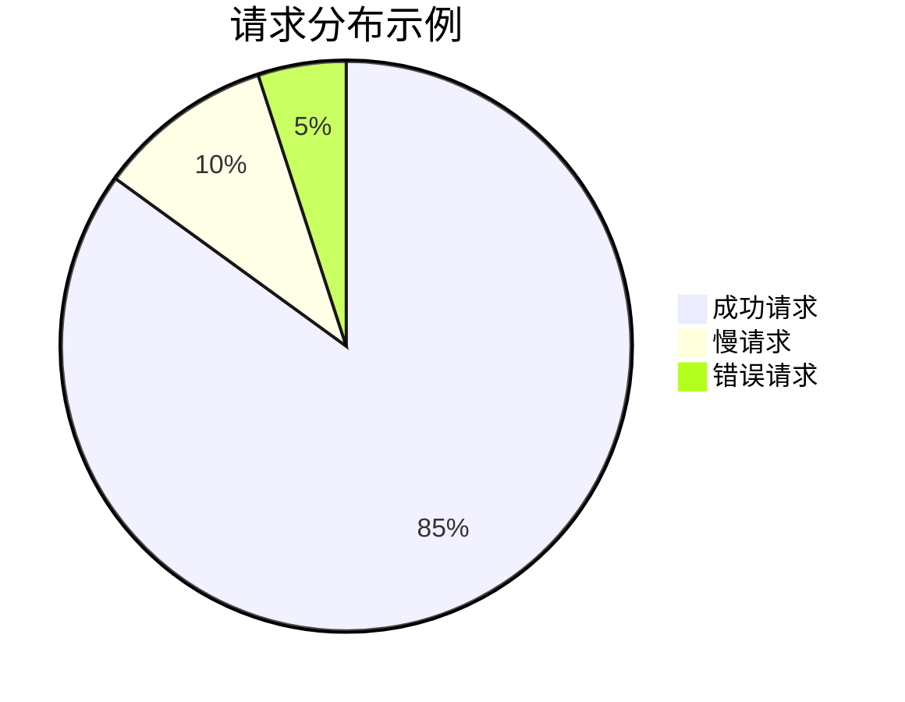
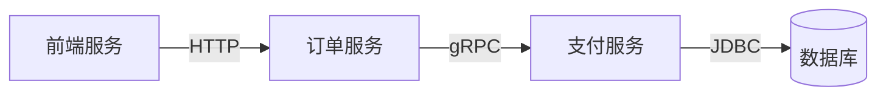

## 简介

SkyWalking UI仪表盘是Apache SkyWalking提供的可视化监控界面，用于展示分布式系统的性能指标、拓扑关系、追踪数据等关键信息。通过直观的图表和交互式操作，开发者可以快速定位系统瓶颈、分析调用链路，并监控服务健康状态。

## 仪表盘核心功能

### 1. 全局视图
仪表盘首页提供系统级别的概览，包括：
- 服务/实例/端点的实时吞吐量（TPS）
- 响应时间（RT）百分位分布
- SLA（服务等级协议）达标率



### 2. 拓扑图
可视化展示服务间调用关系，节点大小反映流量权重，连线颜色表示健康状态：



:::tip
拓扑图中的红色连线通常表示高错误率，需要优先检查
:::

### 3. 指标图表
支持多种图表类型展示时序数据：
- 折线图：显示指标随时间变化趋势
- 柱状图：对比不同维度的数据
- 热力图：分析响应时间分布

## 实际操作指南

### 访问仪表盘
默认访问地址（假设本地部署）：
```bash
http://localhost:8080
```

### 关键操作示例
1. **时间范围选择**：
   - 右上角时间选择器支持快速切换（15分钟/1小时/1天）或自定义范围

2. **服务筛选**：
```javascript
// 通过服务下拉菜单选择目标服务
serviceSelector.select('payment-service');
```

3. **指标对比**：
   - 按住Ctrl可多选多个服务/实例进行对比

## 真实案例解析

### 电商系统性能分析
1. **现象**：订单提交接口响应时间突增
2. **诊断步骤**：
   - 在拓扑图中发现订单服务到库存服务的连线变红
   - 查看库存服务的"Database Access"面板，显示SQL执行时间异常
   - 通过Trace查询发现慢查询语句

:::note
实际案例中，结合`Alarm`功能可以设置自动告警规则
:::

## 高级功能

### 自定义仪表盘
通过`UI Template`功能创建个性化视图：
```yaml
templates:
  - name: "My API Dashboard"
    metrics:
      - name: "API Success Rate"
        unit: "%"
        query: "api_success_rate{service=*}"
```

### 对比分析模式
启用`Comparison`模式可对比不同时间段的指标差异，适合版本发布后的性能对比。

## 总结

SkyWalking UI仪表盘通过：
- 实时可视化监控
- 多维度的指标分析
- 交互式诊断工具
帮助开发者快速理解系统状态并定位问题。

## 延伸学习

推荐练习：
1. 创建一个自定义视图监控关键API
2. 设置基于响应时间的告警规则
3. 对比生产环境不同版本的性能数据

官方资源：
- [SkyWalking Dashboard官方文档](https://skywalking.apache.org/docs/)
- [GitHub示例仓库](https://github.com/apache/skywalking)