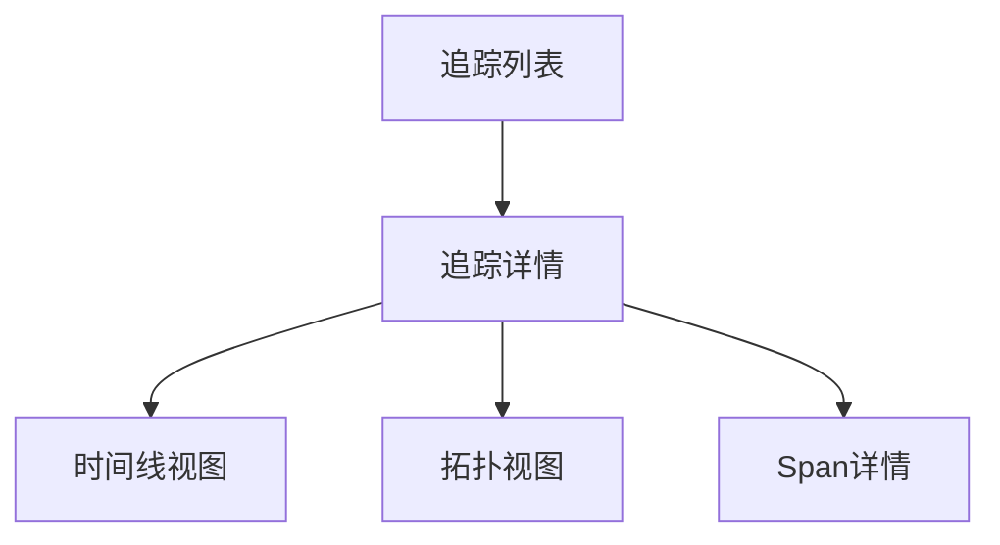
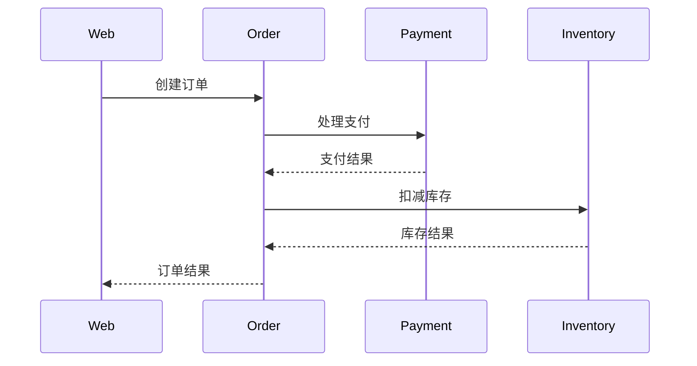

# SkyWalking UI追踪视图

## 介绍

SkyWalking UI的追踪视图（Trace View）是Apache SkyWalking分布式追踪系统的核心功能之一。它允许开发者可视化地查看和分析分布式系统中请求的完整调用链，帮助定位性能瓶颈和故障点。对于初学者来说，理解追踪视图是掌握分布式系统监控的重要一步。

追踪视图以图形化的方式展示：
- 请求在微服务间的流转路径
- 每个服务的处理时间
- 调用层级关系
- 可能出现的错误或异常

## 追踪视图基础

### 如何访问追踪视图

1. 登录SkyWalking UI
2. 导航到顶部菜单的"追踪(Trace)"选项卡
3. 在搜索面板中设置查询条件（时间范围、服务名称等）
4. 点击"搜索"按钮获取追踪列表

### 追踪视图组成

一个典型的追踪视图包含以下元素：

1. **追踪列表**：显示符合条件的追踪记录
2. **追踪详情**：展示单个请求的完整调用链
3. **时间线视图**：以时间轴形式展示各Span的执行情况
4. **拓扑视图**：显示服务间的调用关系图
5. **Span详情**：显示单个Span的详细信息

## 解读追踪视图

### 示例追踪

假设我们有一个简单的电商应用，包含以下服务：
- 前端服务 (Web)
- 订单服务 (Order)
- 支付服务 (Payment)
- 库存服务 (Inventory)

一个用户下单请求的追踪可能如下：

在SkyWalking UI中，这个追踪会显示为：

1. 根Span：Web服务的请求入口
2. 子Span：Order服务处理
   - 子Span：Payment服务调用
   - 子Span：Inventory服务调用

### 关键指标解读

在追踪视图中，你需要关注以下关键指标：

- **Duration**：Span执行的总时间
- **Operation Name**：Span代表的操作名称
- **Component**：使用的组件类型（如HTTP、MySQL等）
- **Tags**：附加的标签信息（如HTTP状态码、SQL语句等）
- **Logs**：Span执行过程中记录的关键日志

## 实际案例分析

### 案例1：慢请求诊断

**场景**：用户反馈下单接口响应缓慢。

**分析步骤**：

1. 在追踪视图中筛选出Order服务的慢请求（如耗时>1s）
2. 查看追踪详情，识别耗时最长的Span
3. 发现Payment服务的处理时间占用了总时间的80%
4. 检查Payment Span的标签和日志，发现大量数据库查询

**解决方案**：优化Payment服务的数据库查询，添加缓存层。

### 案例2：错误追踪

**场景**：系统偶尔出现下单失败。

**分析步骤**：

1. 在追踪视图中筛选出状态为"Error"的追踪
2. 查看错误追踪的Span树，发现Inventory服务返回了"库存不足"异常
3. 检查相关日志，确认是库存同步延迟导致

**解决方案**：改进库存同步机制，或添加库存预检查。

## 高级功能

### 追踪比较

SkyWalking UI允许比较两个相似请求的追踪，帮助识别性能差异：

1. 在追踪列表中选择两个追踪
2. 点击"比较"按钮
3. 系统会并排显示两个追踪的时间线对比

### 端点依赖分析

通过追踪数据，SkyWalking可以自动生成服务依赖图：

1. 导航到"拓扑图"视图
2. 选择特定时间段
3. 系统会显示服务间的调用关系和流量指标

## 总结

SkyWalking UI的追踪视图是分析和诊断分布式系统问题的强大工具。通过本指南，你应该已经了解：

- 如何访问和解读追踪视图
- 关键指标的含义和分析方法
- 实际问题的诊断流程
- 高级功能的使用场景

## 附加资源与练习

### 练习建议

1. 部署一个简单的微服务应用并接入SkyWalking
2. 生成一些追踪数据并练习使用追踪视图分析
3. 故意制造一些性能问题和错误，然后尝试通过追踪视图定位

### 进一步学习

- 官方文档：[SkyWalking Trace View Documentation](https://skywalking.apache.org/docs/)
- 相关概念学习：OpenTelemetry、分布式追踪原理
- 实践项目：使用SkyWalking监控你自己的应用

:::tip
追踪视图分析时，建议先关注异常和长耗时Span，这些通常是系统瓶颈所在。同时，结合日志和指标数据可以获得更全面的诊断视角。
:::

:::caution
请注意，生产环境中可能会有大量追踪数据，合理设置查询条件（如时间范围、服务名）可以显著提高查询效率。
:::