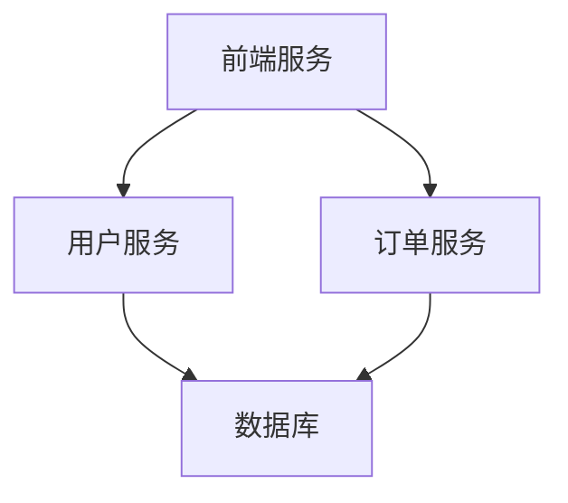

# SkyWalking UI服务视图

## 介绍

SkyWalking UI的**服务视图**是Apache SkyWalking分布式追踪系统的核心功能之一，它为开发者提供了直观的可视化界面，用于监控和分析微服务架构中各个服务的运行状态。通过服务视图，您可以快速发现性能瓶颈、追踪请求链路，并理解服务间的依赖关系。

## 服务视图的核心功能

服务视图主要包含以下关键信息：

1. **服务列表**：展示所有已注册服务的名称、类型和状态
2. **服务拓扑图**：以图形化方式呈现服务间的调用关系
3. **服务指标**：包括响应时间、吞吐量、错误率等关键性能指标
4. **服务实例**：展示服务的具体运行实例及其状态

## 服务拓扑图详解

服务拓扑图是服务视图中最直观的部分，它展示了系统中各服务之间的调用关系。以下是一个简单的mermaid图示：



:::note
拓扑图中的箭头方向表示调用方向，例如"前端服务 → 用户服务"表示前端服务会调用用户服务。
:::

## 服务指标解读

在服务视图中，您会看到以下关键指标：

| 指标名称   | 说明            | 健康阈值示例   |
|--------|---------------|----------|
| 平均响应时间 | 服务处理请求的平均时间   | `<500ms` |
| 吞吐量    | 每分钟处理的请求数     | 根据业务需求设定 |
| 错误率    | 失败请求占总请求数的百分比 | `<0.5%`  |
| SLA    | 服务等级协议达标率     | `>99%`   |

## 实际案例：电商系统监控

假设我们有一个电商系统，包含以下服务：
1. `web-app`：前端应用
2. `user-service`：用户服务
3. `order-service`：订单服务
4. `payment-service`：支付服务

在SkyWalking UI中，我们可能会观察到：

1. **问题发现**：`order-service`的响应时间突然从200ms增加到1200ms
2. **拓扑分析**：发现`order-service`调用了`payment-service`，而后者响应缓慢
3. **深入排查**：检查`payment-service`的指标，发现数据库查询是瓶颈

:::tip
在实际使用中，可以点击服务名称进入详情页，查看该服务的详细指标和追踪数据。
:::

## 代码示例：服务过滤

SkyWalking UI支持通过OQL(Observability Query Language)过滤服务。例如，只显示响应时间大于100ms的服务：

```sql
Service.all.where(responseTime > 100)
```

## 总结

SkyWalking UI的服务视图是监控分布式系统的强大工具，它通过可视化方式帮助您：

- 快速了解系统整体健康状况
- 识别性能瓶颈和服务依赖
- 追踪请求在服务间的流转路径
- 监控关键性能指标的变化趋势

## 进一步学习

1. 尝试在自己的开发环境中部署SkyWalking并接入一个简单应用
2. 观察不同负载下服务指标的变化
3. 练习使用OQL进行服务查询和过滤
4. 探索服务视图与其他视图(如拓扑视图、追踪视图)的关联

:::caution
在生产环境中使用前，请确保充分测试SkyWalking的监控开销，特别是对高频调用的服务。
:::