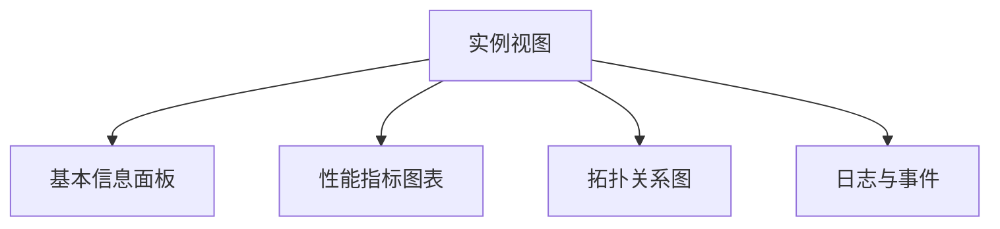
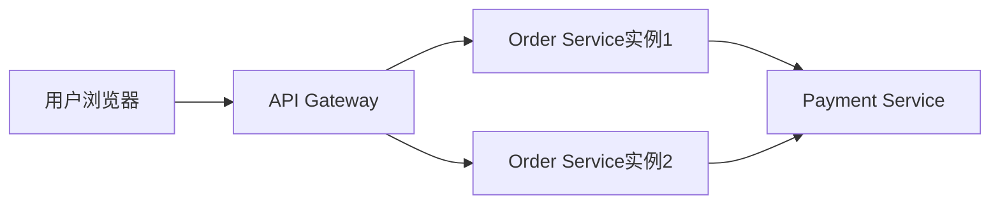

# SkyWalking UI实例视图

## 概述

SkyWalking UI的实例视图是监控系统中展示服务实例运行状态的核心界面。通过该视图，您可以直观地查看单个服务实例的性能指标、健康状况以及与上下游组件的调用关系。对于初学者而言，理解实例视图是掌握分布式系统监控的重要第一步。

:::note 什么是服务实例？
在SkyWalking中，服务实例(Instance)是指实际运行的服务进程。例如，一个订单服务可能部署了3个实例来实现负载均衡。
:::

## 视图结构解析

实例视图主要包含以下几个核心区域：



### 1. 基本信息面板

位于视图顶部，显示实例的关键元数据：
- 实例名称（如 `order-service-instance-1`）
- 所属服务（如 `order-service`）
- 实例属性（IP地址、进程ID等）
- 当前健康状态（正常/警告/危险）

### 2. 性能指标图表

核心监控指标以时间序列图表展示：

#### CPU使用率
```text
示例数据：
时间戳           | 值
-----------------|-----
2023-07-01 10:00 | 45%
2023-07-01 10:05 | 52%
```

#### 内存占用
```text
示例数据：
时间戳           | 堆内存(MB) 
-----------------|---------
2023-07-01 10:00 | 1024
2023-07-01 10:05 | 1152
```

#### 响应时间
```text
示例数据：
端点             | 平均响应时间(ms)
----------------|---------------
GET /orders     | 120
POST /orders    | 250
```

### 3. 拓扑关系图

展示实例在分布式系统中的位置：



## 实际应用案例

### 场景：诊断高延迟问题

1. 在实例列表中发现 `order-service-instance-2` 的响应时间指标异常
2. 进入该实例视图，观察到：
   - CPU使用率持续高于80%
   - 堆内存使用接近最大限制
3. 检查拓扑图发现该实例接收了过多来自 `inventory-service` 的请求
4. 结论：需要扩展实例数量或优化 `inventory-service` 的调用频率

:::tip 诊断技巧
结合多个指标一起分析：
- 高CPU + 低内存 → 可能计算密集型问题
- 低CPU + 高内存 → 可能内存泄漏
- 高网络IO + 正常资源 → 可能外部依赖变慢
:::

## 高级功能

### 自定义指标看板

通过UI提供的仪表板编辑器，可以创建个性化的监控视图：

```javascript
// 示例：创建自定义图表
dashboard.addChart({
  title: 订单处理速率,
  metrics: ["service_instance_resp_time{service='order-service'}"],
  unit: "ms",
  chartType: "line"
});
```

### 实例对比功能

支持选择多个实例进行横向对比，特别适用于：
- 金丝雀发布验证
- 不同版本性能比较
- 硬件配置差异分析

## 总结

SkyWalking UI的实例视图提供了服务实例监控的一站式解决方案，通过本指南您已经学习到：

- 实例视图的核心组成部分
- 关键性能指标的解读方法
- 实际问题的诊断流程
- 高级功能的灵活应用

## 延伸学习

建议练习：
1. 在测试环境中部署两个相同服务的实例，观察指标差异
2. 模拟内存泄漏场景，观察内存指标变化曲线
3. 创建自定义图表跟踪特定端点的响应时间

进一步阅读：
- SkyWalking官方文档中的"实例监控"章节
- 分布式系统可观测性最佳实践
- 性能指标关联分析技巧