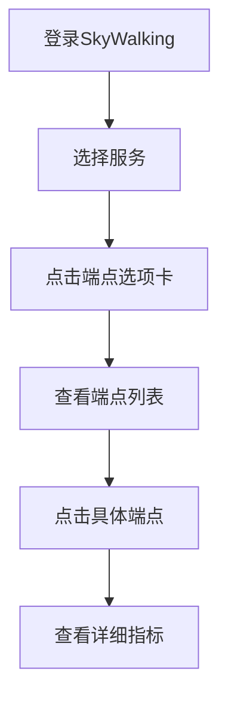
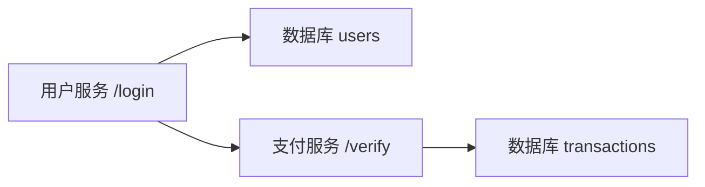

# SkyWalking UI端点视图

## 介绍

SkyWalking UI的**端点视图**是监控分布式系统中API端点性能的核心功能。它为开发者提供了可视化工具，帮助理解端点调用关系、响应时间、错误率等关键指标。对于初学者来说，掌握端点视图是使用SkyWalking进行应用性能监控(APM)的重要第一步。

端点视图会展示：
- 端点的拓扑调用关系
- 响应时间百分位数（P50/P75/P90/P95/P99）
- 吞吐量（每分钟请求数）
- 错误率（HTTP状态码≥400的比例）
- 端点依赖的数据库/外部服务

## 端点视图界面解析

访问端点视图的典型路径：
1. 登录SkyWalking UI
2. 导航到"拓扑图"或"追踪"菜单
3. 选择特定服务
4. 点击"端点"选项卡



## 关键指标解读

### 1. 响应时间分布

端点的响应时间通常以热力图形式展示：

```
慢速区（红色）|■■■■□ 20%
中速区（黄色）|■■■□□ 15%
快速区（绿色）|■■■■■ 65%
```

:::tip 百分位数的意义
P99=500ms 表示99%的请求响应时间≤500ms，是SLA的重要指标
:::

### 2. 吞吐量图表

示例数据格式：
```json
{
  "time": "2023-07-20 14:00",
  "rpm": 1200,
  "errorRate": 0.5
}
```

### 3. 端点依赖关系



## 实际案例：电商订单端点

假设我们监控一个电商平台的订单创建端点：

1. **问题场景**：用户反馈下单缓慢
2. **分析步骤**：
   - 在端点视图中找到 `POST /orders`
   - 发现P99响应时间从200ms突增至1500ms
   - 查看依赖关系，发现支付服务验证超时
   - 追溯支付服务的数据库查询变慢

:::warning 注意
端点名称区分大小写！`/orders` 和 `/Orders` 会被视为不同端点
:::

## 高级功能

### 1. 端点对比

可以同时选择多个端点比较性能：

| 端点          | RPM   | P99   | 错误率 |
|---------------|-------|-------|-------|
| GET /products | 1500  | 320ms | 0.2%  |
| GET /details  | 800   | 520ms | 1.1%  |

### 2. 历史数据对比

使用时间选择器比较不同时段数据：
```bash
# 查询最近1小时与上周同期的对比
timeRange: last_1_hour compare: last_7_days
```

## 总结

SkyWalking端点视图提供了：
- 端点的实时性能监控
- 历史趋势分析能力
- 问题根因定位工具
- 系统依赖可视化

## 练习建议

1. 在测试环境部署SkyWalking
2. 创建一个有多个端点的简单服务
3. 尝试：
   - 找出响应最慢的端点
   - 识别端点间的调用链
   - 模拟错误并观察错误率变化

## 延伸阅读

- SkyWalking官方文档中的"端点分析"章节
- 分布式追踪原理（OpenTelemetry标准）
- 性能指标计算方式（TP90/TP99算法）