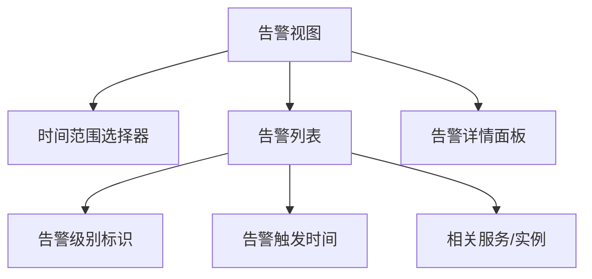

# SkyWalking UI告警视图

## 介绍

SkyWalking的告警视图是运维人员和开发者监控分布式系统健康状况的重要工具。它提供了一个集中化的界面来查看、分析和响应系统产生的告警事件。当系统出现性能下降、错误率上升或违反预设规则时，告警视图会立即通知用户，帮助快速定位问题。

告警视图主要包含以下核心功能：
- 实时告警事件展示
- 历史告警查询
- 告警规则关联
- 告警级别分类（紧急、重要、警告等）

## 告警视图界面解析

访问路径：登录SkyWalking UI后，通过顶部导航栏进入 **Alarm** 选项卡。

主要界面区域：



1. **时间范围选择器**：可查看特定时间段的告警记录
2. **告警列表**：按时间倒序列出所有告警事件
3. **告警详情面板**：点击单个告警可查看详细信息

## 告警规则与触发机制

告警视图展示的告警都基于预先配置的规则触发。以下是一个典型的告警规则配置示例：

```yaml
rules:
  service_resp_time_rule:
    metrics-name: service_resp_time
    op: ">"
    threshold: 1000
    period: 10
    count: 3
    silence-period: 5
    message: 服务 {name} 响应时间超过1秒
```

当满足以下条件时触发告警：
- 服务响应时间(service_resp_time) > 1000毫秒
- 连续3个检测周期(每个周期10分钟)
- 触发后静默5分钟防止重复告警

:::tip 规则字段说明
- `metrics-name`: 监控的指标名称
- `op`: 比较运算符(`>, <, =`等)
- `threshold`: 阈值
- `period`: 检测周期(分钟)
- `count`: 连续触发次数
- `silence-period`: 静默期(分钟)
:::

## 告警级别与处理

SkyWalking告警通常分为三个级别：

1. **紧急(Critical)**：红色标识，需要立即处理
   - 示例：服务完全不可用
2. **重要(Important)**：橙色标识，需要尽快处理
   - 示例：错误率超过50%
3. **警告(Warning)**：黄色标识，需要关注
   - 示例：响应时间缓慢

## 实际案例演示

**场景**：电商网站订单服务响应时间告警

1. 告警触发：
   ```
   [Warning] 服务 order-service 响应时间超过1秒
   触发时间: 2023-05-15 14:30
   当前值: 1200ms
   ```

2. 排查步骤：
   - 通过 **Trace** 功能查看慢请求
   - 检查关联的数据库查询
   - 发现某个SQL查询缺少索引

3. 解决方案：
   - 为相关表添加索引
   - 优化查询逻辑
   - 告警在30分钟后自动恢复

## 高级功能

### 告警关联分析

SkyWalking可以自动关联相关告警，帮助识别根本原因。例如：


### 告警通知集成

告警可以通过以下方式通知：
- WebHook
- 邮件
- Slack/钉钉等IM工具
- SMS短信

配置示例：
```yaml
webhooks:
  - url: http://your-alert-system/notify
    secret: your-secret-key
```

## 总结

SkyWalking的告警视图是分布式系统监控的核心组件，它能够：
- 实时显示系统异常
- 帮助快速定位问题根源
- 提供历史数据用于分析
- 支持多种通知方式

通过合理配置告警规则和有效利用告警视图，团队可以显著提升系统的可靠性和可维护性。

## 进一步学习

1. 实践练习：
   - 配置一个当错误率超过5%时触发的告警规则
   - 模拟触发条件并观察告警视图变化

2. 推荐阅读：
   - SkyWalking官方文档 - 告警配置指南
   - 分布式系统监控最佳实践

3. 进阶话题：
   - 告警规则的优化策略
   - 告警风暴的预防与处理
   - 自定义告警通知模板