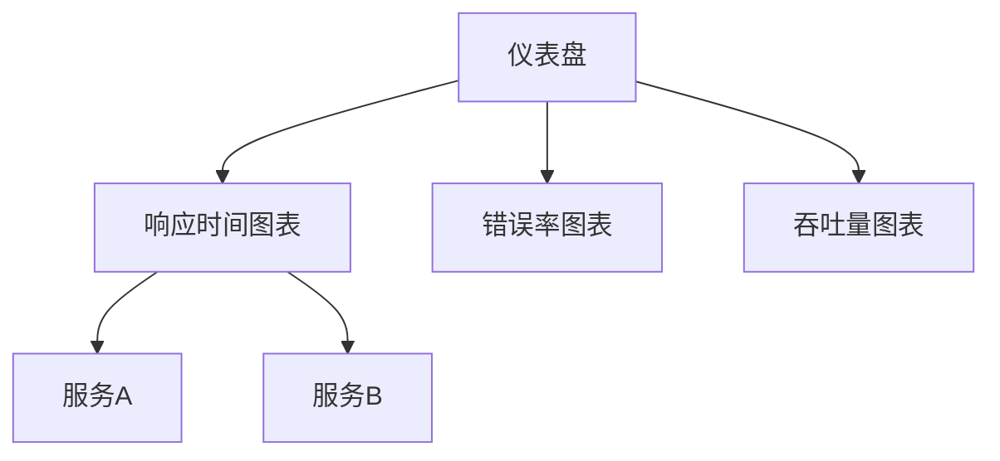

# SkyWalking UI自定义仪表盘

## 介绍

SkyWalking UI的自定义仪表盘功能允许用户根据特定需求创建个性化的监控视图。通过组合不同的指标、图表和布局，你可以构建一个完全符合你团队需求的监控面板，实时跟踪系统的关键性能指标（KPIs）。

自定义仪表盘的核心优势包括：
- **灵活性**：自由选择需要监控的指标
- **可视化**：多种图表类型展示数据
- **团队协作**：可以共享仪表盘配置
- **实时性**：数据自动刷新，无需手动操作

## 基础概念

在开始创建自定义仪表盘前，需要了解几个关键概念：

1. **仪表盘模板**：定义仪表盘的整体结构和布局
2. **小组件**：仪表盘中的单个可视化元素（如折线图、柱状图等）
3. **指标查询**：每个小组件背后连接的数据查询
4. **变量**：可以在仪表盘中使用的动态参数

## 创建你的第一个自定义仪表盘

### 步骤1：访问仪表盘管理界面

1. 登录SkyWalking UI
2. 导航到左侧菜单的"Dashboard"选项
3. 点击"Create Dashboard"按钮

### 步骤2：设置基础信息

在弹出的对话框中填写：
- **仪表盘名称**：例如"生产环境监控"
- **描述**：简要说明仪表盘的用途
- **所属服务**：选择关联的服务（可选）

```json
{
  "name": "生产环境监控",
  "description": "监控生产环境核心服务性能指标",
  "service": "order-service"
}
```

### 步骤3：添加小组件

点击"Add Widget"按钮，选择你想要添加的小组件类型。常见类型包括：

- **Line Chart**：用于展示趋势数据
- **Bar Chart**：比较不同类别的数据
- **Top List**：显示排名靠前的项目
- **Table**：表格形式展示详细数据

#### 示例：添加响应时间折线图

1. 选择"Line Chart"类型
2. 配置数据源：
   ```yaml
   metrics: 
     - name: "service_resp_time"
       aggregation: "avg"
       groupBy: ["service"]
   ```
3. 设置图表选项：
   ```yaml
   title: 服务平均响应时间
   yAxis: 
     name: "毫秒"
     min: 0
   ```

### 步骤4：布局调整

通过拖拽可以重新排列小组件的位置，也可以调整它们的大小。SkyWalking UI使用网格布局系统，可以灵活地组合不同尺寸的小组件。



## 高级功能

### 使用变量实现动态过滤

变量可以让你的仪表盘更加灵活。例如，你可以创建一个时间范围变量，让用户可以选择查看不同时间段的数据。

1. 在仪表盘设置中添加变量：
   ```json
   {
     "name": "time_range",
     "type": "time_range",
     "default": "last_15_minutes"
   }
   ```
2. 在小组件查询中使用变量：
   ```yaml
   metrics:
     - name: "service_resp_time"
       aggregation: "avg"
       conditions:
         - key: "time_range"
           value: "$time_range"
   ```

### 共享仪表盘配置

你可以将创建好的仪表盘导出为JSON文件，与团队成员共享：

1. 点击仪表盘右上角的"Export"按钮
2. 选择导出格式为JSON
3. 其他用户可以通过"Import"功能导入这个文件

## 实际案例

### 电商平台监控仪表盘

假设我们运营一个电商平台，可以创建以下小组件：

1. **订单服务响应时间**：监控下单流程的性能
2. **支付成功率**：跟踪支付流程的转化率
3. **商品搜索延迟**：确保搜索体验流畅
4. **服务器资源使用率**：监控底层基础设施

```yaml
# 示例：支付成功率小组件配置
metrics:
  - name: "payment_success_rate"
    aggregation: "percentage"
    conditions:
      - key: "status"
        value: "success"
title: 支付成功率
chartType: "gauge"
```

## 最佳实践

1. **保持简洁**：不要在一个仪表盘上放置过多小组件，保持重点突出
2. **逻辑分组**：将相关指标放在相邻位置，便于分析
3. **设置阈值**：为关键指标添加警戒线，便于快速发现问题
4. **定期审查**：随着业务发展，调整仪表盘内容

:::tip
为不同角色创建不同的仪表盘视图：
- 运维团队：关注基础设施指标
- 开发团队：关注应用性能指标
- 产品团队：关注业务转化指标
:::

## 总结

SkyWalking UI的自定义仪表盘功能为监控分布式系统提供了强大的可视化工具。通过合理配置，你可以创建出既美观又实用的监控面板，帮助团队快速发现和解决问题。

## 下一步学习

- 探索SkyWalking提供的所有内置指标
- 学习如何创建自定义指标
- 了解如何设置自动告警规则
- 研究如何将SkyWalking数据导出到其他分析工具

## 练习

1. 创建一个包含3个小组件的仪表盘，分别监控：
   - 服务响应时间
   - 错误率
   - 请求吞吐量
2. 添加一个时间范围变量，并测试它的效果
3. 导出你的仪表盘配置，然后尝试导入到一个新的仪表盘中