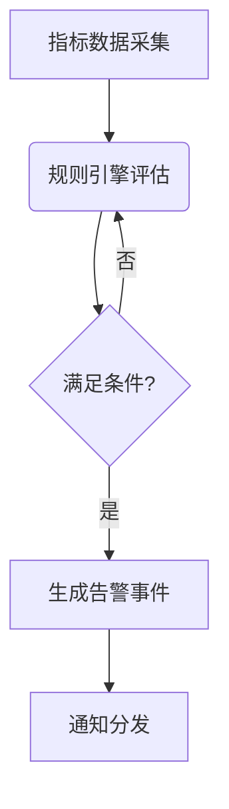

# SkyWalking 告警系统概述

## 介绍

SkyWalking告警系统是Apache SkyWalking可观测性平台的核心组件之一，它能够基于收集到的指标数据自动触发告警规则，帮助开发者和运维团队及时发现系统异常。告警系统通过持续监控服务性能指标（如响应时间、错误率）和基础设施状态（如CPU使用率），在达到预设阈值时通过多种渠道（如邮件、Webhook）通知相关人员。

## 核心概念

### 1. 告警规则（Alert Rules）
告警规则定义了触发告警的条件逻辑，采用SkyWalking特有的表达式语言(Expression Language)编写。例如：
```yaml
rules:
  - name: service_resp_time_rule
    expression: endpoint_avg_response_time > 1000 and service == '订单服务'
    duration: 2m
    period: 1m
    silence-period: 5m
```

### 2. 告警触发流程


### 3. 告警通知渠道
支持多种通知方式：
- Webhook
- 邮件
- Slack/钉钉等IM工具
- 自定义gRPC接口

## 实际案例

### 电商场景：订单服务延迟告警
当订单服务的平均响应时间超过1秒持续2分钟时触发告警：

```yaml
rules:
  - name: high_order_service_latency
    expression: service_resp_time > 1000 and service == 'order-service'
    duration: 2m
    severity: CRITICAL
    silence-period: 10m
    hooks:
      - type: webhook
        url: "http://alert-manager/api/v1/alerts"
```

## 配置示例

### 1. 基础告警配置
在`alarm-settings.yml`中添加规则：

```yaml
rules:
  - name: service_instance_resp_time_rule
    expression: service_instance_resp_time > 1000
    duration: 2
    period: 1
    silence-period: 5
    message: 实例 {name} 响应时间超过阈值
```

### 2. Webhook配置示例
```yaml
webhooks:
  - url: http://127.0.0.1:8080/webhook
    headers:
      Content-Type: application/json
```

## 最佳实践

:::tip 告警设计原则
1. **分级告警**：区分CRITICAL/WARNING等级别
2. **避免告警风暴**：合理设置`silence-period`
3. **上下文丰富**：告警信息应包含服务名、实例IP等关键信息
4. **阈值动态调整**：根据业务周期（如大促期间）调整阈值
:::

## 总结

SkyWalking告警系统通过灵活的规则配置和多样的通知方式，为分布式系统提供了强大的异常检测能力。关键要点包括：
- 基于指标表达式定义告警条件
- 支持多级告警和静默机制
- 可扩展的通知渠道

## 扩展学习

1. [官方告警配置文档](https://skywalking.apache.org/docs/main/latest/en/setup/backend/backend-alarm/)
2. 练习：为你的测试服务配置一个当错误率>5%时触发的告警规则
3. 进阶：尝试通过Webhook将告警接入Prometheus Alertmanager