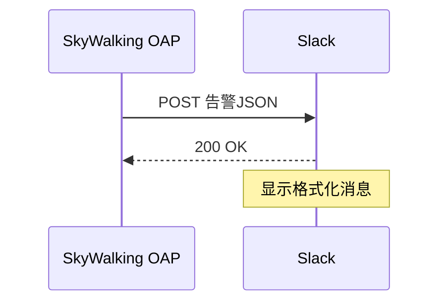

## 简介

SkyWalking的告警系统能够监控分布式系统的健康状态，而Slack是团队协作中广泛使用的即时通讯工具。通过将两者集成，团队可以实时接收系统告警通知，快速响应问题。本章将详细介绍如何配置SkyWalking与Slack的集成。

## 前置条件

1. 已部署SkyWalking OAP Server（版本≥8.4.0）
2. 拥有Slack工作区权限，并已创建[Incoming Webhook](https://api.slack.com/messaging/webhooks)

---

## 配置步骤

### 1. 创建Slack Webhook
在Slack中按以下步骤操作：
1. 进入「Settings & administration」 > 「Manage apps」
2. 搜索「Incoming Webhook」，添加至目标频道
3. 复制生成的Webhook URL（格式如：`https://hooks.slack.com/services/XXXX/YYYY/ZZZZ`）

### 2. 修改SkyWalking告警配置
编辑SkyWalking配置文件 `config/alarm-settings.yml`：

```yaml
rules:
  service_resp_time_rule:
    expression: service_resp_time > 1000
    period: 10
    silence-period: 5
    message: Service {name} 响应时间超过阈值: {value}ms

webhooks:
  - name: "slack-notification"
    url: "YOUR_SLACK_WEBHOOK_URL"
    secret: "optional_signature"
```

:::note
`secret` 字段可选，用于Slack的签名验证（需与Slack配置匹配）
:::

### 3. 配置告警模板（可选）
创建自定义消息模板 `config/slack-template.yml`：

```yaml
text: |-
  :red_circle: *SkyWalking告警*
  *服务*: {name}
  *告警内容*: {message}
  *时间*: {time}
  *详情*: {console}
```

在 `alarm-settings.yml` 中引用模板：
```yaml
webhooks:
  - name: "slack-notification"
    url: "YOUR_WEBHOOK_URL"
    template: "slack-template.yml"
```

---

## 实际案例

### 场景：电商平台监控
某电商团队配置了以下规则监控支付服务：
```yaml
rules:
  payment_service_error_rule:
    expression: service_resp_time > 2000 || service_error_rate > 0.1
    message: 支付服务异常！响应时间: {value}ms
```

当触发告警时，Slack会收到如下通知：
```
🛑 *SkyWalking告警*
服务: payment-service
告警内容: 响应时间超过阈值: 2150ms
时间: 2023-08-20 14:30:45
详情: http://skywalking-ui/alert-details/123
```

---

## 验证配置

1. 手动触发测试告警：
```bash
curl -X POST http://OAP_SERVER:12800/v3/alarm/watcher/trigger \
  -H 'Content-Type: application/json' \
  -d '{"scope":"SERVICE","id":"test-service","message":"Test alert"}'
```

2. 检查Slack频道是否收到测试消息：



---

## 高级配置

### 消息格式化
使用Slack的[Block Kit](https://api.slack.com/block-kit)增强可读性：
```yaml
text: |
  {
    "blocks": [
      {
        "type": "section",
        "text": {
          "type": "mrkdwn",
          "text": "*:warning: SkyWalking告警*"
        }
      },
      {
        "type": "divider"
      }
    ]
  }
```

### 多环境区分
通过`tags`区分不同环境：
```yaml
webhooks:
  - name: "prod-slack"
    url: "PROD_WEBHOOK"
    tags:
      env: "production"
```

---

## 总结

通过本指南，你已学会：
- 配置SkyWalking与Slack的基础集成
- 自定义告警消息模板
- 验证通知链路
- 实现高级消息格式化

:::tip 扩展练习
1. 尝试为不同严重级别的告警设置不同Slack频道
2. 在消息中添加直接跳转到SkyWalking Dashboard的链接
3. 配置告警自动恢复通知
:::

## 常见问题

**Q：收不到Slack通知怎么办？**  
A：按以下步骤排查：
1. 检查OAP日志 `logs/oap.log` 是否有发送错误
2. 使用`curl -X POST WEBHOOK_URL -d '{"text":"test"}'` 测试Webhook
3. 确认SkyWalking告警规则已正确触发

**Q：如何限制告警频率？**  
A：调整`alarm-settings.yml`中的`period`和`silence-period`参数：
```yaml
rules:
  high_cpu_rule:
    silence-period: 15m # 15分钟内不重复告警
```

---

## 附加资源

1. [SkyWalking官方告警文档](https://skywalking.apache.org/docs/main/latest/en/setup/backend/backend-alarm/)
2. [Slack Incoming Webhooks指南](https://api.slack.com/messaging/webhooks)
3. [Block Kit Builder交互工具](https://app.slack.com/block-kit-builder)