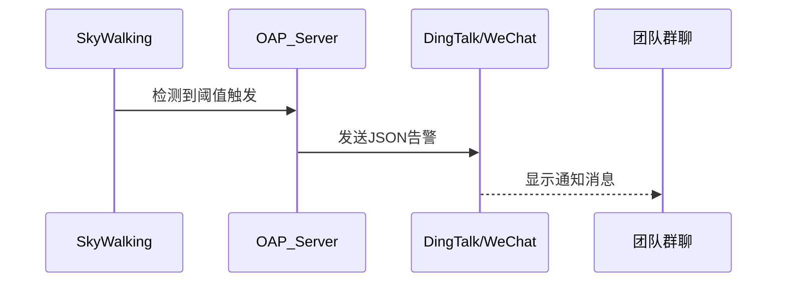

# SkyWalking 钉钉/企业微信通知

## 介绍

SkyWalking的告警系统能够监控分布式系统的健康状态，而集成钉钉或企业微信后，告警信息可以直接推送到团队协作平台，实现实时响应。本章将指导你完成从配置到实战的全流程。

## 前置条件

1. 已部署SkyWalking OAP服务（版本≥8.4.0）
2. 拥有钉钉/企业微信的管理权限
3. 基础YAML语法知识

---

## 钉钉通知配置

### 1. 创建钉钉机器人
在钉钉群组中：
- 进入「群设置」→「智能群助手」→「添加机器人」
- 选择「自定义」机器人，记录Webhook地址（含`access_token`参数）

### 2. 修改SkyWalking配置
编辑`config/alarm-settings.yml`：

```yaml
dingtalkHooks:
  textTemplate: |-
    {
      "msgtype": "text",
      "text": {
        "content": "SkyWalking告警: \n 级别: %s \n 服务: %s \n 实例: %s \n 端点: %s \n 消息: %s \n 时间: %s"
      }
    }
  webhooks:
    - url: https://oapi.dingtalk.com/robot/send?access_token=your_token_here
```

:::note 变量说明
- `%s` 为占位符，依次对应：告警级别、服务名、实例名、端点、消息内容、触发时间
:::

---

## 企业微信通知配置

### 1. 获取企业微信Webhook
在企业微信应用管理中：
- 创建自建应用，记录「AgentId」、「CorpId」、「Secret」

### 2. SkyWalking配置示例
```yaml
wechatHooks:
  textTemplate: |-
    {
      "msgtype": "text",
      "text": {
        "content": "【SkyWalking告警】\n>状态: $status\n>服务: $serviceName\n>实例: $instanceName\n>详情: $alarmMessage"
      }
    }
  webhooks:
    - corpId: your_corp_id
      secret: your_secret
      agentId: your_agent_id
      toUser: "@all"
```

---

## 告警规则与通知联动

### 示例规则配置
```yaml
rules:
  service_resp_time_rule:
    metrics-name: service_resp_time
    op: ">"
    threshold: 1000
    period: 10
    count: 2
    silence-period: 5
    message: 服务 {name} 平均响应时间超过1秒
```



---

## 实战案例

**场景**：电商服务响应延迟告警  
1. 当`order-service`的P99延迟>2秒持续5分钟时  
2. 告警同时推送至钉钉「运维群」和企业微信「SRE频道」

```yaml
rules:
  order_service_latency_rule:
    metrics-name: service_p99
    include-names: ["order-service"]
    threshold: 2000
    period: 5
    count: 1
    hooks: ["dingtalkHooks", "wechatHooks"]
```

:::tip 调试技巧
使用`curl`手动测试Webhook：
```bash
curl -X POST -H "Content-Type: application/json" \
-d '{"msgtype":"text","text":{"content":"测试消息"}}' \
https://oapi.dingtalk.com/robot/send?access_token=your_token
```
:::

---

## 总结与进阶

### 关键点回顾
- 钉钉通过Webhook直接集成
- 企业微信需要CorpId/Secret认证
- 告警模板支持Markdown格式变量插值

### 常见问题
1. **消息未送达**：检查网络策略，确保OAP服务器可访问外网
2. **模板解析失败**：使用在线JSON校验工具验证格式

### 扩展练习
1. 尝试在模板中添加跳转SkyWalking Dashboard的链接  
2. 配置不同告警级别使用不同@通知对象

```mermaid
flowchart TD
    A[告警触发] --> B{级别?}
    B -->|紧急| C[@所有人]
    B -->|警告| D[@运维组]
    B -->|提醒| E[不@]
```

```yaml
# 进阶模板示例（企业微信）
text: |
  {
    "msgtype": "markdown",
    "markdown": {
      "content": "**$title**\n>服务: $serviceName\n[查看详情](http://your-skywalking/ui)"
    }
  }
```