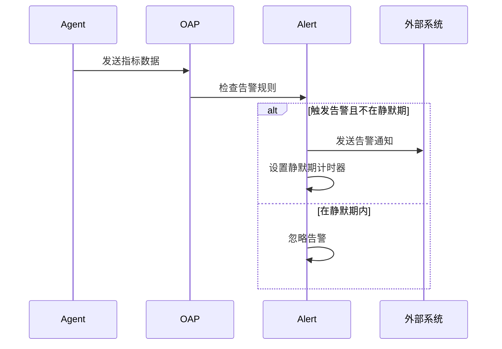

## 什么是告警静默期？

告警静默期（Silence Period）是SkyWalking告警系统中一个重要的功能，它允许你在特定时间段内暂时屏蔽某些告警通知。当系统检测到问题时，静默期可以防止在短时间内重复发送相同或相似的告警，从而避免告警风暴（Alert Storm）。

:::tip 为什么需要静默期？
- 减少告警噪音，避免重复通知
- 给运维团队时间处理已发现的故障
- 防止网络抖动等短暂问题触发过多告警
:::

## 静默期配置基础

SkyWalking的告警静默期通过修改 `alarm-settings.yml` 配置文件实现。以下是基本配置结构：

```yaml
rules:
  service_resp_time_rule:
    metrics-name: service_resp_time
    silence-period: 10 # 单位：分钟
    threshold: 1000
    op: ">"
```

在这个例子中：
- `silence-period: 10` 表示触发告警后，10分钟内不会再次发送相同告警
- 其他参数定义了告警规则本身（响应时间超过1000ms触发）

## 详细配置示例

让我们看一个完整的告警规则配置示例：

```yaml
rules:
  service_sla_rule:
    metrics-name: service_sla
    silence-period: 30 # 30分钟静默期
    threshold: 80
    op: "<"
    period: 10
    count: 2
    message: 服务SLA低于80%，持续10分钟内出现2次

  endpoint_avg_rule:
    metrics-name: endpoint_avg
    silence-period: 15 # 15分钟静默期
    threshold: 1000
    op: ">"
    period: 5
    count: 3
    message: 端点平均响应时间超过1秒，5分钟内出现3次
```

:::note 参数说明
- `silence-period`: 静默期时长（分钟）
- `period`: 监控数据统计周期（分钟）
- `count`: 触发告警需要满足条件的次数
:::

## 实际应用场景

### 场景1：计划内维护

假设你计划在凌晨2:00-3:00进行系统维护，可以提前设置静默期：

```yaml
rules:
  database_rule:
    metrics-name: database_access_time
    silence-period: 120 # 2小时静默期
    threshold: 500
    op: ">"
    message: 数据库访问时间超过500ms
```

### 场景2：应对短暂网络抖动

对于网络相关指标，可以设置较短的静默期：

```yaml
rules:
  network_latency_rule:
    metrics-name: network_latency
    silence-period: 5 # 5分钟静默期
    threshold: 300
    op: ">"
    message: 网络延迟超过300ms
```

## 静默期工作原理



## 最佳实践

1. **合理设置静默期时长**：
   - 关键业务告警：10-30分钟
   - 非关键告警：5-15分钟
   - 网络相关告警：3-5分钟

2. **结合告警级别**：
   ```yaml
   rules:
     critical_rule:
       metrics-name: service_availability
       silence-period: 0 # 关键告警不设静默期
       threshold: 99.9
       op: "<"
   ```

3. **动态调整**：
   - 根据业务高峰/低谷期调整静默期
   - 故障恢复后及时缩短静默期

## 常见问题解答

:::note
静默期会影响告警触发条件判断吗？
- 不会，静默期只控制告警通知的发送，不影响告警条件的检测和记录。

如何查看当前处于静默期的告警？
- 可以通过SkyWalking UI的"Alert"页面查看，静默期告警会有特殊标记。

静默期可以设置为0吗？
- 可以，设置为0表示禁用静默期，每次满足条件都会发送告警。
:::

## 总结

SkyWalking的告警静默期是优化监控体验的重要功能。通过合理配置：
- 减少不必要的告警干扰
- 提高告警的有效性和可操作性
- 为团队提供更专注的问题处理时间

## 进一步学习

1. 尝试为你的服务配置不同级别的静默期
2. 观察静默期设置对告警数量的影响
3. 结合SkyWalking的告警分组功能，实现更精细的控制

记得在实际环境中测试你的配置，找到最适合你业务需求的静默期设置！