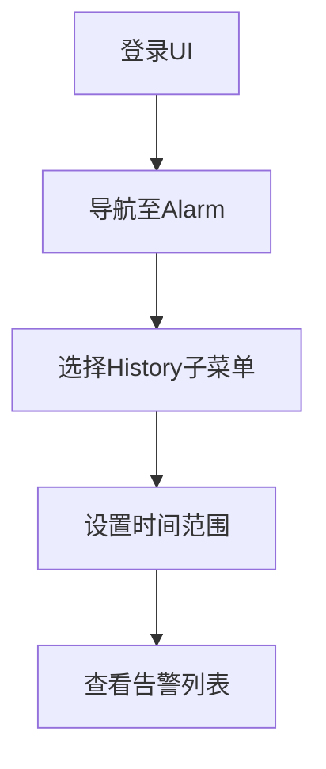
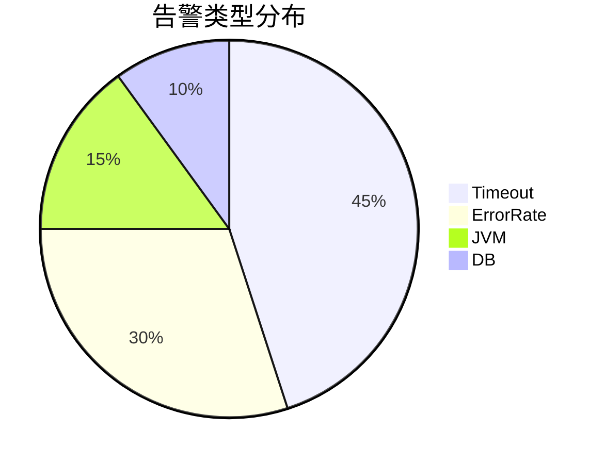

## 介绍

SkyWalking的告警系统能够监控服务的健康状态，并在满足预设条件时触发告警。告警历史查询功能允许开发者回溯已触发的告警记录，分析服务异常的根本原因。本章将详细介绍如何通过UI和API查询告警历史，并解读关键字段。

## 告警历史的核心概念

告警历史记录包含以下关键信息：
- **触发时间**：告警规则被触发的时间戳
- **告警规则名称**：关联的规则标识
- **告警内容**：具体触发的条件描述
- **服务/实例**：涉及的目标服务
- **严重程度**：`CRITICAL`/`MEDIUM`/`LOW`等级别

## 通过UI查询告警历史

1. 登录SkyWalking Web UI
2. 导航至 `Alarm` → `History` 面板
3. 使用时间选择器筛选范围（默认显示最近24小时）



## 通过API查询告警历史

SkyWalking提供REST API获取告警历史数据：

```bash
curl -X GET "http://<oap-server>:12800/alarm/history?start=2023-01-01&end=2023-01-02"
```

典型响应示例：
```json
{
  "data": {
    "queryAlarmHistory": {
      "items": [
        {
          "startTime": 1672531200000,
          "scope": "SERVICE",
          "name": "service_resp_time_rule",
          "message": "serviceA response time > 2000ms in 3 minutes"
        }
      ]
    }
  }
}
```

:::tip 时间格式说明
API参数需使用`YYYY-MM-DD`格式，时间戳返回值为毫秒级Unix时间戳
:::

## 实际应用案例

**场景**：电商平台大促期间出现订单服务延迟告警

1. 通过时间范围筛选定位告警时段
2. 发现多条`high_cpu_usage`告警记录
3. 结合拓扑图确认受影响服务为`payment-service`
4. 查询对应时段日志发现线程阻塞问题

```mermaid
timeline
    title 告警分析时间线
    2023-06-18 20:00 : 首次出现CPU告警
    2023-06-18 20:15 : 关联数据库延迟告警
    2023-06-18 20:30 : 触发自动扩容机制
```

## 高级查询技巧

1. **关键词过滤**：
   ```sql
   message LIKE "%timeout%"
   ```
2. **严重程度筛选**：
   ```bash
   curl "...&level=CRITICAL"
   ```
3. **分页查询**：
   ```bash
   curl "...&pageNum=2&pageSize=10"
   ```

:::caution 注意事项
- 历史数据保留时间取决于存储配置
- 大量查询可能影响OAP性能
:::

## 总结

告警历史查询是故障排查的重要工具，通过本章你学会了：
- 通过UI直观查看历史告警
- 使用API进行自动化查询
- 结合其他数据定位问题根源

**延伸学习**：
- 尝试配置告警规则的静默策略
- 研究告警历史数据的存储原理
- 实践将告警历史接入通知渠道（如钉钉/邮件）



:::note 练习建议
1. 创建一个测试告警规则并触发它
2. 分别通过UI和API查询该告警记录
3. 尝试用不同时间范围过滤结果
:::