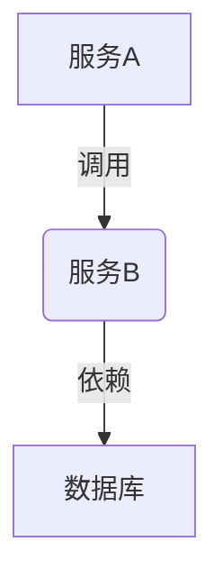

# SkyWalking 告警指标定义

## 介绍

SkyWalking的告警系统允许您基于收集到的指标数据定义告警规则。当系统检测到异常行为时，会自动触发告警通知。告警指标是告警系统的核心，它们定义了什么样的条件应该触发告警。

在本章中，我们将学习：

- 告警指标的基本概念
- 如何定义告警指标
- 指标表达式的语法
- 实际应用案例

## 告警指标基础

告警指标是用于评估系统健康状况的量化标准。在SkyWalking中，告警指标通常基于以下数据：

1. 服务指标（如响应时间、错误率）
2. 实例指标（如CPU使用率、内存使用量）
3. 端点指标（如特定API的吞吐量）
4. JVM指标（如GC时间、堆内存使用）

:::tip
告警指标通常由三部分组成：
- 指标名称：标识要监控的具体指标
- 阈值：触发告警的临界值
- 时间窗口：评估指标的时间范围
:::

## 指标定义语法

SkyWalking使用一种表达式语言来定义告警指标。基本语法结构如下：

```yaml
rules:
  - name: "规则名称"
    expression: "指标表达式"
    duration: 持续时间
    period: 评估周期
    silence-period: 静默期
    message: "告警消息"
    tags:
      key: value
```

### 表达式详解

指标表达式支持多种操作符和函数。常见表达式示例：

1. 简单阈值比较：
   `endpoint_resp_time > 1000`

2. 使用聚合函数：
   `avg(endpoint_resp_time) > 1000`

3. 组合条件：
   `endpoint_success_rate < 90 && endpoint_qps > 100`

### 常用函数

| 函数名 | 描述 | 示例 |
|--------|------|------|
| `avg` | 平均值 | `avg(endpoint_resp_time)` |
| `sum` | 求和 | `sum(service_instance_resp_time)` |
| `percentile` | 百分位数 | `percentile(endpoint_resp_time, 95)` |
| `rate` | 变化率 | `rate(service_cpm)` |

## 实际案例

### 案例1：高响应时间告警

```yaml
rules:
  - name: "HighResponseTime"
    expression: "endpoint_resp_time > 1000"
    duration: 10m
    period: 1m
    silence-period: 5m
    message: "Endpoint {name} response time is too high: {value}"
    tags:
      severity: warning
```

这个规则会在端点响应时间超过1000毫秒持续10分钟时触发告警。

### 案例2：服务错误率告警

```yaml
rules:
  - name: "HighErrorRate"
    expression: "service_resp_err_rate > 0.05"
    duration: 5m
    period: 1m
    silence-period: 30m
    message: "Service {name} error rate is too high: {value}"
    tags:
      severity: critical
```

当服务错误率超过5%持续5分钟时触发告警。

## 高级指标定义

### 使用指标组合

```yaml
rules:
  - name: "HighTrafficWithError"
    expression: "service_cpm > 100 && service_resp_err_rate > 0.03"
    duration: 5m
    period: 1m
    message: "High traffic with errors on service {name}"
```

### 依赖指标



对于这种依赖关系，可以定义级联告警：

```yaml
rules:
  - name: "DependencyError"
    expression: "service_relation_client_cpm_err > 10"
    duration: 2m
    message: "Error in dependency {name}"
```

## 最佳实践

1. **合理设置阈值**：基于历史数据设置合理的阈值
2. **避免告警风暴**：使用适当的`silence-period`
3. **分级告警**：使用不同严重级别的标签
4. **定期审查**：根据系统变化调整告警规则

:::caution
避免设置过于敏感的告警规则，这可能导致"告警疲劳"，使重要告警被忽略。
:::

## 总结

SkyWalking的告警指标定义提供了灵活强大的方式来监控系统健康状况。通过合理配置告警规则，您可以：

- 及时发现系统异常
- 预防潜在问题
- 提高系统可靠性

记住，有效的告警系统应该是：
- 准确的（减少误报）
- 及时的（快速发现问题）
- 可操作的（提供足够信息进行修复）

## 进一步学习

1. 尝试为您的服务定义基本的响应时间告警
2. 实验不同的聚合函数和组合条件
3. 查看SkyWalking官方文档中的高级指标示例
4. 使用SkyWalking UI测试您的告警规则

:::note 练习
在您的SkyWalking实例中创建以下告警规则：
1. 当某个服务的平均响应时间超过500ms时触发告警
2. 当JVM堆内存使用率超过80%持续5分钟时触发告警
3. 当数据库调用的错误率超过1%时触发告警
:::