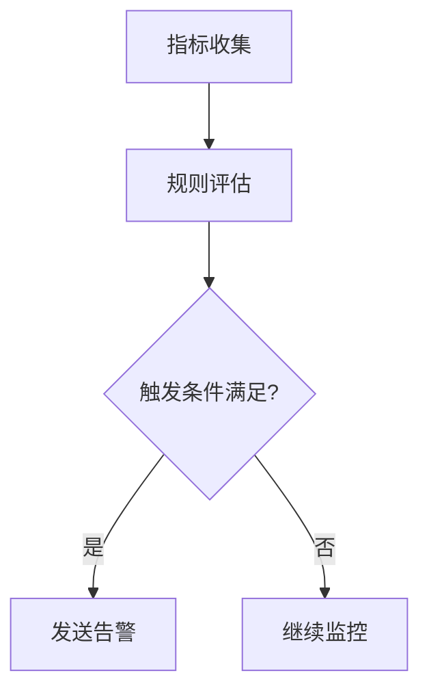

## 介绍

SkyWalking的告警系统是一个核心功能，它通过预定义的规则自动检测服务、实例和端点的异常行为。默认告警规则是开箱即用的配置，覆盖了常见的监控场景，如响应时间超长、错误率过高等。本章将详细解析这些规则的结构、触发逻辑及实际应用。

## 默认告警规则解析

SkyWalking的默认告警规则存储在 `config/alarm-settings.yml` 文件中，主要包含以下类型：

1. **服务响应时间规则**：监控服务的平均响应时间是否超过阈值。
2. **服务错误率规则**：检测服务的请求错误率是否异常。
3. **实例心跳丢失规则**：判断实例是否停止上报数据（可能已崩溃）。

### 示例规则片段

```yaml
rules:
  service_resp_time_rule:
    metrics-name: service_resp_time
    op: ">"
    threshold: 1000
    period: 10
    count: 3
    silence-period: 5
    message: "服务 {name} 的平均响应时间超过1秒"
```

- `metrics-name`: 监控的指标名称（如 `service_resp_time`）。
- `op`: 比较操作符（如 `>`）。
- `threshold`: 触发阈值（单位：毫秒）。
- `period`: 评估周期（分钟）。
- `count`: 连续触发次数。
- `silence-period`: 静默期（分钟），避免重复告警。

:::note
修改告警规则后需重启SkyWalking OAP服务生效。
:::

## 实际案例

### 场景：电商服务超时告警
假设有一个订单服务，默认规则配置如下：

```yaml
rules:
  order_service_rule:
    metrics-name: service_resp_time
    op: ">"
    threshold: 2000
    period: 5
    count: 2
    message: "订单服务响应时间超过2秒"
```

当订单服务在5分钟内连续2次平均响应时间超过2秒时，SkyWalking会触发告警并通知配置的Webhook或邮件。

## 告警规则工作流程



## 总结

SkyWalking的默认告警规则提供了基础监控能力，开发者可通过修改 `alarm-settings.yml` 自定义规则。关键点：
- 理解阈值、周期和静默期的关系
- 结合业务需求调整规则参数
- 通过日志或Webhook接收告警

## 扩展练习
1. 尝试修改默认规则，将错误率阈值从默认的0.01调整为0.05。
2. 配置一个Webhook接收器，将告警信息发送到自定义API。

## 附加资源
- [SkyWalking官方文档-Alerting](https://skywalking.apache.org/docs/main/latest/en/setup/backend/backend-alarm/)
- `alarm-settings.yml` 文件注释模板（GitHub仓库）