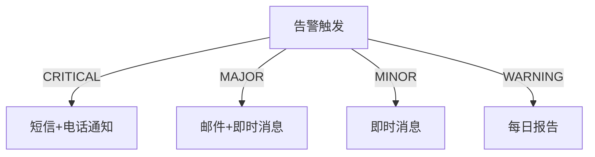

# SkyWalking 告警级别管理

## 介绍

SkyWalking的告警系统是其监控能力的核心组件之一，它允许用户定义规则来检测服务、实例和端点的异常行为。告警级别管理是告警系统的关键部分，它决定了告警的严重性和处理优先级。通过合理配置告警级别，团队可以更高效地响应问题，避免告警疲劳。

在本章节中，我们将学习：

- SkyWalking告警级别的基本概念
- 如何配置不同级别的告警规则
- 实际应用案例
- 最佳实践

## 告警级别基础

SkyWalking支持多种告警级别，每种级别代表不同的严重程度：

1. **CRITICAL**（严重）：需要立即关注的问题，通常表示服务完全不可用
2. **MAJOR**（重要）：显著影响服务性能的问题
3. **MINOR**（次要）：轻微问题，可能影响部分功能
4. **WARNING**（警告）：潜在问题，需要关注但不需要立即处理

:::note
告警级别不仅影响通知的紧急程度，还可能决定后续的自动化处理流程。
:::

## 配置告警级别

告警级别在SkyWalking的告警规则文件中定义。以下是一个基本的告警规则配置示例：

```yaml
rules:
  service_resp_time_rule:
    metrics-name: service_resp_time
    op: ">"
    threshold: 1000
    period: 10
    count: 3
    silence-period: 5
    message: 服务 {name} 响应时间超过1秒
    level: MAJOR
```

在这个例子中，我们定义了一个名为`service_resp_time_rule`的规则，当服务响应时间连续3次超过1秒时，会触发`MAJOR`级别的告警。

### 告警规则关键字段解释

- `metrics-name`: 监控的指标名称
- `op`: 比较操作符（`>, <, =`等）
- `threshold`: 阈值
- `period`: 评估周期（分钟）
- `count`: 触发告警需要满足条件的连续次数
- `silence-period`: 静默期（分钟）
- `message`: 告警消息模板
- `level`: 告警级别

## 多级别告警策略

在实际应用中，我们可能需要根据不同的阈值设置多个级别的告警。例如：

```yaml
rules:
  service_resp_time_critical:
    metrics-name: service_resp_time
    op: ">"
    threshold: 3000
    period: 5
    count: 2
    message: 服务 {name} 响应时间严重超时（超过3秒）
    level: CRITICAL
  
  service_resp_time_major:
    metrics-name: service_resp_time
    op: ">"
    threshold: 1000
    period: 10
    count: 3
    message: 服务 {name} 响应时间较长（超过1秒）
    level: MAJOR
  
  service_resp_time_warning:
    metrics-name: service_resp_time
    op: ">"
    threshold: 500
    period: 15
    count: 5
    message: 服务 {name} 响应时间略高（超过500毫秒）
    level: WARNING
```

这种分层策略可以帮助团队优先处理最严重的问题。

## 告警级别与通知渠道

通常，不同级别的告警会路由到不同的通知渠道：



## 实际案例：电商平台告警管理

假设我们有一个电商平台，以下是其关键服务的告警级别配置：

1. **支付服务**：
   - CRITICAL: 支付成功率`<90%`
   - MAJOR: 支付平均响应时间`>2秒`
   - WARNING: 支付队列长度`>100`

2. **商品服务**：
   - MAJOR: 商品详情页加载时间`>1.5秒`
   - MINOR: 商品搜索API错误率`>1%`

3. **用户服务**：
   - CRITICAL: 登录失败率`>5%`
   - WARNING: 注册成功率`<95%`

这种配置确保了团队能够优先处理最关键的业务功能问题。

## 最佳实践

1. **避免告警疲劳**：不要为所有指标设置高级别告警
2. **定期评审**：根据业务变化调整告警级别
3. **分级响应**：建立不同级别告警的响应流程
4. **自动化处理**：对某些低级告警设置自动恢复机制
5. **上下文信息**：在告警消息中包含足够的诊断信息

:::tip
建议从较宽松的告警级别开始，随着对系统行为的了解逐渐调整阈值和级别。
:::

## 总结

SkyWalking的告警级别管理是确保监控系统有效性的关键。通过合理配置不同级别的告警规则，团队可以：

- 优先处理最关键的问题
- 减少误报和告警疲劳
- 建立分级的响应机制
- 提高系统整体可靠性

## 附加资源与练习

**练习**：
1. 为你的测试环境配置一个多级别的响应时间告警规则
2. 模拟不同级别的告警触发，观察通知行为
3. 尝试将告警级别与不同的通知渠道关联

**进一步学习**：
- SkyWalking官方文档中的告警配置部分
- 分布式系统监控最佳实践
- 告警疲劳管理策略