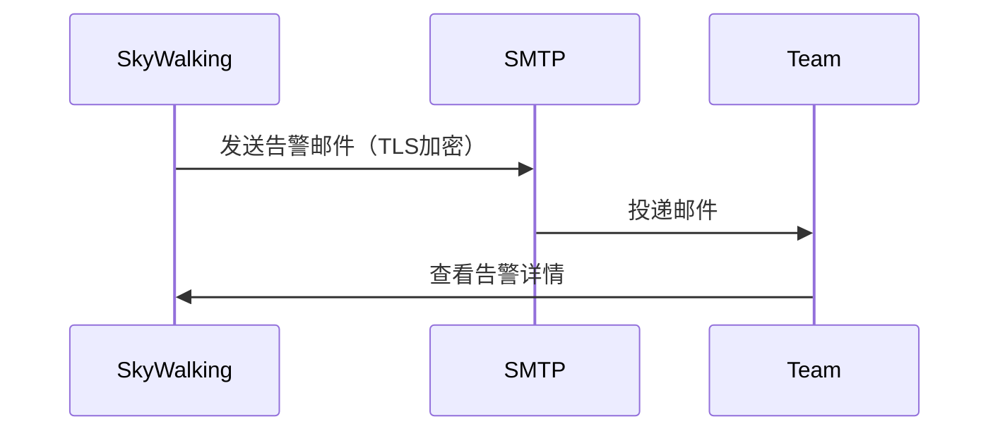

## 介绍

SkyWalking的告警系统能够实时监控服务的健康状态，并在触发规则时发送通知。邮件通知是最常用的告警方式之一，适合团队协作场景。本章将详细介绍如何配置SkyWalking的邮件通知功能。

:::note
确保已安装SkyWalking 8.0+版本，并具备管理员权限修改配置文件。
:::

## 配置步骤

### 1. 修改告警配置文件

打开SkyWalking的配置文件 `config/alarm-settings.yml`，添加邮件服务器和接收人信息：

```yaml
rules:
  service_resp_time_rule:
    expression: service_resp_time > 1000
    period: 10
    silence-period: 5
    message: 服务响应时间超过阈值 {name}

webhooks: []
mailers:
  - host: smtp.example.com
    port: 587
    username: "alert@example.com"
    password: "your_password"
    sender: "alert@example.com"
    receivers:
      - "team@example.com"
```

### 2. 参数说明

| 参数          | 说明                                                                 |
|---------------|----------------------------------------------------------------------|
| `host`        | SMTP服务器地址（如Gmail: `smtp.gmail.com`）                         |
| `port`        | 端口（TLS常用587，SSL用465）                                        |
| `username`    | 发件邮箱账号                                                        |
| `password`    | 邮箱密码/授权码（Gmail需使用[应用专用密码](https://myaccount.google.com/apppasswords)） |
| `sender`      | 显示的发件人地址（需与`username`一致）                              |
| `receivers`   | 收件人列表（支持多个邮箱）                                          |

:::warning
生产环境建议使用加密密码存储方式（如Vault），而非明文密码。
:::

### 3. 测试配置

重启SkyWalking OAP服务后，触发告警规则测试邮件发送：

```bash
# Linux
bin/oapService.sh restart

# Windows
bin\oapService.bat restart
```

成功时收到的邮件示例：
```
主题: [SkyWalking Alarm] 服务响应时间超过阈值 OrderService
内容: 告警规则 service_resp_time_rule 在 2023-08-20 14:00 触发。
      详情: 服务响应时间超过阈值 OrderService (当前值: 1200ms)
```

## 高级配置

### 自定义邮件模板

在 `config/alarm-settings.yml` 中添加模板配置：

```yaml
mailers:
  - ... # 原有配置
    template: |
      主题: [SkyWalking告警] {alarmName}
      内容: |
        告警时间: {time}
        服务名称: {name}
        当前值: {value}
        阈值: {threshold}
```

支持的变量：
- `{alarmName}`: 告警规则名称
- `{name}`: 触发告警的服务/实例名称
- `{value}`: 实际监控值
- `{threshold}`: 规则阈值

## 实际案例

### 电商系统监控场景

某电商平台配置了以下告警规则：
```yaml
rules:
  payment_timeout_rule:
    expression: service_resp_time("payment-service") > 3000
    message: 支付服务响应延迟 {value}ms
    mailers: ["payment-team"]
```

当支付服务响应时间超过3秒时，运维和开发团队会立即收到邮件通知，便于快速排查数据库或网络问题。



## 常见问题解决

1. **邮件发送失败**
   - 检查SMTP服务器是否需要启用STARTTLS
   - 测试telnet连接：`telnet smtp.example.com 587`
   - 查看OAP日志：`logs/skywalking-oap.log`

2. **Gmail配置示例**
   ```yaml
   mailers:
     - host: smtp.gmail.com
       port: 587
       username: "your@gmail.com"
       password: "app-specific-password"
       sender: "your@gmail.com"
   ```

## 总结

通过本章学习，你已经能够：
- 配置SkyWalking的SMTP邮件通知
- 自定义告警邮件内容和接收人
- 解决常见的邮件发送问题

## 延伸学习

1. [SkyWalking官方文档 - 告警配置](https://skywalking.apache.org/docs/)
2. 练习：尝试配置企业微信或Slack通知
3. 进阶：结合Webhook实现告警自动化处理