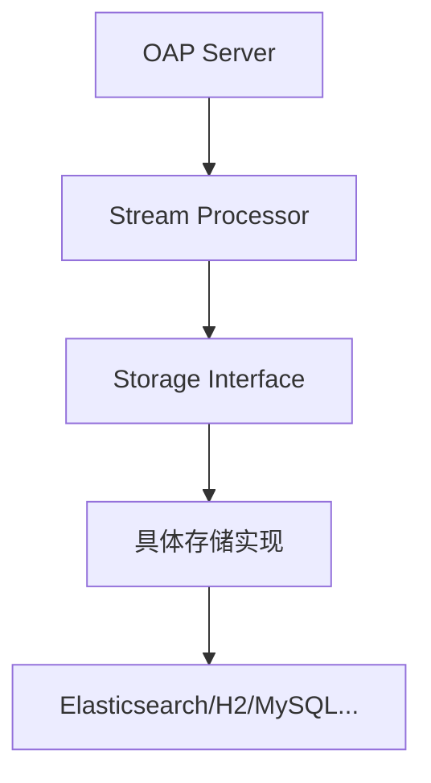

# SkyWalking 存储架构

## 介绍

SkyWalking的后端存储架构是其分布式追踪系统的核心组件，负责高效存储和查询海量监控数据。作为初学者，理解这一架构将帮助你掌握SkyWalking如何处理性能指标、调用链和拓扑图等关键数据。

存储架构设计遵循以下原则：
- **可扩展性**：支持水平扩展以应对数据增长
- **高性能**：优化读写路径满足实时分析需求
- **灵活性**：支持多种存储后端实现

## 核心组件

### 1. 存储分层设计



SkyWalking采用分层架构，主要包含：

1. **Stream Processor**：实时处理原始数据流
2. **Storage Interface**：抽象存储操作的标准接口
3. **Storage Implementation**：对接具体存储引擎的实现

### 2. 数据模型

主要存储三类数据：

- **Metrics**：性能指标数据（如TPS、延迟）
- **Traces**：分布式调用链数据
- **Topology**：服务拓扑关系数据

:::tip 数据分片策略
SkyWalking默认按时间分片（如天/小时），可通过`segment/day`等配置调整
:::

## 存储实现示例

### 使用Elasticsearch配置

```yaml
# application.yml片段
storage:
  selector: ${SW_STORAGE:elasticsearch}
  elasticsearch:
    nameSpace: ${SW_NAMESPACE:""}
    clusterNodes: ${SW_STORAGE_ES_CLUSTER_NODES:localhost:9200}
    protocol: ${SW_STORAGE_ES_HTTP_PROTOCOL:"http"}
```

### H2内存数据库示例

适合开发环境快速验证：

```java
// 创建H2存储表示例
@Stream(name = "service_relation", processor = "none")
@ScopeDeclaration(id = SERVICE_RELATION, name = "ServiceRelation")
public class ServiceRelation extends Source {
    @Override public int scope() {
        return DefaultScopeDefine.SERVICE_RELATION;
    }
}
```

## 实际案例

### 电商系统监控存储

假设一个电商平台使用SkyWalking监控：

1. **指标存储**：每秒订单数写入metrics索引
2. **调用链存储**：支付链路trace存入traces索引
3. **拓扑数据**：服务间调用关系存入topology图

:::note 性能优化实践
对于高频查询，可在Elasticsearch中配置热节点专门处理实时查询
:::

## 总结

SkyWalking存储架构的关键特点：

- 通过抽象层支持多种存储后端
- 针对可观测性数据特化设计
- 内置数据分片和TTL管理

## 扩展学习

推荐下一步了解：
- 存储性能调优参数
- 自定义存储实现开发
- 存储数据迁移策略

尝试练习：
1. 配置H2和ES两种存储后端
2. 查询存储的指标数据API
3. 分析不同存储引擎的监控指标