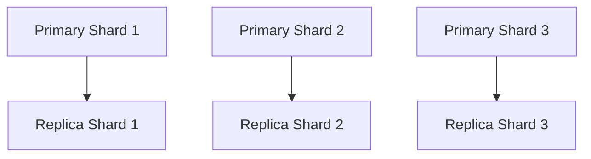

# SkyWalking 存储高可用配置

## 介绍

SkyWalking作为分布式系统的APM工具，其存储的高可用性至关重要。当后端存储出现故障时，可能导致监控数据丢失或服务中断。本文将介绍如何配置SkyWalking的存储高可用方案，包括**集群部署**、**数据分片**和**故障转移**机制，帮助初学者构建可靠的监控系统。

:::note 什么是高可用？
高可用（High Availability, HA）指系统能够持续提供服务，即使部分组件发生故障。对于SkyWalking，这意味着存储层需要具备冗余和自动恢复能力。
:::

## 核心配置方案

### 1. 集群化部署

SkyWalking支持多种存储后端（如Elasticsearch、MySQL集群、TiDB等）。以下是Elasticsearch集群的配置示例：

```yaml
# application.yml
storage:
  selector: ${SW_STORAGE:elasticsearch}
  elasticsearch:
    nameSpace: ${SW_NAMESPACE:""}
    clusterNodes: ${SW_STORAGE_ES_CLUSTER_NODES:localhost:9200,localhost:9201,localhost:9202}
    protocol: ${SW_STORAGE_ES_HTTP_PROTOCOL:"http"}
```
**参数说明**：
- `clusterNodes`: 多个ES节点地址，用逗号分隔
- `protocol`: 通信协议（HTTP/HTTPS）

:::tip 生产建议
至少部署3个Elasticsearch节点组成集群，并配置`discovery.zen.minimum_master_nodes`防止脑裂问题。
:::

### 2. 数据分片与副本

通过Elasticsearch的分片机制实现数据高可用：

```json
PUT /skywalking_segment
{
  "settings": {
    "number_of_shards": 3,
    "number_of_replicas": 1
  }
}
```
**效果**：
- 数据分散在3个主分片
- 每个分片有1个副本
- 任一节点故障时，副本可接管服务



### 3. 故障转移配置

在OAP服务器配置重试策略：

```yaml
# application.yml
storage:
  elasticsearch:
    bulkActions: ${SW_STORAGE_ES_BULK_ACTIONS:1000}
    flushInterval: ${SW_STORAGE_ES_FLUSH_INTERVAL:10}
    concurrentRequests: ${SW_STORAGE_ES_CONCURRENT_REQUESTS:2}
    maxRetries: ${SW_STORAGE_ES_MAX_RETRIES:3}  # 失败重试次数
    retryInterval: ${SW_STORAGE_ES_RETRY_INTERVAL:1}  # 重试间隔(秒)
```

## 实际案例

**电商平台监控系统**：
- 部署3节点Elasticsearch集群
- 配置分片数=3，副本数=2
- OAP服务器连接所有ES节点

当某个ES节点宕机时：
1. 剩余节点自动提升副本为主分片
2. OAP服务器自动切换到健康节点
3. 数据写入无中断，查询可能有短暂延迟

:::warning 注意
确保ES集群的`cluster.routing.allocation.enable`设置为`all`，允许自动重新分配分片。
:::

## 总结

| 配置项          | 推荐值          | 作用                     |
|----------------|----------------|-------------------------|
| 集群节点数       | ≥3             | 避免单点故障             |
| 分片数          | 数据量/30GB     | 均衡负载                 |
| 副本数          | ≥1             | 数据冗余                 |
| 最大重试次数     | 3              | 网络波动容错             |

## 扩展学习

1. **实践练习**：
   - 搭建双节点ES集群，手动关闭一个节点观察故障转移
   - 修改`number_of_replicas`为0，测试数据丢失风险

2. **进阶阅读**：
   - [Elasticsearch官方高可用指南](https://www.elastic.co/guide/en/elasticsearch/reference/current/high-availability.html)
   - SkyWalking的H2存储内存模式（仅限开发环境）

3. **监控建议**：
   ```bash
   # 检查集群健康状态
   GET /_cluster/health?pretty
   ```