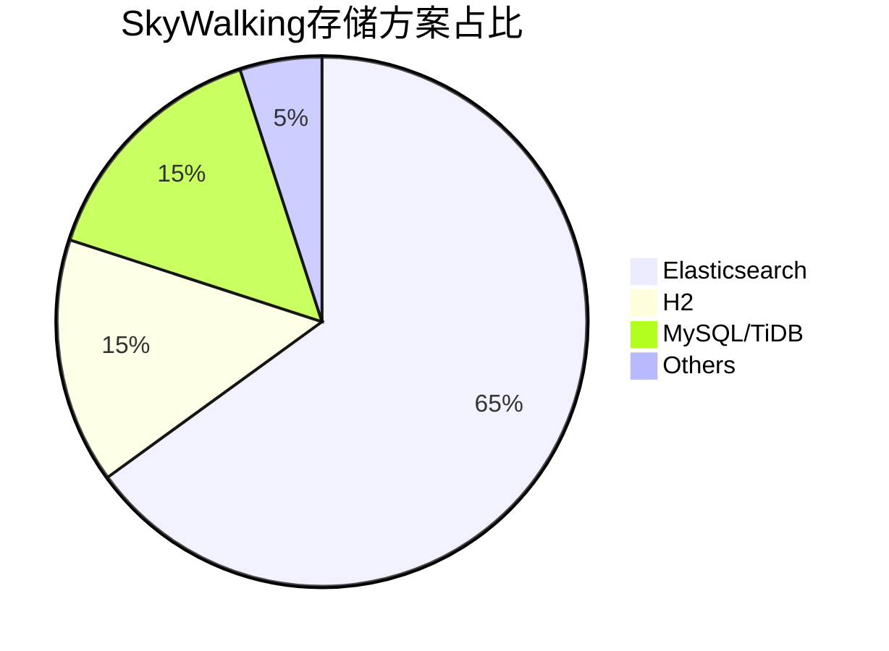
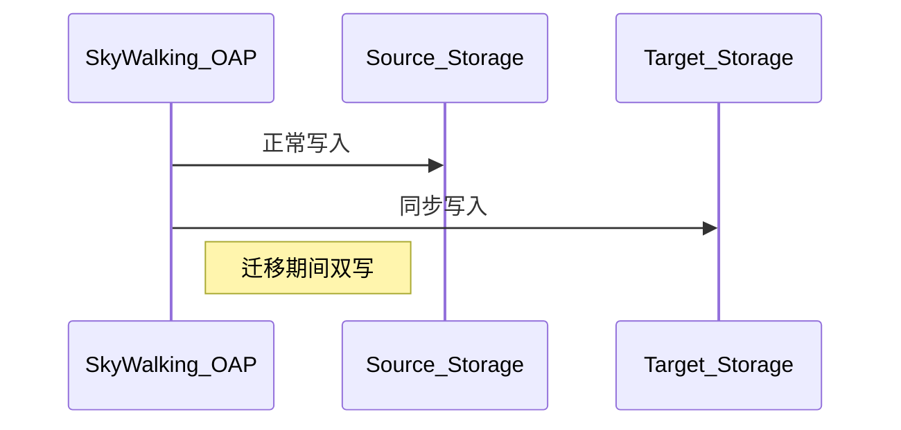

# SkyWalking 存储迁移方案

## 介绍

SkyWalking作为分布式系统的APM工具，支持多种后端存储（如Elasticsearch、H2、MySQL等）。当业务规模变化或性能需求升级时，可能需要迁移存储方案。本文将介绍迁移的常见场景、规划方法和操作步骤。

:::note 为什么需要迁移？
- 从H2迁移到生产级存储（如ES）
- 性能优化（如ES集群扩容）
- 成本控制（切换至更经济的存储）
- 架构标准化（统一监控栈存储）
:::

## 迁移前准备

### 1. 存储方案对比



### 2. 环境检查清单
- 源存储数据量统计：`curl -XGET 'http://source-storage:9200/_cat/indices?v'`
- 目标存储版本兼容性
- 网络带宽评估
- 维护窗口时间确认

## 迁移方案详解

### 方案A：双写迁移（推荐）



配置示例（`application.yml`片段）：
```yaml
storage:
  selector: ${SW_STORAGE:elasticsearch}
  elasticsearch: # 主存储
    nameSpace: ${SW_NAMESPACE:""}
    clusterNodes: ${SW_STORAGE_ES_CLUSTER_NODES:localhost:9200}
  h2: # 次要存储（迁移测试用）
    driver: ${SW_STORAGE_H2_DRIVER:org.h2.jdbcx.JdbcDataSource}
    url: ${SW_STORAGE_H2_URL:jdbc:h2:mem:skywalking-oap-db}
```

### 方案B：离线迁移步骤
1. 停止OAP服务
2. 使用SkyWalking提供的工具导出数据：
   ```bash
   ./bin/oapDataTool.sh --mode=export --source=elasticsearch \
   --target=/data/backup/skywalking
   ```
3. 导入到新存储：
   ```bash
   ./bin/oapDataTool.sh --mode=import --source=/data/backup/skywalking \
   --target=mysql
   ```

## 实际案例

### 案例：从H2迁移到Elasticsearch
某电商平台初期使用H2开发环境，随着微服务数量增长：
1. **问题**：H2内存不足导致OAP频繁重启
2. **解决方案**：
   - 部署3节点ES集群
   - 配置双写1周验证数据一致性
   - 最终切换至ES专用存储
3. **效果**：
   - 存储容量提升10倍
   - 查询性能提升300%

:::warning 注意事项
- ES索引模板需提前配置
- 迁移后需验证所有UI指标正常
- 建议保留旧数据至少2周
:::

## 验证与回滚

### 验证脚本示例
```python
# compare_record_counts.py
import requests

def compare_counts():
    src_count = requests.get("http://src-es:9200/skywalking*/_count").json()["count"]
    dst_count = requests.get("http://dst-es:9200/skywalking*/_count").json()["count"]
    assert src_count == dst_count, f"数据不一致: 源={src_count} 目标={dst_count}"
```

### 回滚步骤
1. 修改`storage.selector`回原配置
2. 重启OAP集群
3. 检查UI数据连续性

## 总结

关键要点：
- 生产环境避免使用H2
- 双写方案最安全但资源消耗大
- 迁移后监控GC和堆内存变化

## 扩展学习
- [SkyWalking存储扩展开发指南](https://skywalking.apache.org/docs/)
- 练习：在Docker环境实践H2到MySQL的迁移
- 工具推荐：使用`elasticsearch-dump`辅助迁移