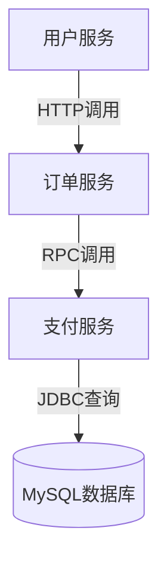

# SkyWalking MySQL存储设置

## 介绍

SkyWalking是一个开源的分布式系统监控和追踪工具，支持多种后端存储选项。MySQL作为一种常见的关系型数据库，可以作为SkyWalking的后端存储方案。本文将详细介绍如何配置SkyWalking使用MySQL存储数据，适合初学者快速上手。

## 为什么选择MySQL？

MySQL是一个广泛使用的关系型数据库管理系统，具有以下优点：
- 成熟稳定，社区支持丰富
- 易于安装和维护
- 适合中小规模部署
- 支持事务和复杂查询

:::note
对于生产环境的大规模部署，建议考虑Elasticsearch等更适合的存储方案。MySQL更适合开发、测试或小规模生产环境。
:::

## 准备工作

在开始配置前，请确保：
1. 已安装MySQL服务器（5.7或更高版本）
2. 已创建专用数据库和用户
3. 已下载SkyWalking发行版

## 配置步骤

### 1. 创建数据库和用户

首先，在MySQL中创建专用数据库和用户：

```sql
CREATE DATABASE skywalking CHARACTER SET utf8mb4 COLLATE utf8mb4_unicode_ci;
CREATE USER 'skywalking'@'%' IDENTIFIED BY 'your_password';
GRANT ALL PRIVILEGES ON skywalking.* TO 'skywalking'@'%';
FLUSH PRIVILEGES;
```

### 2. 修改SkyWalking配置文件

编辑SkyWalking的`config/application.yml`文件，找到存储配置部分：

```yaml
storage:
  selector: ${SW_STORAGE:mysql}
  mysql:
    properties:
      jdbcUrl: ${SW_JDBC_URL:"jdbc:mysql://localhost:3306/skywalking"}
      dataSource.user: ${SW_DATA_SOURCE_USER:skywalking}
      dataSource.password: ${SW_DATA_SOURCE_PASSWORD:your_password}
    metadataQueryMaxSize: ${SW_STORAGE_MYSQL_QUERY_MAX_SIZE:5000}
```

### 3. 初始化数据库表结构

SkyWalking提供了初始化脚本，位于`/bin/init-mysql.sql`。执行以下命令：

```bash
mysql -u skywalking -p skywalking < bin/init-mysql.sql
```

### 4. 启动SkyWalking

使用修改后的配置启动SkyWalking：

```bash
bin/startup.sh
```

## 验证配置

检查SkyWalking日志文件`logs/skywalking-oap-server.log`，查找类似以下内容确认MySQL连接成功：

```
Storage [mysql] started successfully...
```

## 实际案例

假设你正在开发一个电商平台，需要监控以下服务：
- 用户服务
- 订单服务
- 支付服务

使用MySQL存储的配置后，你可以：
1. 追踪跨服务的调用链
2. 分析服务性能指标
3. 监控数据库查询性能



## 性能优化建议

1. **索引优化**：确保SkyWalking生成的表有适当的索引
2. **定期维护**：设置定期清理旧数据的任务
3. **连接池配置**：调整连接池大小以适应你的负载

```sql
-- 示例：添加索引优化查询
ALTER TABLE `segment` ADD INDEX `idx_endpoint_id` (`endpoint_id`);
```

## 常见问题解决

:::caution 连接问题
如果遇到连接失败，检查：
1. MySQL服务是否运行
2. 用户名密码是否正确
3. 网络连接是否通畅
4. 用户是否有足够的权限
:::

:::warning 性能问题
如果发现查询缓慢：
1. 检查MySQL服务器资源使用情况
2. 优化表结构和索引
3. 考虑增加MySQL资源配置
:::

## 总结

通过本文，你学会了：
- 如何配置SkyWalking使用MySQL作为后端存储
- 基本的MySQL设置和优化技巧
- 实际应用场景和问题解决方法

MySQL作为SkyWalking的存储后端，为开发和小规模生产环境提供了简单可靠的解决方案。

## 进一步学习

1. [SkyWalking官方文档](https://skywalking.apache.org/docs/)
2. [MySQL性能优化指南](https://dev.mysql.com/doc/refman/8.0/en/optimization.html)
3. 练习：尝试配置SkyWalking使用不同的MySQL用户权限，观察效果差异