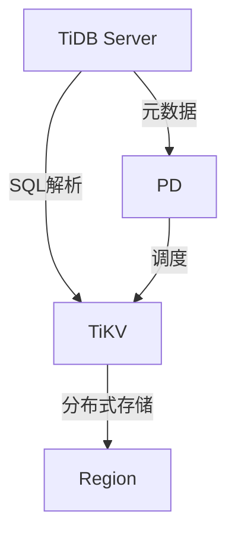

# SkyWalking TiDB存储方案

## 介绍

SkyWalking作为分布式系统的应用性能监控(APM)工具，需要处理海量的链路追踪和指标数据。TiDB作为兼容MySQL协议的分布式数据库，为SkyWalking提供了**水平扩展**和**高可用性**的存储解决方案。本章将介绍TiDB的架构优势、与SkyWalking的集成方式，以及实际配置示例。

:::note 为什么选择TiDB？
- 无缝替代MySQL，兼容现有生态
- 自动分片（Sharding）能力
- 支持强一致性事务
- 弹性扩展能力
:::

## TiDB核心架构



关键组件说明：
- **TiDB Server**：无状态SQL层
- **TiKV**：分布式键值存储引擎
- **PD (Placement Driver)**：集群调度大脑

## 配置SkyWalking使用TiDB

### 1. 修改存储配置

编辑 `application.yml` 文件：

```yaml
storage:
  selector: ${SW_STORAGE:tidb}
  tidb:
    properties:
      jdbcUrl: "jdbc:mysql://<tidb-server>:4000/swtest"
      dataSource.user: "root"
      dataSource.password: ""
      dataSource.cachePrepStmts: "true"
      dataSource.prepStmtCacheSize: "250"
      dataSource.prepStmtCacheSqlLimit: "2048"
```

### 2. 初始化数据库

执行TiDB的初始化SQL（与MySQL语法兼容）：

```sql
CREATE DATABASE swtest CHARACTER SET utf8mb4 COLLATE utf8mb4_bin;
USE swtest;
SOURCE /path/to/skywalking/sql/mysql-init.sql
```

:::caution 注意
TiDB与MySQL的差异点：
- 避免使用`SELECT FOR UPDATE`
- 自增ID非连续
- 索引创建需要评估Region分布
:::

## 性能优化实践

### 分片策略示例

通过PD控制台调整Region大小：

```bash
pd-ctl -u http://<pd-address>:2379 config set region-split-size 1536MB
```

### 实际案例：电商平台监控

**场景需求**：
- 每日20亿Span数据
- 30天数据保留周期
- P99查询延迟 < 2秒

**TiDB集群配置**：
```yaml
# 集群拓扑
tidb_servers: 3节点（16C32G）
tikv_servers: 6节点（32C128G, 2TB SSD）
pd_servers: 3节点（8C16G）
```

## 常见问题排查

1. **连接池耗尽**：
   ```log
   HikariPool-1 - Connection is not available, request timed out after 30000ms
   ```
   解决方案：调整`dataSource.maximumPoolSize`（建议值：CPU核心数*2 + 1）

2. **Region热点**：
   ```sql
   SHOW TABLE REGIONS WHERE TABLE_NAME = 'segment';
   ```

## 总结与拓展

**核心优势**：
- 线性扩展能力支持PB级数据
- 兼容MySQL协议降低迁移成本
- 完善的监控体系（Grafana+Prometheus）

**推荐练习**：
1. 使用TiUP部署测试集群
2. 对比TiDB与H2/MySQL的写入性能差异
3. 通过TiDB Dashboard分析慢查询

**延伸阅读**：
- [TiDB事务模型官方文档](https://docs.pingcap.com/zh/tidb/stable/transaction-model)
- [SkyWalking存储扩展设计](https://skywalking.apache.org/docs/main/latest/en/concepts-and-designs/storage/)