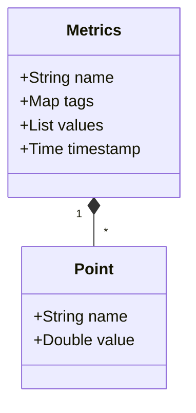

# SkyWalking InfluxDB配置

## 介绍

Apache SkyWalking是一个开源的APM（应用性能监控）系统，支持多种后端存储选项。InfluxDB是一个高性能的时间序列数据库，非常适合存储和分析SkyWalking收集的监控数据。本文将指导你如何配置SkyWalking使用InfluxDB作为其后端存储。

## 前提条件

在开始之前，请确保你已经具备以下条件：
- 已安装并运行InfluxDB（建议版本2.x）
- 已安装SkyWalking OAP Server（建议版本9.x+）
- 基本了解YAML配置语法

## 配置步骤

### 1. 修改SkyWalking OAP配置

打开SkyWalking OAP的配置文件 `config/application.yml`，找到存储相关的配置部分，修改为以下内容：

```yaml
storage:
  selector: ${SW_STORAGE:influxdb}
  influxdb:
    url: ${SW_STORAGE_INFLUXDB_URL:http://localhost:8086}
    token: ${SW_STORAGE_INFLUXDB_TOKEN:your-influxdb-token}
    org: ${SW_STORAGE_INFLUXDB_ORG:skywalking}
    bucket: ${SW_STORAGE_INFLUXDB_BUCKET:skywalking}
    step: ${SW_STORAGE_INFLUXDB_STEP:1} # 存储间隔，单位分钟
    # 连接超时设置
    connectTimeout: ${SW_STORAGE_INFLUXDB_CONNECT_TIMEOUT:10}
    writeTimeout: ${SW_STORAGE_INFLUXDB_WRITE_TIMEOUT:10}
    readTimeout: ${SW_STORAGE_INFLUXDB_READ_TIMEOUT:10}
```

:::note
如果你使用的是InfluxDB 1.x版本，配置会有所不同，需要使用用户名和密码而不是token。
:::

### 2. 环境变量配置

你也可以通过环境变量来覆盖配置文件中的设置：

```bash
export SW_STORAGE=influxdb
export SW_STORAGE_INFLUXDB_URL=http://influxdb-server:8086
export SW_STORAGE_INFLUXDB_TOKEN=your-token-here
export SW_STORAGE_INFLUXDB_ORG=skywalking
export SW_STORAGE_INFLUXDB_BUCKET=skywalking
```

### 3. 验证配置

启动SkyWalking OAP Server后，检查日志中是否有以下类似信息：

```
INFO  o.a.s.o.server.storage.plugin.influxdb.InfluxDBStorageProvider - InfluxDB storage provider is ready.
```

### 4. 数据模型映射

SkyWalking将数据存储在InfluxDB中的方式如下：



## 实际案例

### 案例：监控Web应用性能

假设我们有一个Web应用，想要监控其API响应时间和错误率：

1. SkyWalking收集的数据会以如下格式存储在InfluxDB中：

```
measurement: endpoint_avg

fields: value=120.5
time: 2023-01-01T00:00:00Z
```

2. 你可以使用InfluxDB的Flux语言查询这些数据：

```flux
from(bucket: "skywalking")
  |> range(start: -1h)
  |> filter(fn: (r) => r._measurement == "endpoint_avg" and r.endpoint == "/api/users")
  |> aggregateWindow(every: 1m, fn: mean)
```

## 常见问题解决

:::caution 连接问题
如果遇到连接问题，请检查：
1. InfluxDB服务是否正常运行
2. Token是否有正确的权限
3. 网络连接是否通畅
:::

:::warning 性能问题
对于高负载环境，建议：
1. 调整 `step` 参数增加存储间隔
2. 增加InfluxDB的资源分配
3. 考虑使用InfluxDB集群版
:::

## 总结

通过本文，你学会了如何配置SkyWalking使用InfluxDB作为后端存储。关键点包括：
1. 修改 `application.yml` 配置文件
2. 理解SkyWalking与InfluxDB的数据映射关系
3. 通过实际案例了解配置的应用场景

## 扩展学习

要进一步探索SkyWalking和InfluxDB的集成，可以：
1. 尝试配置不同的存储策略
2. 学习使用InfluxDB的TICK堆栈进行数据分析
3. 探索SkyWalking的其他存储选项，如Elasticsearch

:::tip 练习建议
1. 设置一个本地InfluxDB实例并配置SkyWalking使用它
2. 创建自定义仪表板来可视化SkyWalking数据
3. 尝试不同的查询来分析性能数据
:::