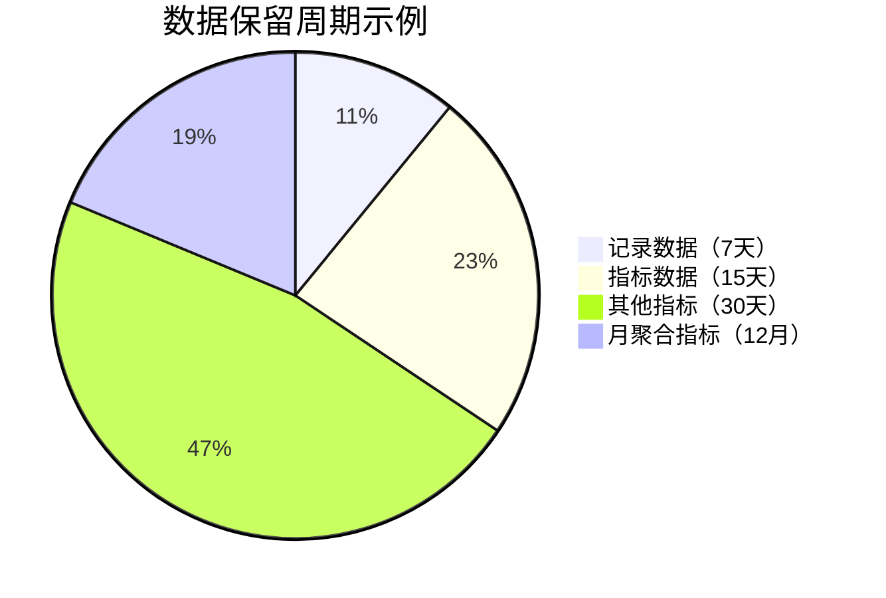

## 介绍

在分布式系统监控中，SkyWalking收集了大量的性能指标、追踪数据和日志信息。这些数据随着时间的推移会不断累积，占用大量存储空间。为了平衡存储成本和历史数据分析需求，SkyWalking提供了**数据保留策略**，允许用户配置不同类型数据的保留周期。

数据保留策略的核心是：
- 定义不同数据类型的存储时长
- 自动清理过期数据
- 优化存储资源使用

## 数据保留策略配置

SkyWalking的数据保留策略主要通过配置文件进行设置。主要的配置文件是`application.yml`，其中与数据保留相关的部分如下：

```yaml
storage:
  selector: ${SW_STORAGE:h2}
  elasticsearch:
    # 指标数据保留设置
    dayStep: 1              # 存储数据的天数间隔
    recordDataTTL: 7        # 记录数据保留天数（如端点、服务关系）
    metricsDataTTL: 15      # 指标数据保留天数
    otherMetricsDataTTL: 30 # 其他指标数据保留天数
    monthMetricsDataTTL: 12 # 月聚合指标保留月数
```

:::note
不同存储后端（如Elasticsearch、H2、MySQL等）的配置参数可能略有不同，但核心概念相同。
:::

## 数据保留策略详解

### 1. 数据类型与保留周期

SkyWalking将监控数据分为几种主要类型，每种类型可以设置不同的保留周期：



### 2. 关键配置参数说明

| 参数 | 描述 | 默认值 | 建议值 |
|------|------|--------|--------|
| `recordDataTTL` | 记录数据（如拓扑关系）保留天数 | 7 | 7-14 |
| `metricsDataTTL` | 核心指标数据保留天数 | 15 | 15-30 |
| `otherMetricsDataTTL` | 其他指标数据保留天数 | 30 | 30-90 |
| `monthMetricsDataTTL` | 月聚合指标保留月数 | 12 | 12-24 |

### 3. 存储后端差异

不同存储后端对数据保留策略的实现方式不同：

- **Elasticsearch**：通过索引生命周期管理(ILM)实现
- **H2/MySQL**：通过定时任务删除过期数据
- **TiDB**：类似MySQL的实现方式

## 实际配置示例

### 案例1：生产环境Elasticsearch配置

```yaml
storage:
  selector: ${SW_STORAGE:elasticsearch}
  elasticsearch:
    namespace: ${SW_NAMESPACE:""}
    clusterNodes: ${SW_STORAGE_ES_CLUSTER_NODES:localhost:9200}
    dayStep: 1
    recordDataTTL: 14
    metricsDataTTL: 30
    otherMetricsDataTTL: 90
    monthMetricsDataTTL: 24
```

### 案例2：开发环境H2配置

```yaml
storage:
  selector: ${SW_STORAGE:h2}
  h2:
    driver: org.h2.jdbcx.JdbcDataSource
    url: jdbc:h2:mem:skywalking-oap-db
    user: sa
    metadataQueryMaxSize: 500
    recordDataTTL: 3
    metricsDataTTL: 7
    otherMetricsDataTTL: 7
```

:::tip
开发环境可以设置较短的保留周期以减少资源占用，生产环境应根据实际需求和数据重要性设置合理的保留周期。
:::

## 高级主题：索引生命周期管理（ILM）

当使用Elasticsearch作为存储后端时，可以配置更精细的索引生命周期管理策略：

```yaml
storage:
  elasticsearch:
    # ...其他配置...
    indexRollingPeriod: 1d    # 索引滚动周期
    bulkActions: 5000         # 批量操作阈值
    flushInterval: 15         # 刷新间隔(秒)
    concurrentRequests: 2     # 并发请求数
    resultWindowMaxSize: 10000
```

## 最佳实践

1. **评估数据需求**：根据业务需求确定各类数据的重要性
2. **监控存储使用**：定期检查存储空间使用情况
3. **平衡成本与需求**：在存储成本和数据分析需求间找到平衡点
4. **测试环境验证**：任何配置变更前先在测试环境验证
5. **文档记录**：记录保留策略配置及其变更原因

## 总结

SkyWalking的数据保留策略是系统运维的重要部分，合理配置可以：
- 控制存储成本
- 确保重要数据的可用性
- 优化系统性能

通过本文，你应该已经了解了：
- 数据保留策略的基本概念
- 主要配置参数及其含义
- 不同环境的配置示例
- 高级配置选项

## 进一步学习

1. 尝试在自己的测试环境中修改保留策略配置
2. 监控不同保留策略下的存储使用变化
3. 阅读SkyWalking官方文档中关于存储配置的部分
4. 了解不同存储后端（如Elasticsearch、MySQL）的数据管理机制

:::caution
修改生产环境的保留策略前，请确保已备份重要数据并充分测试。
:::