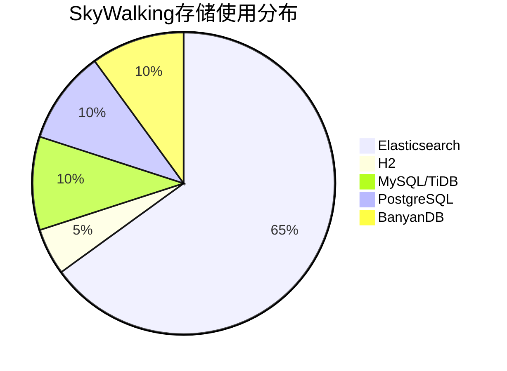

# SkyWalking 存储容量规划

## 介绍

在分布式系统中，SkyWalking作为一款优秀的APM（应用性能监控）工具，会产生大量监控数据。合理的存储容量规划能够帮助您平衡成本与性能需求，避免因存储不足导致数据丢失或查询性能下降。本文将介绍SkyWalking存储的基本原理、容量估算方法和优化策略。

## 存储架构概述

SkyWalking支持多种后端存储，包括：

- Elasticsearch
- H2（仅用于测试）
- MySQL/TiDB（有限支持）
- PostgreSQL
- BanyanDB（SkyWalking原生数据库）



## 关键数据指标

进行容量规划前，需要了解以下关键指标：

1. **TPS（每秒跟踪数）**：系统每秒处理的请求数
2. **Trace保留周期**：需要保留跟踪数据的天数
3. **Metrics采样频率**：指标采集间隔（通常为10-60秒）
4. **平均Span大小**：单个跟踪Span的大小（通常1-5KB）

:::note
生产环境中，Elasticsearch是最常用的存储方案，以下示例均以Elasticsearch为例。
:::

## 容量估算方法

### 1. 原始数据估算

假设您的系统有以下特征：
- 日均请求量：100万
- 平均每个请求产生5个Span
- 平均Span大小：2KB
- 数据保留周期：7天

计算公式：
```
每日数据量 = 请求量 × 平均Span数 × 平均Span大小
          = 1,000,000 × 5 × 2KB 
          = 10GB/天

总存储需求 = 每日数据量 × 保留天数
          = 10GB × 7 
          = 70GB
```

### 2. Elasticsearch实际占用估算

Elasticsearch会有额外的开销，通常需要考虑：

- 副本因子（通常设置为1-2）
- 索引开销（约20-30%）
- 压缩率（约50%）

调整后的计算公式：
```
实际存储需求 = 原始数据 × (1 + 副本数) × (1 + 索引开销) / 压缩率
            = 70GB × (1 + 1) × 1.3 / 0.5
            ≈ 364GB
```

## 配置示例

### 1. Elasticsearch索引策略

在SkyWalking的`application.yml`中配置：

```yaml
storage:
  elasticsearch:
    # 索引滚动策略
    dayStep: 1              # 每天创建新索引
    indexShardsNumber: 3     # 分片数
    indexReplicasNumber: 1   # 副本数
    # 数据保留
    recordDataTTL: 7         # 跟踪数据保留7天
    otherMetricsDataTTL: 15  # 其他指标保留15天
    monthMetricsDataTTL: 30  # 月度聚合数据保留30天
```

### 2. 采样率调整

降低采样率可以减少存储压力：

```yaml
agent:
  sample:
    # 每秒最多收集3个trace
    rate: 3
    # 强制保存的trace比例(0-1)
    force: 0.1
```

## 实际案例

### 案例1：电商平台

**场景**：
- 日均订单量：50万
- 高峰期TPS：200
- 使用Elasticsearch集群：3节点（16核32GB内存）

**配置**：
```yaml
storage:
  elasticsearch:
    indexShardsNumber: 5
    indexReplicasNumber: 1
    recordDataTTL: 3     # 仅保留3天详细数据
    otherMetricsDataTTL: 7
```

**效果**：
- 存储需求从预估的1TB降至400GB
- 查询性能提升30%

### 案例2：SaaS服务

**优化策略**：
1. 对重要客户采用100%采样
2. 普通用户采用10%采样
3. 使用冷热数据分离架构

## 优化技巧

:::tip 存储优化建议
1. **分层存储**：热数据使用SSD，冷数据迁移至HDD
2. **调整映射**：禁用不必要的字段索引
3. **定期清理**：设置合理的TTL策略
4. **压缩数据**：启用Elasticsearch的best_compression
5. **聚合降精度**：长期数据只保留聚合结果
:::

## 总结

合理的存储容量规划需要：
1. 准确评估业务规模和数据特征
2. 选择合适的存储后端和配置
3. 实施持续监控和调整

## 扩展学习

1. [Elasticsearch官方容量规划指南](https://www.elastic.co/guide/en/elasticsearch/reference/current/size-your-shards.html)
2. SkyWalking官方文档中的存储配置章节
3. 练习：根据您系统的TPS计算7天存储需求

## 常见问题

:::note
如何监控当前存储使用情况？
- 可以通过Elasticsearch的`_cat/indices?v` API或SkyWalking的存储健康指标。

存储不足时有哪些表现？
- 查询超时、OOM错误、Elasticsearch拒绝写入等。
:::